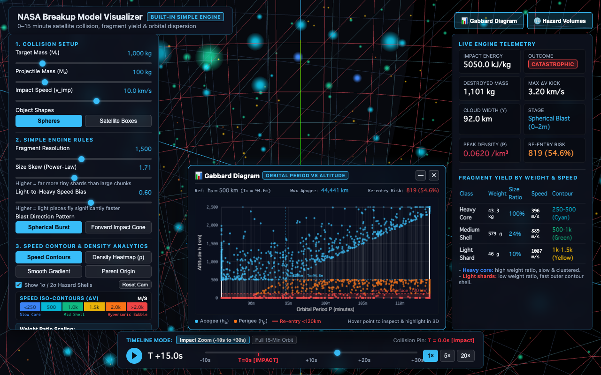
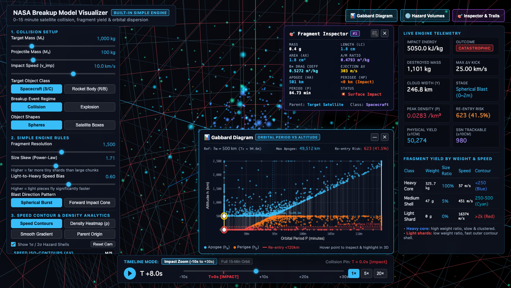
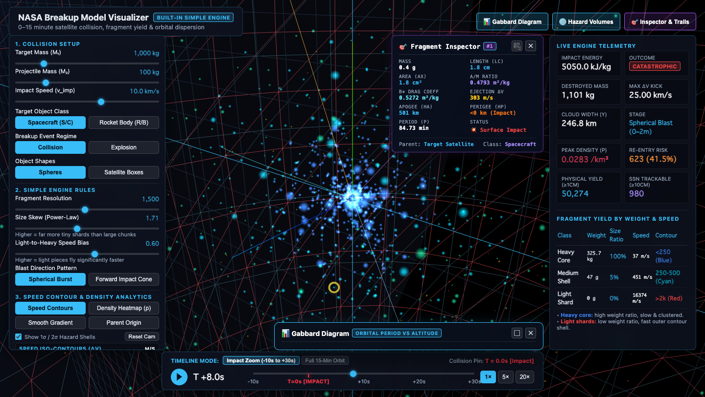
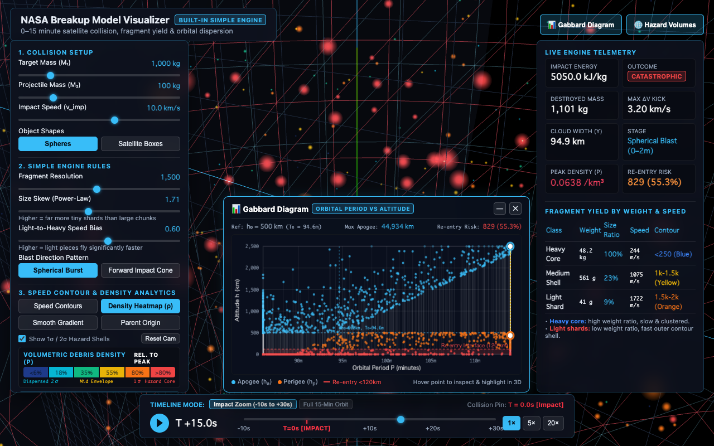
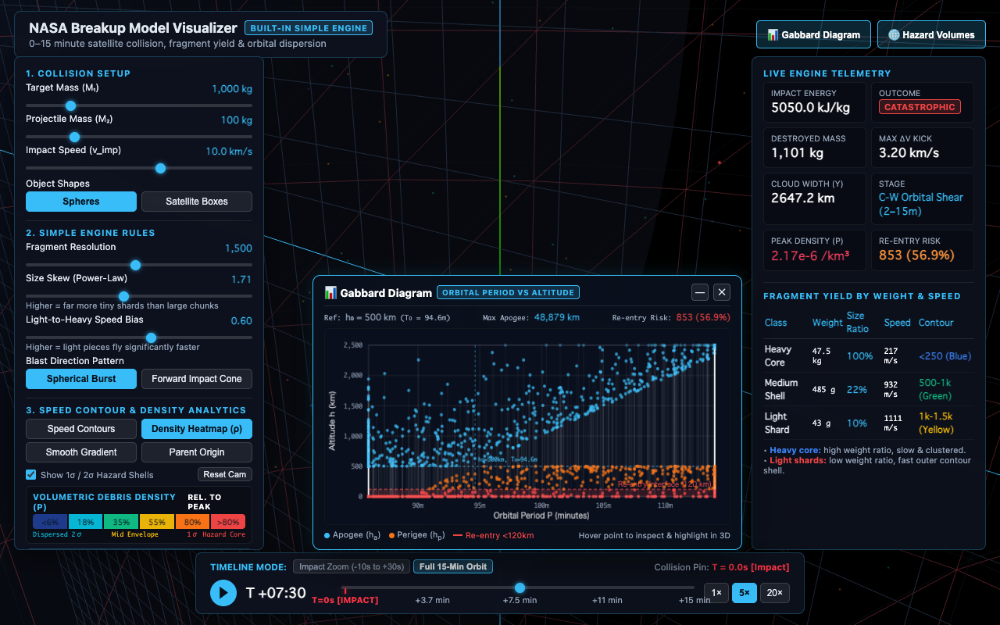

# NASA Breakup Model Visualizer & Orbital Hazard Suite

A high-performance, offline-first 3D visualization and astrodynamics analysis suite for hypervelocity satellite collisions in Low Earth Orbit (LEO), based on the **NASA Standard Breakup Model (NASA SBM)**, **Clohessy-Wiltshire (Hill) relative orbital dynamics**, **volumetric spatial density hazard modeling**, and an **interactive Gabbard diagram**.



---

## Key Capabilities

* **Mathematical $T = 0.000\text{s}$ Impact Synchronization**:
  * Incoming approach trajectories with visual flight guide lines.
  * Surfaces touch at precisely $(0, 0, 0)$ at $T = 0.0\text{s}$, followed by a dynamic shockwave ring and collision flash.
* **Physical Mass-Proportional Scaling ($R \propto \sqrt[3]{m}$)**:
  * Fragment visual radii scale strictly to the cube root of physical fragment mass ($R_i \propto m_i^{1/3}$).
  * Custom WebGL GLSL `ShaderMaterial` with view-space point attenuation, anti-aliased Gaussian glow discs, and additive blending.
* **Clohessy-Wiltshire (Hill) Orbital Propagation**:
  * Closed-form analytical propagation in the rotating Hill frame ($\hat{\mathbf{x}}$ radial, $\hat{\mathbf{y}}$ in-track, $\hat{\mathbf{z}}$ cross-track).
  * Dual-mode scrubbing: **Impact Zoom** ($-10\text{s}$ to $+30\text{s}$) for collision micro-dynamics and **Full 15-Minute Orbit** ($-10\text{s}$ to $+900\text{s}$) capturing multi-thousand-kilometer secular along-track Keplerian shear ($y_{\text{secular}} \approx -3 \Delta v_y t$).
* **Volumetric Spatial Debris Density Heatmap ($\rho(x, y, z)$)**:
  * Dynamic spatial covariance tensor $\mathbf{\Sigma}(t) = \text{diag}(\sigma_x^2, \sigma_y^2, \sigma_z^2)$.
  * Real-time calculation of peak spatial density:
    $$\rho_{\max}(t) = \frac{N}{(2\pi)^{3/2} \sigma_x(t) \sigma_y(t) \sigma_z(t)} \quad [\text{fragments / km}^3]$$
  * Volumetric 3D Hazard Envelopes: **$1\sigma$ Core Hazard Shell** (crimson red wireframe) and **$2\sigma$ Dispersion Boundary** (cyan wireframe).
  * Vertex coloring mapping local concentration relative to peak density.
* **Interactive Gabbard Diagram ($P \text{ vs. } h_a / h_p$)**:
  * Classical astrodynamics plot displaying orbital period ($P$) vs. apogee ($h_a$, cyan) and perigee ($h_p$, orange/red).
  * Calibrated LEO domain ($86\text{--}114\text{ min}$, $0\text{--}2,500\text{ km}$) highlighting the classic "X-wing" crossing at reference breakup altitude ($h_0 = 500\text{ km}$, $T_0 = 94.62\text{ min}$).
  * **Atmospheric Re-entry Danger Zone ($< 120\text{ km}$)** and direct ballistic surface impact ($0\text{ km}$) detection with live percentage tracking ($\sim 55\%$).
  * **Bidirectional Cross-Highlighting**: Hovering or clicking any fragment point on the Gabbard canvas displays a full telemetry tooltip and illuminates a glowing yellow spotlight ring on the corresponding fragment in 3D space.
  * Draggable floating window with minimize/restore and header toggles.
* **Interactive 3D Fragment Selection & Floating Inspector HUD**:
  * Precision 3D raycasting with drag-filtering selects individual fragments directly in the 3D scene.
  * Floating, draggable Fragment Inspector HUD displaying detailed physical and orbital parameters: mass, characteristic length ($L_c$), cross-sectional area ($A_x$), area-to-mass ratio ($A/M$), $B^*$ ballistic drag coefficient, ejection $\Delta v$, apogee, perigee, period, parent satellite origin, and orbit stability classification.
  * Bidirectional synchronization across 3D viewport, Gabbard diagram, and data preview table.
* **Dynamic Clohessy-Wiltshire (CW) 3D Orbit Trails**:
  * Real-time closed-form evaluation of Hill relative orbit curves for past trajectories and future orbit predictions.
  * Multiple display modes: **Selected Fragment**, **Top 5 Heaviest Fragments**, **Top 5 Fastest Fragments**, and **4 Cardinal Axes** (In-track, Radial, Cross-track).
* **AutoOrbit: Physics-Informed Satellite Orbit Prediction (KDD 2026)**:
  * Pure-Rust, zero-dependency implementation of the hierarchical orbit prediction framework:
    * **Global Structure**: Ground-track recurrence phase-averaged reference orbit ($s_{ref}$) and residual learning.
    * **Local Dynamics**: 1D Fourier Neural Operator (FNO1d) with low-frequency mode truncation ($k_{max}$) and acceleration-level physics loss ($\vec{a}_{pred} = \frac{-\vec{v}_{+2} + 8\vec{v}_{+1} - 8\vec{v}_{-1} + \vec{v}_{-2}}{12\tau}$).
    * **Maneuver Correction**: Gaussian Variational Equations (GVEs) mapping impulsive RAC thrust $\Delta \vec{v}$ to instantaneous element jumps $(\Delta a, \Delta e, \Delta \omega, \Delta i, \Delta \Omega)$ with $O(H)$ Keplerian propagation.
  * Python training & weight export pipeline (`scripts/autoorbit/`) and reproduction test suite (`tests/test_autoorbit_reproduction.py`).
* **100% Offline & Standalone Execution**:
  * Zero external network or CDN dependencies. Runs completely self-contained in modern web browsers.

---

## Gallery

| Interactive Fragment Inspector & Orbit Trails | 3D Debris Cloud with Minimized Gabbard |
| :---: | :---: |
|  |  |

| Volumetric Debris Density Heatmap ($\rho$) | 15-Minute Orbital Shear Dispersion |
| :---: | :---: |
|  |  |

---

## Mathematical & Architectural Documentation

Detailed engineering and mathematical specifications are provided in the `docs/` directory:

1. [**Mathematical Specification**](docs/breakup_model_mathematical_specification.md):
   * Coordinate frame transformations ($\mathcal{F}_{\text{ECI}} \leftrightarrow \mathcal{F}_{\text{LVLH}}$).
   * Specific impact energy ($E_p$) and catastrophic disruption criterion ($E_p \ge 40\text{ kJ/kg}$).
   * NASA SBM power-law sampling and mass conservation.
   * Log-normal velocity dispersion and directional distribution functions.
   * Analytical Clohessy-Wiltshire state transition equations.
   * 3D spatial covariance tensor and Mahalanobis distance metric.
   * Vis-viva reconstruction and analytical proof of the Gabbard "X-wing" asymptotes.
2. [**Application Architecture Specification**](docs/application_architecture_and_functional_specification.md):
   * Component architecture and module-by-module breakdown.
   * UI/UX glassmorphism layout and window management.
   * Headless Chrome verification protocol and URL parameter automation.
3. [**Operational Space Domain Awareness (SDA) Roadmap**](docs/operational_space_situational_awareness_roadmap.md):
   * Detailed gap analysis between academic breakup models and real-world operational environments (NASA CARA, USSF 18th SDS, ESA).
   * Canonical and SOTA reference papers across 7 operational domains (HPOP, Sensor/RCS, Conjunction Assessment, Frame Standards, UQ, Component Breakup, Parallel Compute).
   * Governing equations for Gim-Alfriend $J_2$ STM, NASA SEM radar cross-section conversion, Hall fast 2D $P_c$ collision probability, and CCSDS CDM/OEM standards.
   * 6-phase engineering transition roadmap.
4. [**Deep Space Optimal Trajectory Planning & SCvx Specification**](docs/deep_space_scvx_flight_dynamics_specification.md):
   * Multi-body non-convex optimal control formulation in the Circular Restricted Three-Body Problem (CR3BP).
   * Variational dynamics linearization ($\mathbf{A}_k, \mathbf{B}_k, \mathbf{r}_k$), Coriolis coupling ($\boldsymbol{\Omega}$), and potential Hessian ($\mathbf{U}_{(x, y, z)}$).
   * In-place $LU$ factorization and Projected ADMM for exact $L_2$ thrust saturation ($\|\mathbf{u}\|_2 \le T_{\max}$) with zero external C dependencies.
   * Dynamic line-search trust regions ($\rho$-ratio step adaptation) and virtual control absorption ($\|\boldsymbol{\nu}\|_1 \to 0$).
   * Verified reproduction of Mao et al. (2016) drag benchmark and Short et al. (2020) AAS 20-459 low-energy transfer.
5. [**Architectural Decision Records (ADRs)**](docs/adr/):
   * [ADR-001: NASA EVOLVE 4.0 Breakup Model Alignment](docs/adr/ADR-001-nasa-evolve4-breakup-model-alignment.md).
   * [ADR-002: Native Client-Server Architecture & Pure-Rust SCvx Trajectory Engine](docs/adr/ADR-002-deep-space-scvx-native-client-server-architecture.md).

---

## Quick Start

### Running the Web Visualizer
Simply open `index.html` in any modern web browser:
```bash
# macOS
open index.html

# Linux
xdg-open index.html

# Windows
start index.html
```

### URL Automation Parameters
You can launch the visualizer with pre-configured parameters:
```bash
# Open at T = +15s, paused, in density heatmap mode, hovering fragment #12
open "index.html?t=15&play=0&color=density&hover=12"

# Open in full 15-minute orbit mode at T = +7.5 min
open "index.html?t=450&play=0&mode=full"
```

Available query parameters:
* `t`: Initial time in seconds (e.g., `-5`, `0`, `8`, `450`).
* `mode`: Timeline range (`zoom` for $-10\text{s}$ to $+30\text{s}$, `full` for $-10\text{s}$ to $+900\text{s}$).
* `play`: Initial playback state (`1` or `0`).
* `color`: Particle coloring mode (`contour`, `density`, `smooth`, `origin`).
* `gabbard`: Gabbard window visibility (`1` or `0`).
* `volumes`: 3D hazard envelopes visibility (`1` or `0`).
* `hover`: Highlight fragment ID on start (e.g. `12`).
* `select`: Select fragment ID and open Inspector on start (e.g. `0`).
* `trails`: Orbit trail mode (`off`, `selected`, `heaviest`, `fastest`, `cardinal`).

---

### Deep Space Flight Dynamics & Successive Convexification (SCvx)

The suite integrates a pure-Rust, state-of-the-art optimal trajectory candidate finder for cislunar and deep-space missions:

* **Successive Convexification (SCvx) Engine (`sbm_core::scvx`)**:
  - Exact scientific reproduction of Mao, Szmuk, Açıkmeşe (2016) (*Successive Convexification of Non-Convex Optimal Control Problems with State Constraints*, arXiv:1608.05133) and Malyuta et al. (2021) (*IEEE CSM Tutorial*).
  - In-place $LU$ solver with partial pivoting factorizing the block KKT system once per succession.
  - Projected Alternating Direction Method of Multipliers (ADMM) enforcing exact $L_2$ thrust saturation $\|\mathbf{u}\|_2 \le T_{\max}$ with decoupled proximal shrinkage.
  - Dynamical line-search trust-region adaptation ($\rho$-ratio trust expansion/contraction) and virtual control absorption ($\|\boldsymbol{\nu}\|_1 \to 0$).
* **CR3BP Low-Thrust Transfer Optimization**:
  - Full 6-DoF variational state-transition coupling with the rotating three-body potential Hessian.
  - Real-world electric propulsion modeling (NASA NEXT-C Ion Thruster, Busek BHT-600 Hall Thruster, Chemical Bipropellant).
  - Generates discrete, operational burn schedule segments (burn durations, thrust levels in mN, $\Delta v$, fuel mass consumption in kg).
* **Local Native Daemon (`crates/sbm_server`)**:
  - High-performance Axum REST daemon running locally on `http://127.0.0.1:8080`.
  - Exposes `/api/v1/transfer/optimize`, `/api/v1/export/oem`, and orbit correction endpoints.
  - Direct export to standard **CCSDS OEM v2.0** ephemerides and **RFC 4180 CSV** burn schedules.
* **Non-Mathematician Operator Cockpit UI**:
  - Embedded Mission Planning Wizard inside [`cr3bp_deep_space_visualizer.html`](file:///Users/tomohiko/work/sbm_visualizer/cr3bp_deep_space_visualizer.html).
  - Evaluates and ranks **Top 3 Flight Candidates**:
    1. *Candidate A (Recommended: Min-Fuel SCvx)*: Maximum payload delivery fraction.
    2. *Candidate B (Balanced Transit)*: $-15\%$ flight duration with moderate propellant trade-off.
    3. *Candidate C (Rapid Response)*: High-thrust insertion for time-critical operations.
  - Live 3D trajectory rendering into Three.js scene with synchronized camera framing and telemetry inspector.

---

### Rust Library & Standalone CLI Engine

The repository provides a modular, multi-crate Rust architecture:

* **`crates/sbm_core`**: A standalone, zero-dependency Rust library implementing:
  - **NASA EVOLVE 4.0 Standard Breakup Model**: Complete collision and explosion physics engine.
  - **AutoOrbit (KDD 2026)**: Hierarchical satellite orbit prediction with FNO and Gaussian Variational Equations.
  - **CR3BP Propagator & Deep Space Engine (AAS 20-459)**: High-precision Circular Restricted Three-Body Problem propagator reproducing STK Astrogator, exact $L_1\text{--}L_5$ libration points, periodic Lyapunov/Halo/NRHO orbits, frame transformations (CBI $\leftrightarrow$ Rotating), and multi-body low-energy transfers ($\Delta v \approx 23.2\text{ m/s}$).
  - **SCvx Trajectory Optimizer (Mao 2016, Malyuta 2021)**: Zero-external-dependency convexified trajectory optimization.
* **`crates/sbm_server`**: Local-first native daemon serving the Web Cockpit and providing high-speed flight dynamics APIs on `127.0.0.1:8080`.
* **`engine_cli`**: Standalone CLI application consuming `sbm_core` to run high-speed Monte Carlo breakup simulations, print telemetry metrics, and export debris clouds as JSON.

```bash
# Launch the local Astrodynamics Server & Web Cockpit:
cargo run -p sbm_server

# Run the Rust CLI engine:
cargo run --bin sbm_simple_engine --release

# Run the CR3BP Deep Space & Multi-Body Transfer Demo:
cargo run --example cr3bp_deep_space_demo

# Run the full test suite (56 tests across all crates):
cargo test --workspace

# Run clippy with zero warnings & zero print macros:
cargo clippy --workspace --all-targets -- -D warnings -D clippy::print_stdout -D clippy::print_stderr

# Run Python paper reproduction test suite:
python3 -m unittest tests/test_autoorbit_reproduction.py
```

---

## Interactive 3D Visualizers

* **NASA EVOLVE 4.0 Collision Visualizer**: Open [`index.html`](file:///Users/tomohiko/work/sbm_visualizer/index.html) in any modern web browser.
* **CR3BP Deep Space & Multi-Body Transfer Cockpit**: Open [`cr3bp_deep_space_visualizer.html`](file:///Users/tomohiko/work/sbm_visualizer/cr3bp_deep_space_visualizer.html) or navigate to `http://127.0.0.1:8080/` with the daemon running. Click **Mission Planning Wizard** to run live SCvx optimizations, inspect burn schedules, and download CCSDS OEM v2.0 files.

---

## Scientific Reference Papers

All foundational papers have been downloaded to the [`papers/`](file:///Users/tomohiko/work/sbm_visualizer/papers/) directory and verified via automated reproduction test suites:

1. **Short, Haapala, Bosanac (2020)**: *STK Astrogator CR3BP & Low-Energy Transfers*, AAS 20-459 ([`papers/2020_AAS_ShoHaaBos.pdf`](file:///Users/tomohiko/work/sbm_visualizer/papers/2020_AAS_ShoHaaBos.pdf)) — Verified in `crates/sbm_core/tests/cr3bp_test.rs`.
2. **Mao, Szmuk, Açıkmeşe (2016)**: *Successive Convexification of Non-Convex Optimal Control Problems with State Constraints*, arXiv:1608.05133 ([`papers/2016_arXiv_Mao_Szmuk_Acikmese_SCvx.pdf`](file:///Users/tomohiko/work/sbm_visualizer/papers/2016_arXiv_Mao_Szmuk_Acikmese_SCvx.pdf)) — Verified in `crates/sbm_core/src/scvx/drag_benchmark.rs`.
3. **Malyuta et al. (2021)**: *Advances in Trajectory Optimization for Aerospace Systems: A Tutorial on Successive Convexification*, IEEE CSM, arXiv:2106.09125 ([`papers/2021_arXiv_Malyuta_SCvx_Tutorial.pdf`](file:///Users/tomohiko/work/sbm_visualizer/papers/2021_arXiv_Malyuta_SCvx_Tutorial.pdf)).
4. **Szmuk & Açıkmeşe (2018)**: *Successive Convexification for 6-DoF Mars Powered Descent*, arXiv:1804.00767 ([`papers/2018_arXiv_Szmuk_Acikmese_Mars_6DoF_SCvx.pdf`](file:///Users/tomohiko/work/sbm_visualizer/papers/2018_arXiv_Szmuk_Acikmese_Mars_6DoF_SCvx.pdf)).
5. **Zhang et al. (2026)**: *AutoOrbit: Physics-Informed Satellite Orbit Prediction*, ACM KDD 2026 ([`papers/3770855.3818960.pdf`](file:///Users/tomohiko/work/sbm_visualizer/papers/3770855.3818960.pdf)) — Verified in `tests/autoorbit_test.rs`.

---

## License
MIT License
