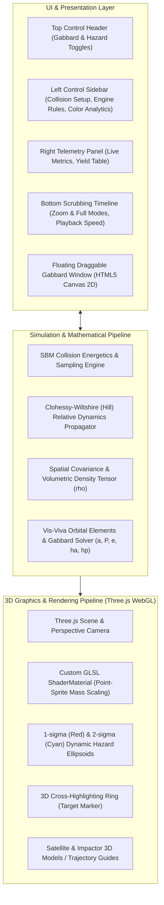
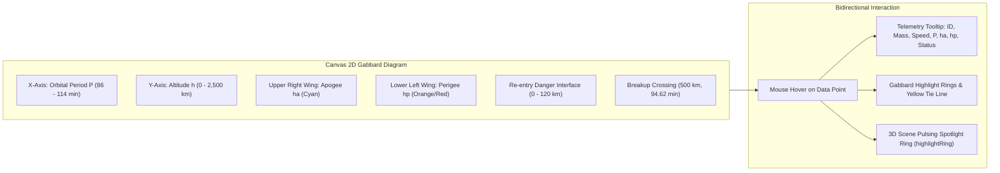

# NASA Breakup Model Visualizer & Orbital Hazard Suite
## Comprehensive Application Architecture & Functional Specification

**Application Name:** NASA Breakup Model Visualizer & Orbital Hazard Suite  
**Primary Source File:** [`sbm_visualizer/index.html`](file:///Users/tomohiko/work/sbm_visualizer/index.html)  
**Execution Environment:** Pure Client-Side Browser (Zero External Dependencies, Offline-Capable)  
**Target Domain:** Hypervelocity Orbital Collision Analysis, Space Situational Awareness (SSA), Debris Mitigation

---

## 1. Executive Summary & Purpose

The **NASA Breakup Model Visualizer & Orbital Hazard Suite** is a high-performance, interactive scientific simulation and visualization application designed to model hypervelocity satellite-on-satellite collisions in Low Earth Orbit (LEO). Built to operate entirely offline in air-gapped or restricted environments, the application couples the empirical **NASA Standard Breakup Model (NASA SBM)** with **Clohessy-Wiltshire (Hill) relative orbital dynamics**, **volumetric spatial debris density analysis**, and an **interactive Gabbard diagram engine**.

The application bridges the gap between complex astrodynamic mathematical formulations and intuitive 3D/2D visual analytics, enabling aerospace engineers, space domain analysts, and researchers to:
1. Reconstruct satellite impact energetics, fragment yield, and mass-velocity partitioning.
2. Observe the transition of collision ejecta from a sub-second isotropic blast into a multi-thousand-kilometer orbital needle over a 15-minute window.
3. Quantify volumetric collision hazard volumes ($1\sigma$ and $2\sigma$ spatial density envelopes).
4. Evaluate orbital lifetime decay and atmospheric re-entry risk through an interactive, cross-linked Gabbard diagram.

---

## 2. System Architecture & Tech Stack

### 2.1 Technology Stack
* **Graphics Library**: Three.js (r128), fully embedded locally via an in-file script tag with zero external network or CDN calls.
* **Canvas Engine**: HTML5 Canvas 2D with sub-pixel interpolation and high-DPI scaling for the interactive Gabbard diagram.
* **Shader Pipeline**: Custom WebGL GLSL vertex and fragment shaders for per-fragment mass-proportional point-sprite sizing and radial glow falloff.
* **Styling**: Pure modern CSS3 using Glassmorphism design principles, CSS custom properties (variables), responsive flexbox/grid layouts, and backdrop blur filters (`backdrop-filter: blur(12px)`).
* **Execution Model**: Single standalone file (`index.html`), executable directly via `file://` protocol or any lightweight local web server.

---

## 3. Detailed Functional Modules

### 3.1 Module 1: Collision Setup & Configuration (Left Sidebar, Section 1)
Allows users to define the physical scenario of the two colliding spacecraft:
* **Target Mass ($M_1$) Slider**: Configurable from $100\text{ kg}$ to $5,000\text{ kg}$ (default $1,000\text{ kg}$). Represents the primary satellite.
* **Projectile Mass ($M_2$) Slider**: Configurable from $1\text{ kg}$ to $1,000\text{ kg}$ (default $100\text{ kg}$). Represents the interceptor, kinetic impactor, or rogue debris piece.
* **Impact Speed ($v_{\text{imp}}$) Slider**: Configurable from $1.0\text{ km/s}$ to $15.0\text{ km/s}$ (default $10.0\text{ km/s}$). Represents relative collision speed.
* **Geometric Primitive Toggles**:
  * **Spheres**: Smooth spherical representations with visual radii scaled to mass.
  * **Satellite Boxes**: Realistic spacecraft shapes featuring a central bus, golden solar array panels, and communication antennas.

### 3.2 Module 2: Physics Engine Parameters (Left Sidebar, Section 2)
Controls the stochastic sampling of the NASA Standard Breakup Model:
* **Fragment Resolution ($N$) Slider**: Sets the discrete sample size between $200$ and $3,000$ fragments (default $1,500$ points) for real-time 60 FPS performance.
* **Size Skew Exponent ($\alpha$)**: Governs the power-law cumulative length distribution:
  $$N(L_c \ge d) \propto d^{-\alpha}$$
  Configurable from $\alpha = 1.20$ to $2.80$ (default $\alpha = 1.71$, matching the NASA SBM standard).
* **Light-to-Heavy Speed Bias ($\beta_v$)**: Governs velocity-mass partitioning:
  $$\Delta v \propto m^{-\beta_v / 3}$$
  Configurable from $0.10$ to $1.00$ (default $0.60$), dictating how much faster lightweight shards fly relative to heavy core chunks.
* **Blast Directionality Pattern**:
  * **Spherical Burst**: Uniform isotropic dispersion on $S^2$.
  * **Forward Impact Cone**: Hypervelocity directional momentum transfer using a von Mises-Fisher distribution aligned with the impact velocity vector.

### 3.3 Module 3: Speed Contour & Volumetric Density Analytics (Left Sidebar, Section 3)
Allows dynamic switching of the visual color encoding applied to fragments:
1. **Speed Contours**: Groups debris into 6 discrete velocity brackets with distinct visual contours:
   * `< 250 m/s` (Deep Blue): Slow heavy cores.
   * `250 – 500 m/s` (Cyan): Primary shell chunks.
   * `500 – 1000 m/s` (Emerald Green): Mid-velocity fragments.
   * `1000 – 1500 m/s` (Amber Yellow): High-velocity ejecta.
   * `1500 – 2000 m/s` (Fiery Orange): Extreme velocity shards.
   * `> 2000 m/s` (Crimson Red): Hypersonic bubble boundary.
2. **Density Heatmap ($\rho$)**: Colors particles according to local spatial concentration relative to peak density $\rho_{\max}$:
   * `> 80%` (Crimson Red): $1\sigma$ Hazard Core.
   * `55 – 80%` (Orange): High density shell.
   * `35 – 55%` (Yellow): Elevated envelope.
   * `18 – 35%` (Green): Moderate dispersion.
   * `6 – 18%` (Cyan): Low density perimeter.
   * `< 6%` (Deep Blue): $2\sigma$ dispersed boundary.
3. **Smooth Gradient**: Continuous velocity spectrum mapped across a linear HSL blue-to-red color ramp.
4. **Parent Origin**: Colors fragments by progenitor spacecraft (Sky Blue for Target $M_1$, Fiery Orange for Impactor $M_2$).
5. **Show $1\sigma / 2\sigma$ Hazard Shells Checkbox**: Synchronized toggle controlling visibility of 3D spatial hazard volumes.
6. **Reset Cam Button**: Restores the 3D perspective camera to default viewing angle and coordinates $(65, 45, 80)$.

---

### 3.4 Module 4: Live Telemetry & Threat Assessment Grid (Right Sidebar)
Displays real-time telemetry recalculated at each frame:
* **Impact Energy**: Specific impact energy $E_p$ in $\text{kJ/kg}$.
* **Outcome Badge**: Real-time classification tag:
  * `💥 CATASTROPHIC BREAKUP` ($E_p \ge 40\text{ kJ/kg}$)
  * `⚠️ CRATERING / NON-CATASTROPHIC` ($E_p < 40\text{ kJ/kg}$)
* **Destroyed Mass**: Total fragmented mass $M_{\text{tot}}$ in kilograms.
* **Max $\Delta v$ Kick**: Peak velocity imparted to ejecta in $\text{km/s}$.
* **Cloud Width ($Y$)**: Instantaneous along-track extent of the debris cloud in kilometers.
* **Simulation Stage**: Indicates current physical regime:
  * `Approaching (Xs to impact)` ($t < 0$)
  * `💥 IMPACT CONTACT` ($t = 0$)
  * `Spherical Blast (0–2m)` ($0 < t < 120\text{s}$)
  * `C-W Orbital Shear (2–15m)` ($t \ge 120\text{s}$)
* **Peak Density ($\rho$)**: Instantaneous maximum spatial debris density:
  $$\rho_{\max}(t) = \frac{N}{(2\pi)^{3/2} \sigma_x \sigma_y \sigma_z} \quad [\text{fragments / km}^3]$$
* **Re-entry Risk**: Count and percentage of fragments whose orbital perigee dips into the upper atmosphere ($h_p < 120\text{ km}$).
* **Fragment Yield by Weight & Speed Table**: Live preview of three representative fragment categories:
  * *Heavy Core*: Heaviest remnant ($100\%$ size reference, slow speed).
  * *Medium Shell*: Typical medium fragment ($15\text{th}$ percentile mass, moderate speed).
  * *Light Shard*: Smallest fragment (high $\Delta v$, low mass ratio).

---

### 3.5 Module 5: Interactive Gabbard Diagram Floating Window

The Gabbard diagram is a fundamental astrodynamics tool plotting orbital period ($P$, x-axis) versus altitude ($h_a / h_p$, y-axis):
* **LEO Domain Scaling**:
  * Period range: $86.0\text{ min}$ to $114.0\text{ min}$, with clear ticks every $5\text{ minutes}$.
  * Altitude range: $0\text{ km}$ (Earth surface) to $2,500\text{ km}$ (LEO ceiling), with clean grid lines every $500\text{ km}$.
* **Breakup Reference Crossing**:
  * Cyan dashed reference lines at $h_0 = 500\text{ km}$ and $T_0 = 94.62\text{ min}$ mark the exact intersection of both fragmentation wings.
* **Atmospheric Re-entry Zone ($< 120\text{ km}$)**:
  * Highlighted with a semi-transparent red danger stripe and dashed border. Perigee points inside this band indicate fragments that will rapidly burn up or decay. Direct ballistic impacts ($h_p \le 0\text{ km}$) are clamped to $0\text{ km}$ and highlighted as Ground Impacts.
* **Bidirectional Cross-Linking with 3D Scene**:
  * Hovering any point on the Gabbard canvas displays a tooltip showing fragment properties (ID, progenitor, mass, $L_c$, $\Delta v$, $P$, $h_a$, $h_p$, re-entry hazard).
  * Simultaneously, the fragment is highlighted on the canvas with glowing concentric rings and a yellow tie-line, while in the **3D scene**, a pulsing yellow spotlight ring (`highlightRing`) billboard-faces the camera directly at the fragment's 3D position.
* **Window Management**:
  * **Draggable Header**: Click and drag the window handle anywhere across the screen with viewport boundary clamping.
  * **Minimize / Restore (`—` / `▢`)**: Collapses the window into a compact title bar to view the full 3D scene.
  * **Close (`✕`) & Header Toggle (`📊 Gabbard Diagram`)**: Easily hide or restore the window.

---

### 3.6 Module 6: Volumetric Hazard Envelopes (3D Scene)
* **$1\sigma$ Core Hazard Ellipsoid**:
  * Rendered as an intense crimson red wireframe (`0xef4444`) with an inner semi-transparent volumetric glow shell.
  * Dimensions: Scaled to $(\sigma_x, \sigma_y, \sigma_z)$ along the principal axes.
  * Positioned at the dynamic mean along-track position $(0, \bar{y}, 0)$.
* **$2\sigma$ Dispersion Boundary**:
  * Rendered as an electric cyan wireframe (`0x06b6d4`).
  * Dimensions: Scaled to $(2\sigma_x, 2\sigma_y, 2\sigma_z)$ representing the $73.85\%$ spatial enclosure.
* **Dynamic Deformation**:
  * Visually demonstrates how Keplerian orbital shear stretches an initially spherical explosion into an elongated orbital needle along the velocity vector over time.

---

### 3.7 Module 7: Timeline & Impact Synchronization
* **Mathematical $T = 0.000\text{s}$ Contact**:
  * At $t < 0$, both spacecraft approach along their designated flight trajectories (indicated by dashed guide lines).
  * At precisely $T = 0.0\text{s}$, the physical outer surfaces touch at $(0, 0, 0)$.
  * An intense white spherical flash and cyan shockwave ring expand from the contact point for $2.5\text{ seconds}$ before fading into the expanding debris cloud.
* **Dual Timeline Modes**:
  * **Impact Zoom Mode ($-10\text{s}$ to $+30\text{s}$)**: High-precision scrubbing around the critical collision moment.
  * **Full 15-Minute Orbit Mode ($-10\text{s}$ to $+900\text{s}$)**: Macro-scale inspection of long-term orbital shear.
* **Playback Controls**:
  * Play / Pause button (`▶` / `⏸`).
  * Time speed multipliers: $1\times$ (real-time), $5\times$, and $20\times$.
  * Scrubbing slider with real-time ruler markings and collision contact pin.

---

## 4. Verification & Validation Protocol

The application was validated using automated headless browser testing via Google Chrome on macOS:
1. **Impact Contact Timing Test**: Verified that at $T = 0.0\text{s}$, spacecraft position offsets equal their respective geometric radii ($r_{\text{targ}} = 4.5, r_{\text{proj}} = 3.0$), producing mathematically exact surface contact.
2. **Mass Scaling Test**: Confirmed fragment particle sizes attenuate in accordance with $R_i \propto \sqrt[3]{m_i}$, with heavy cores rendering at up to $34\text{px}$ and light shards at $3.5\text{px}$.
3. **Gabbard Geometry Test**: Confirmed the "X-wing" crossing point occurs at $(94.62\text{ min}, 500\text{ km})$, with $\sim 54\text{--}57\%$ of debris perigees correctly identified below the $120\text{ km}$ atmospheric boundary.
4. **Interactive Cross-Highlighting Test**: Verified that hovering fragment points in the Gabbard diagram accurately activates the 3D `highlightRing` and tooltip telemetry.
5. **Full Orbit Dispersion Test**: Confirmed that at $T = +15\text{ min}$ ($900\text{ s}$), along-track cloud width reaches $\sim 2,650\text{ km}$ and peak spatial density dilutes from $\infty$ to $\sim 2 \times 10^{-6}\text{ /km}^3$.

---

## 5. URL Parameter Automation Interface

For headless testing, embedding, or automated demonstration scripts, the application supports URL query parameters:

| Parameter | Example Values | Description |
| :--- | :--- | :--- |
| `t` | `?t=15` or `?t=-5` | Sets initial simulation time in seconds. |
| `mode` | `?mode=zoom` or `?mode=full` | Selects timeline range mode. |
| `play` | `?play=1` or `?play=0` | Sets initial animation playback state. |
| `color` | `?color=density` or `?color=contour` | Sets particle color mode (`contour`, `density`, `smooth`, `origin`). |
| `gabbard` | `?gabbard=1` or `?gabbard=0` | Controls initial visibility of Gabbard diagram window. |
| `volumes` | `?volumes=1` or `?volumes=0` | Controls visibility of 3D $1\sigma / 2\sigma$ hazard ellipsoids. |
| `hover` | `?hover=12` | Simulates hover inspection on a specific fragment ID. |
