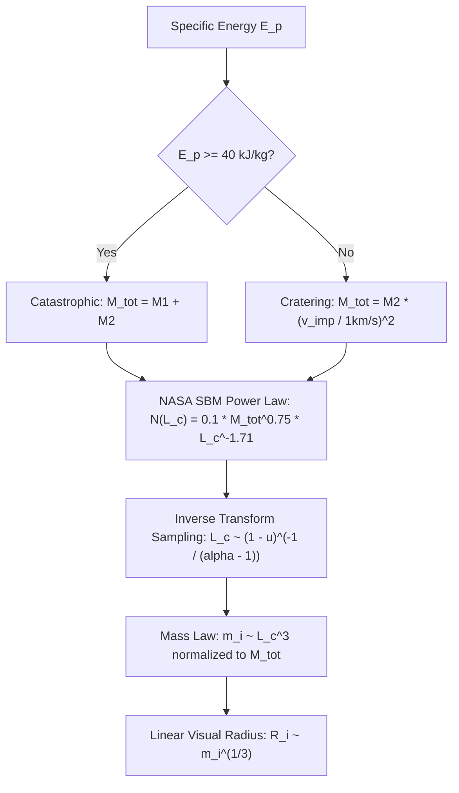
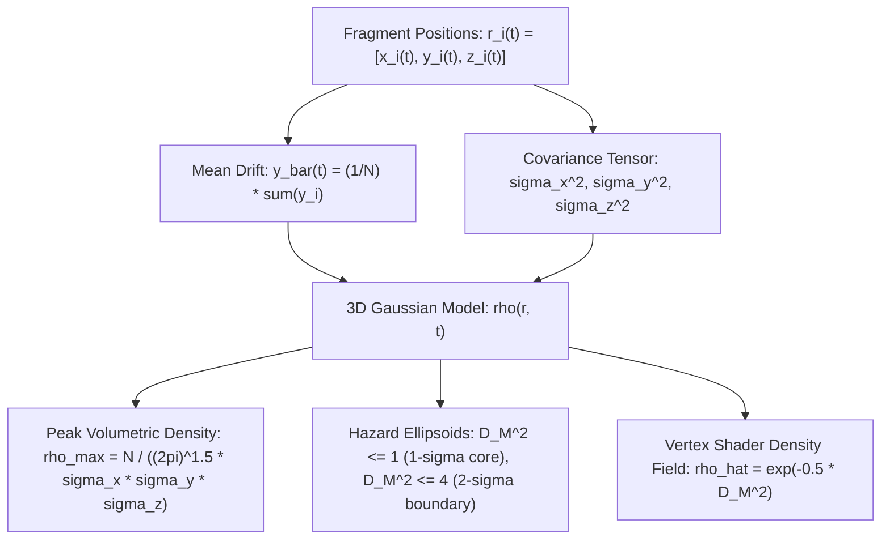
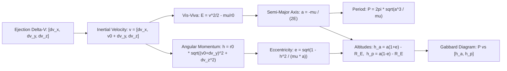

# NASA Standard Breakup Model (SBM) & Orbital Hazard Visualizer
## Detailed Mathematical & Engineering Specification

**Document Version:** 1.0  
**Target System:** High-Precision Browser-Based Orbital Debris & SBM Simulation Engine  
**Core Implementation:** [`sbm_visualizer/index.html`](file:///Users/tomohiko/work/sbm_visualizer/index.html)

---

## 1. Coordinate Frames & Reference Systems

```mermaid
flowchart LR
    subgraph ECI["Earth-Centered Inertial (ECI) Frame"]
        O_E["Earth Center (0,0,0)"] -->|r_0| O_H["Satellite Center of Mass"]
    end
    subgraph LVLH["Hill / LVLH Rotating Frame"]
        O_H -->|+X (Radial)| X_axis["Away from Earth Center"]
        O_H -->|+Y (In-track)| Y_axis["Along Velocity Vector"]
        O_H -->|+Z (Cross-track)| Z_axis["Normal to Orbital Plane"]
    end
```

### 1.1 Earth-Centered Inertial (ECI) Frame $\mathcal{F}_{\text{ECI}}$
* **Origin**: Earth center of mass.
* **Basis Vectors**: $\{\hat{\mathbf{I}}, \hat{\mathbf{J}}, \hat{\mathbf{K}}\}$ (equatorial plane $\hat{\mathbf{I}}-\hat{\mathbf{J}}$, vernal equinox along $\hat{\mathbf{I}}$, polar axis along $\hat{\mathbf{K}}$).
* **Gravitational Parameter**: $\mu_{\oplus} = G M_{\oplus} = 3.986004418 \times 10^{14} \text{ m}^3 / \text{s}^2$.
* **Mean Earth Radius**: $R_{\oplus} = 6378.137 \text{ km}$.

### 1.2 Local-Vertical Local-Horizontal (LVLH / Hill) Rotating Frame $\mathcal{F}_{\text{LVLH}}$
The simulation origin $\mathbf{O}_{\text{LVLH}} = (0, 0, 0)$ is fixed to the unperturbed reference satellite center of mass moving on a circular reference orbit of altitude $h_0 = 500\text{ km}$:
* **Radial Axis ($\hat{\mathbf{x}}$)**: Pointing radially outward from the Earth's center through the satellite:
  $$\hat{\mathbf{x}} = \frac{\mathbf{r}_0}{\|\mathbf{r}_0\|}$$
* **Along-Track / In-Track Axis ($\hat{\mathbf{y}}$)**: Pointing in the direction of orbital velocity, orthogonal to $\hat{\mathbf{x}}$:
  $$\hat{\mathbf{y}} = \frac{\mathbf{v}_0}{\|\mathbf{v}_0\|} = \hat{\mathbf{z}} \times \hat{\mathbf{x}}$$
* **Cross-Track Axis ($\hat{\mathbf{z}}$)**: Orthogonal to the orbital plane, aligned with the orbital angular momentum vector:
  $$\hat{\mathbf{z}} = \frac{\mathbf{r}_0 \times \mathbf{v}_0}{\|\mathbf{r}_0 \times \mathbf{v}_0\|}$$

The frame rotates with instantaneous orbital angular velocity $\mathbf{\omega} = \omega \hat{\mathbf{z}}$, where:
$$\omega = \sqrt{\frac{\mu_{\oplus}}{r_0^3}} = \sqrt{\frac{3.986004418 \times 10^{14}}{(6878137)^3}} \approx 1.10672 \times 10^{-3} \text{ rad/s}$$

Nominal circular orbital period:
$$T_0 = \frac{2\pi}{\omega} \approx 5677.2 \text{ s} \approx 94.62 \text{ min}$$

Nominal orbital speed:
$$v_0 = \omega r_0 = \sqrt{\frac{\mu_{\oplus}}{r_0}} \approx 7612.6 \text{ m/s}$$

---

## 2. Collision Energetics & Regime Classification

### 2.1 Specific Impact Energy ($E_p$)
Let $M_1$ be the target satellite mass, $M_2$ the projectile (impactor) mass, and $v_{\text{imp}}$ the relative impact speed. The specific impact energy relative to target mass is defined as:
$$E_p = \frac{\frac{1}{2} M_2 v_{\text{imp}}^2}{M_1} \quad [\text{J/kg}]$$

In standard units with $M_1, M_2$ in $\text{kg}$ and $v_{\text{imp}}$ in $\text{km/s}$:
$$E_p = \frac{1000 \cdot M_2 v_{\text{imp}}^2}{2 M_1} \quad [\text{kJ/kg}]$$

### 2.2 Breakup Regime Criterion
According to the NASA Standard Breakup Model (Johnson et al., 2001):

$$\text{Regime} = \begin{cases}
\textbf{Catastrophic Breakup} & \text{if } E_p \ge E_p^* = 40.0 \text{ kJ/kg} \\
\textbf{Non-Catastrophic (Cratering)} & \text{if } E_p < 40.0 \text{ kJ/kg}
\end{cases}$$

### 2.3 Total Fragmented Mass ($M_{\text{tot}}$)
* **Catastrophic Breakup**: Complete structural disruption:
  $$M_{\text{tot}} = M_1 + M_2$$
* **Non-Catastrophic (Cratering)**: Localized ejecta with surviving target remnant:
  $$M_{\text{tot}} = M_2 \left(\frac{v_{\text{imp}}}{1.0 \text{ km/s}}\right)^2$$

---

## 3. Fragment Size & Mass Distributions



### 3.1 Cumulative Characteristic Length Distribution
The NASA Standard Breakup Model defines the cumulative number of fragments with characteristic length $L_c \ge d$ (where $d$ is in meters) as:
$$N(L_c \ge d) = 0.10 \, M_{\text{tot}}^{0.75} \, d^{-1.71} \quad (d \ge 0.01\text{ m})$$

The probability density function (PDF) corresponding to this Pareto/power-law distribution is:
$$f_{L_c}(l) = -\frac{d N(L_c \ge l)}{dl} = C \, l^{-\alpha}, \quad \alpha \approx 1.71$$

### 3.2 Inverse Transform Sampling
Given a uniform random variable $u \in [0, 1)$ and minimum cutoff size $L_{\min} = 0.01\text{ m}$:
$$L_c(u) = L_{\min} (1 - u)^{-\frac{1}{\alpha - 1}}$$

In the visualizer, $\alpha$ is parameterizable via slider $\alpha \in [1.2, 2.8]$ with default $\alpha = 1.71$.

### 3.3 Mass Scaling & Conservation
The characteristic volume scales cubically with $L_c$:
$$\tilde{m}_i = \rho_{\text{eff}} L_{c, i}^3$$

To guarantee rigorous physical mass conservation over the discrete sample population of $N$ fragments:
$$m_i = M_{\text{tot}} \cdot \frac{\tilde{m}_i}{\sum_{k=1}^N \tilde{m}_k}$$
$$\sum_{i=1}^N m_i = M_{\text{tot}}$$

### 3.4 Visual Linear Radius Scaling
Since volume $V \propto m$, the visual cross-sectional radius $R_i$ of fragment $i$ must scale as:
$$R_i = R_{\text{ref}} \left(\frac{m_i}{m_{\max}}\right)^{1/3}$$

---

## 4. Fragment Ejection Velocity Distribution ($\Delta \mathbf{v}$)

### 4.1 Velocity Magnitude Distribution
In the NASA SBM, the ejection velocity magnitude $\Delta v$ conditioned on characteristic length $L_c$ follows a log-normal distribution:
$$\log_{10}(\Delta v) \sim \mathcal{N}\left(\mu_v(L_c), \sigma_v^2\right)$$

where:
$$\mu_v(L_c) = \mu_0 - \beta_v \log_{10}(L_c)$$
$$\sigma_v = 0.40$$

In the visualizer, the velocity-size bias parameter $\beta_v \in [0.1, 1.0]$ (default $0.60$) governs the kinetic energy partitioning between light shards and heavy core remnants:
$$\Delta v_i = v_{\text{base}} \cdot \left(\frac{m_{\max}}{m_i}\right)^{\frac{\beta_v}{3}} \cdot \exp\left(\sigma_v Z_i\right), \quad Z_i \sim \mathcal{N}(0, 1)$$

### 4.2 Directional Distributions
1. **Isotropic Spherical Burst ($\text{blastMode} = \text{'sphere'}$)**:
   Sampled uniformly on the unit 2-sphere $S^2$:
   $$\theta = 2\pi u_1, \quad \phi = \arccos(2u_2 - 1), \quad u_1, u_2 \sim \mathcal{U}(0, 1)$$
   $$\hat{\mathbf{d}}_i = \begin{bmatrix} \sin\phi \cos\theta \\ \sin\phi \sin\theta \\ \cos\phi \end{bmatrix}$$

2. **Forward Impact Cone ($\text{blastMode} = \text{'cone'}$)**:
   Sampled using a von Mises-Fisher distribution concentrated around the relative impact direction unit vector $\hat{\mathbf{v}}_{\text{imp}}$:
   $$\hat{\mathbf{d}}_i = \text{normalize}\left(\hat{\mathbf{v}}_{\text{imp}} + \frac{1}{\kappa} \mathbf{\xi}_i\right), \quad \mathbf{\xi}_i \sim \mathcal{N}(\mathbf{0}, \mathbf{I}_3)$$

---

## 5. Clohessy-Wiltshire (Hill) Relative Orbital Propagation

### 5.1 Equations of Motion in Rotating Hill Frame
Linearizing gravitational acceleration around a circular reference orbit of radius $r_0$ with orbital frequency $\omega$:

$$\begin{cases}
\ddot{x} - 2\omega \dot{y} - 3\omega^2 x = 0 & \text{(Radial)} \\
\ddot{y} + 2\omega \dot{x} = 0 & \text{(In-track / Along-track)} \\
\ddot{z} + \omega^2 z = 0 & \text{(Cross-track / Out-of-plane)}
\end{cases}$$

### 5.2 Exact Closed-Form Analytical Solution
With initial contact boundary condition $(x_0, y_0, z_0) = (0, 0, 0)$ at contact instant $t = 0$:

$$\begin{bmatrix} x(t) \\ y(t) \\ z(t) \end{bmatrix} = \mathbf{\Phi}_{rr}(t) \begin{bmatrix} x_0 \\ y_0 \\ z_0 \end{bmatrix} + \mathbf{\Phi}_{rv}(t) \begin{bmatrix} \Delta v_x \\ \Delta v_y \\ \Delta v_z \end{bmatrix}$$

Expanding the state transition submatrix $\mathbf{\Phi}_{rv}(t)$:

$$\begin{aligned}
x(t) &= \frac{\Delta v_x}{\omega} \sin(\omega t) + \frac{2 \Delta v_y}{\omega} (1 - \cos(\omega t)) \\
y(t) &= \frac{2 \Delta v_x}{\omega} (\cos(\omega t) - 1) + \frac{\Delta v_y}{\omega} (4 \sin(\omega t) - 3 \omega t) \\
z(t) &= \frac{\Delta v_z}{\omega} \sin(\omega t)
\end{aligned}$$

### 5.3 Asymptotic Secular Along-Track Shear
Expanding the in-track equation $y(t)$:
$$y(t) = \underbrace{\frac{2\Delta v_x}{\omega}(\cos\omega t - 1) + \frac{4\Delta v_y}{\omega}\sin\omega t}_{\text{Periodic bounded epicyclic oscillation}} \quad - \quad \underbrace{3 \Delta v_y \, t}_{\text{Secular Keplerian drift}}$$

The secular drift term $-3 \Delta v_y t$ arises because a velocity perturbation in the direction of motion ($\Delta v_y > 0$) increases the semi-major axis, which by Kepler's Third Law ($P \propto a^{3/2}$) increases the orbital period, causing the fragment to fall behind the reference origin ($y < 0$). Conversely, $\Delta v_y < 0$ decreases the period, causing the fragment to race ahead ($y > 0$).

Over $t \in [0, 900\text{ s}]$ (15 minutes), with $\Delta v_y \approx \pm 1000\text{ m/s}$:
$$\Delta y_{\text{secular}} \approx 3 \times 1000 \times 900 \approx 2.7 \times 10^6 \text{ m} = 2,700 \text{ km}$$
This causes the initial spherical blast bubble to stretch into a long orbital needle along $Y$.

---

## 6. Spatial Debris Density & 3D Volumetric Hazard Envelopes



### 6.1 Spatial Covariance Tensor
At time $t \ge 0$, the spatial distribution of the cloud is characterized by its empirical first and second central moments:

$$\bar{\mathbf{r}}(t) = \begin{bmatrix} 0 \\ \bar{y}(t) \\ 0 \end{bmatrix}, \quad \bar{y}(t) = \frac{1}{N} \sum_{i=1}^N y_i(t)$$

$$\mathbf{\Sigma}(t) = \text{diag}\left(\sigma_x^2(t), \sigma_y^2(t), \sigma_z^2(t)\right)$$

where:
$$\sigma_x(t) = \sqrt{\frac{1}{N} \sum_{i=1}^N x_i^2(t)}$$
$$\sigma_y(t) = \sqrt{\frac{1}{N} \sum_{i=1}^N (y_i(t) - \bar{y}(t))^2}$$
$$\sigma_z(t) = \sqrt{\frac{1}{N} \sum_{i=1}^N z_i^2(t)}$$

### 6.2 3D Gaussian Density Function
Approximating the spatial cloud density $\rho(x, y, z, t)$ as a 3D anisotropic Gaussian distribution:

$$\rho(x, y, z, t) = \frac{N}{(2\pi)^{3/2} \sigma_x(t) \sigma_y(t) \sigma_z(t)} \exp\left(-\frac{1}{2} \left[ \left(\frac{x}{\sigma_x(t)}\right)^2 + \left(\frac{y - \bar{y}(t)}{\sigma_y(t)}\right)^2 + \left(\frac{z}{\sigma_z(t)}\right)^2 \right]\right)$$

### 6.3 Peak Volumetric Density ($\rho_{\max}$)
At the cloud center $(\bar{x}, \bar{y}, \bar{z}) = (0, \bar{y}(t), 0)$:
$$\rho_{\max}(t) = \frac{N}{(2\pi)^{3/2} s_x(t) s_y(t) s_z(t)} \quad \left[\frac{\text{fragments}}{\text{km}^3}\right]$$
where $s_k(t) = \max(0.05, \sigma_k(t) / 1000.0)$ in kilometers.

* At $t \to 0^+$: $\sigma_x, \sigma_y, \sigma_z \to 0$, yielding $\rho_{\max} \to \infty$ (singularity at collision impact contact).
* At $t = 15\text{ s}$: $\rho_{\max} \approx 6.2 \times 10^{-2}\text{ frags/km}^3$.
* At $t = 450\text{ s}$ ($7.5\text{ min}$): $\rho_{\max} \approx 2.1 \times 10^{-6}\text{ frags/km}^3$ (dilution due to Keplerian along-track dispersion).

### 6.4 Mahalanobis Distance & Hazard Ellipsoids
The normalized distance of any point $\mathbf{r} = (x, y, z)$ from the cloud center is given by the Mahalanobis metric:
$$D_M^2(\mathbf{r}, t) = \left(\frac{x}{\sigma_x(t)}\right)^2 + \left(\frac{y - \bar{y}(t)}{\sigma_y(t)}\right)^2 + \left(\frac{z}{\sigma_z(t)}\right)^2$$

1. **$1\sigma$ Core Hazard Shell** ($D_M \le 1$):
   Encloses $19.87\%$ of all fragments in 3D (the highest probability-of-collision region).
   Semi-axes lengths: $a_x = \sigma_x(t), \; a_y = \sigma_y(t), \; a_z = \sigma_z(t)$.
2. **$2\sigma$ Dispersion Boundary** ($D_M \le 2$):
   Encloses $73.85\%$ of all fragments in 3D.
   Semi-axes lengths: $a_x = 2\sigma_x(t), \; a_y = 2\sigma_y(t), \; a_z = 2\sigma_z(t)$.

### 6.5 Local Relative Density Field ($\hat{\rho}$)
For vertex coloring on the GPU:
$$\hat{\rho}_i = \exp\left(-\frac{1}{2} D_{M, i}^2\right) \in [0, 1]$$

Color mapping thresholds:
$$\text{Color}(\hat{\rho}) = \begin{cases}
\text{#ef4444} \text{ (Core Crimson Red)} & \hat{\rho} \ge 0.80 \\
\text{#f97316} \text{ (High Hazard Orange)} & 0.55 \le \hat{\rho} < 0.80 \\
\text{#eab308} \text{ (Mid-High Amber)} & 0.35 \le \hat{\rho} < 0.55 \\
\text{#10b981} \text{ (Moderate Emerald)} & 0.18 \le \hat{\rho} < 0.35 \\
\text{#06b6d4} \text{ (Low Hazard Cyan)} & 0.06 \le \hat{\rho} < 0.18 \\
\text{#1e3a8a} \text{ (Sparse Outer Deep Blue)} & \hat{\rho} < 0.06
\end{cases}$$

---

## 7. Orbital Elements & Gabbard Diagram Formulation



### 7.1 Inertial State Reconstruction at Breakup
At the breakup instant $t = 0$, the position in ECI coordinates is:
$$\mathbf{r}_{\text{breakup}} = \begin{bmatrix} r_0 \\ 0 \\ 0 \end{bmatrix}, \quad r_0 = R_{\oplus} + h_0 = 6878.137 \text{ km}$$

The inertial velocity vector of fragment $i$ is:
$$\mathbf{v}_{\text{inertial}, i} = \begin{bmatrix} \Delta v_{x, i} \\ v_0 + \Delta v_{y, i} \\ \Delta v_{z, i} \end{bmatrix}$$
where $v_0 = \sqrt{\frac{\mu_{\oplus}}{r_0}} \approx 7612.6\text{ m/s}$.

### 7.2 Specific Orbital Energy & Semi-Major Axis
$$v_i^2 = \Delta v_{x, i}^2 + (v_0 + \Delta v_{y, i})^2 + \Delta v_{z, i}^2$$
$$\mathcal{E}_i = \frac{v_i^2}{2} - \frac{\mu_{\oplus}}{r_0}$$

For bound elliptical orbits ($\mathcal{E}_i < 0$):
$$a_i = -\frac{\mu_{\oplus}}{2\mathcal{E}_i}$$

### 7.3 Orbital Period ($P_i$)
By Kepler's Third Law:
$$P_i = \frac{2\pi}{\sqrt{\mu_{\oplus}}} a_i^{3/2} \quad [\text{seconds}] = \frac{2\pi}{60\sqrt{\mu_{\oplus}}} a_i^{3/2} \quad [\text{minutes}]$$

### 7.4 Eccentricity ($e_i$)
The specific orbital angular momentum magnitude:
$$h_{\text{ang}, i} = r_0 \sqrt{(v_0 + \Delta v_{y, i})^2 + \Delta v_{z, i}^2}$$

The semi-latus rectum $p_i = \frac{h_{\text{ang}, i}^2}{\mu_{\oplus}}$, yielding:
$$e_i = \sqrt{\max\left(0, \; 1 - \frac{p_i}{a_i}\right)}$$

### 7.5 Apogee & Perigee Altitudes ($h_{a, i}, h_{p, i}$)
$$r_{a, i} = a_i (1 + e_i), \quad r_{p, i} = a_i (1 - e_i)$$
$$h_{a, i} = \frac{r_{a, i} - R_{\oplus}}{1000.0} \quad [\text{km}]$$
$$h_{p, i} = \frac{r_{p, i} - R_{\oplus}}{1000.0} \quad [\text{km}]$$

### 7.6 Mathematical Derivation of the Classic "X-Wing" Geometry
To understand why the Gabbard diagram forms its iconic cross ("X-wing") shape, linearize the orbital elements for small in-track velocity perturbations $|\Delta v_y| \ll v_0$ (with $\Delta v_x \approx 0, \Delta v_z \approx 0$):

1. **Specific Energy Perturbation**:
   $$\mathcal{E} \approx \frac{(v_0 + \Delta v_y)^2}{2} - \frac{\mu_{\oplus}}{r_0} \approx \underbrace{\left(\frac{v_0^2}{2} - \frac{\mu_{\oplus}}{r_0}\right)}_{\mathcal{E}_0 = -\frac{\mu_{\oplus}}{2r_0}} + v_0 \Delta v_y$$
2. **Semi-Major Axis Perturbation**:
   $$a = -\frac{\mu_{\oplus}}{2\mathcal{E}} \approx r_0 \left(1 + \frac{2\Delta v_y}{v_0}\right) \implies \Delta a \approx 2 r_0 \frac{\Delta v_y}{v_0}$$
3. **Period Perturbation**:
   $$P \propto a^{3/2} \implies \frac{\Delta P}{T_0} \approx \frac{3}{2} \frac{\Delta a}{r_0} \approx 3 \frac{\Delta v_y}{v_0}$$
4. **Eccentricity Perturbation**:
   Since the breakup occurs at radius $r_0$, the breakup point must remain on the orbit ($r_p \le r_0 \le r_a$):
   * **Case A: $\Delta v_y > 0$ (Forward Ejection)**:
     The breakup point becomes the **perigee** of the new orbit:
     $$r_p \approx r_0 \implies h_p \approx h_0 = 500 \text{ km} \quad (\text{constant lower-right arm})$$
     Since $2a = r_a + r_p \implies r_a = 2a - r_0 \approx r_0 + 4 r_0 \frac{\Delta v_y}{v_0}$:
     $$h_a \approx h_0 + 4 r_0 \frac{\Delta v_y}{v_0} = h_0 + \frac{4}{3} r_0 \frac{\Delta P}{T_0} \quad (\text{upper-right ascending wing})$$
   * **Case B: $\Delta v_y < 0$ (Backward Ejection)**:
     The breakup point becomes the **apogee** of the new orbit:
     $$r_a \approx r_0 \implies h_a \approx h_0 = 500 \text{ km} \quad (\text{constant upper-left arm})$$
     Since $r_p = 2a - r_0 \approx r_0 + 4 r_0 \frac{\Delta v_y}{v_0}$:
     $$h_p \approx h_0 + 4 r_0 \frac{\Delta v_y}{v_0} = h_0 + \frac{4}{3} r_0 \frac{\Delta P}{T_0} \quad (\text{lower-left descending wing})$$

The two branches intersect at the common point $(P, h) = (T_0, h_0) = (94.62\text{ min}, 500\text{ km})$, forming the exact symmetric "X" observed on the canvas.

### 7.7 Atmospheric Re-entry & Ground Impact Criteria
* **Atmospheric Re-entry Interface**:
  $$h_{p, i} < h_{\text{atm}} = 120.0 \text{ km}$$
  Fragments satisfying this condition enter the thermosphere/mesosphere where aerodynamic drag causes rapid orbital decay within hours to days.
* **Direct Ballistic Earth Impact**:
  $$h_{p, i} \le 0.0 \text{ km}$$
  Fragments whose osculating trajectory intersects the solid Earth surface during their very first half-orbit.

---

## 8. Rendering & Shader Formulation

### 8.1 GPU Point-Sprite Perspective Sizing
A custom Three.js `ShaderMaterial` renders fragments with sizes proportional to the physical cube-root mass ratio:

$$\text{gl\_PointSize} = \text{clamp}\left(s_i \cdot \frac{K}{-z_{\text{eye}}}, \; s_{\min}, \; s_{\max}\right)$$

where:
* $s_i = 3.5 + 30.5 \left(\frac{m_i}{m_{\max}}\right)^{1/3} \quad [\text{pixels}]$
* $K = 170.0$ (focal projection constant)
* $z_{\text{eye}}$ is the camera view-space depth ($z_{\text{eye}} < 0$)
* $s_{\min} = 2.5\text{ px}, \; s_{\max} = 75.0\text{ px}$

### 8.2 Radial Gaussian Alpha Falloff
Inside the fragment shader, circular point sprites are smoothed via procedural canvas alpha gradients:
$$\alpha_{\text{frag}}(\mathbf{u}) = \begin{cases}
1.0 & \|\mathbf{u}\| \le 0.3 \\
\frac{1.0 - \|\mathbf{u}\|}{0.7} & 0.3 < \|\mathbf{u}\| \le 1.0 \\
0.0 & \|\mathbf{u}\| > 1.0
\end{cases}$$
with `gl_FragColor = vec4(vColor * tex.rgb, tex.a)` combined with additive blending (`THREE.AdditiveBlending`) to produce an intense, non-saturating optical core.

---

## 9. Parameter Reference Table

| Parameter | Symbol | Nominal Value | Units | Description |
| :--- | :---: | :---: | :---: | :--- |
| Earth Gravitational Parameter | $\mu_{\oplus}$ | $3.986004418 \times 10^{14}$ | $\text{m}^3/\text{s}^2$ | WGS-84 gravitational constant |
| Mean Earth Radius | $R_{\oplus}$ | $6378.137$ | $\text{km}$ | Earth equatorial radius |
| Breakup Reference Altitude | $h_0$ | $500.0$ | $\text{km}$ | Reference circular orbit altitude |
| Reference Orbit Radius | $r_0$ | $6878.137$ | $\text{km}$ | Center of Earth to breakup origin |
| Mean Motion Frequency | $\omega$ | $1.10672 \times 10^{-3}$ | $\text{rad/s}$ | Circular orbit angular velocity |
| Reference Orbital Period | $T_0$ | $94.62$ | $\text{min}$ | Unperturbed orbital period ($5677.2\text{ s}$) |
| Reference Orbital Speed | $v_0$ | $7612.6$ | $\text{m/s}$ | Circular orbital velocity at $h_0$ |
| Catastrophic Threshold | $E_p^*$ | $40.0$ | $\text{kJ/kg}$ | Specific energy threshold for total disruption |
| Cumulative Power-Law Skew | $\alpha$ | $1.71$ | — | NASA SBM fragment count exponent |
| Re-entry Atmospheric Limit | $h_{\text{atm}}$ | $120.0$ | $\text{km}$ | Upper atmospheric decay boundary |
| Spatial Density Cutoff $1\sigma$ | $D_M$ | $1.0$ | — | Core hazard ellipsoid boundary |
| Spatial Density Cutoff $2\sigma$ | $D_M$ | $2.0$ | — | Secondary dispersion boundary |
| Visual Distance Scale | — | $0.01$ | $\text{units/m}$ | $1\text{ Three.js unit} = 100\text{ meters}$ |
