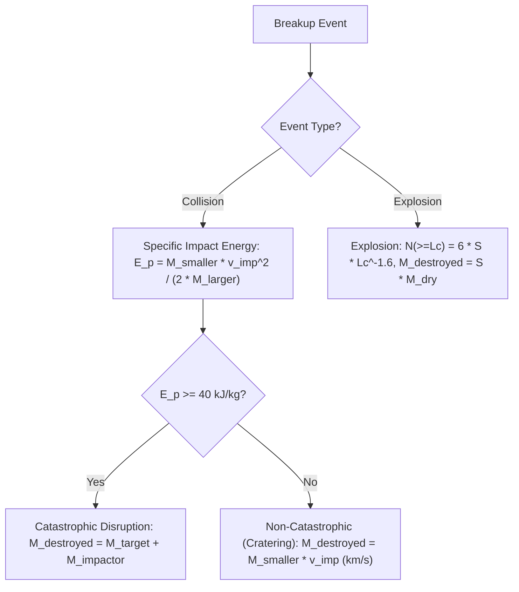
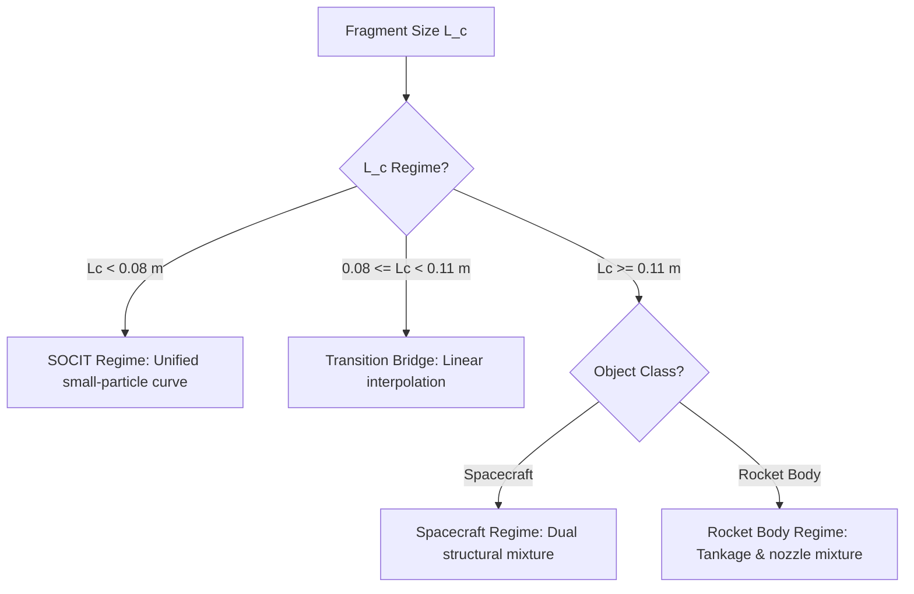
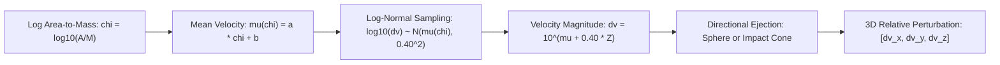
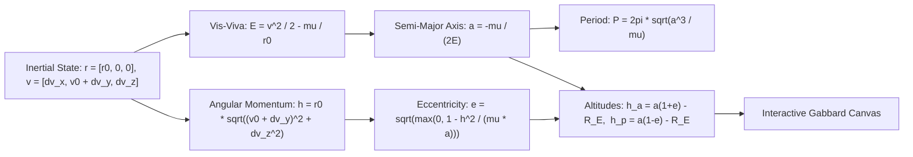

# NASA Standard Breakup Model (EVOLVE 4.0) & Orbital Hazard Visualizer
## Comprehensive Mathematical & Engineering Specification

**Document Version:** 2.0 (NASA EVOLVE 4.0 SBM Alignment)  
**Target System:** High-Precision Browser-Based Orbital Debris Simulation Engine & Rust Analysis CLI  
**Primary Reference:** Johnson, N. L., Krisko, P. H., Liou, J.-C., & Anz-Meador, P. D. (2001). *NASA's new breakup model of EVOLVE 4.0*. Advances in Space Research, 28(9), 1377–1387.  
**Implementations:**
* WebGL / Three.js Visualizer: [`index.html`](file:///Users/tomohiko/work/sbm_visualizer/index.html)
* High-Throughput Rust CLI Engine: [`engine_cli/src/main.rs`](file:///Users/tomohiko/work/sbm_visualizer/engine_cli/src/main.rs)
* Automated Verification Suite: [`tests/test_evolve4_reproduction.py`](file:///Users/tomohiko/work/sbm_visualizer/tests/test_evolve4_reproduction.py)
* Architecture Decision Record: [`docs/adr/ADR-001-nasa-evolve4-breakup-model-alignment.md`](file:///Users/tomohiko/work/sbm_visualizer/docs/adr/ADR-001-nasa-evolve4-breakup-model-alignment.md)

---

## 1. Coordinate Frames & Reference Systems

```mermaid
flowchart LR
    subgraph ECI["Earth-Centered Inertial (ECI) Frame"]
        O_E["Earth Center (0,0,0)"] -->|r_0| O_H["Satellite Center of Mass"]
    end
    subgraph LVLH["Hill / LVLH Rotating Frame"]
        O_H -->|+X (Radial)| X_axis["Away from Earth Center"]
        O_H -->|+Y (In-track)| Y_axis["Along Velocity Vector"]
        O_H -->|+Z (Cross-track)| Z_axis["Normal to Orbital Plane"]
    end
```

### 1.1 Earth-Centered Inertial (ECI) Frame $\mathcal{F}_{\text{ECI}}$
* **Origin**: Center of mass of the Earth.
* **Basis Vectors**: $\{\hat{\mathbf{I}}, \hat{\mathbf{J}}, \hat{\mathbf{K}}\}$ (equatorial plane $\hat{\mathbf{I}}-\hat{\mathbf{J}}$, vernal equinox along $\hat{\mathbf{I}}$, north celestial pole along $\hat{\mathbf{K}}$).
* **Gravitational Parameter**: $\mu_{\oplus} = G M_{\oplus} = 3.986004418 \times 10^{14} \text{ m}^3 / \text{s}^2$ (WGS-84).
* **Mean Earth Radius**: $R_{\oplus} = 6378.137 \text{ km}$.

### 1.2 Local-Vertical Local-Horizontal (LVLH / Hill) Rotating Frame $\mathcal{F}_{\text{LVLH}}$
The origin $\mathbf{O}_{\text{LVLH}} = (0, 0, 0)$ is fixed to the reference satellite center of mass moving on a circular reference orbit of altitude $h_0 = 500.0\text{ km}$:
* **Radial Axis ($\hat{\mathbf{x}}$)**: Pointing radially outward from the Earth center through the satellite:
  $$\hat{\mathbf{x}} = \frac{\mathbf{r}_0}{\|\mathbf{r}_0\|}$$
* **In-Track / Along-Track Axis ($\hat{\mathbf{y}}$)**: Pointing along orbital velocity, orthogonal to $\hat{\mathbf{x}}$:
  $$\hat{\mathbf{y}} = \frac{\mathbf{v}_0}{\|\mathbf{v}_0\|} = \hat{\mathbf{z}} \times \hat{\mathbf{x}}$$
* **Cross-Track / Out-of-Plane Axis ($\hat{\mathbf{z}}$)**: Orthogonal to the orbital plane, aligned with the orbital angular momentum:
  $$\hat{\mathbf{z}} = \frac{\mathbf{r}_0 \times \mathbf{v}_0}{\|\mathbf{r}_0 \times \mathbf{v}_0\|}$$

The frame rotates with instantaneous orbital angular velocity $\mathbf{\omega} = \omega \hat{\mathbf{z}}$, where:
$$\omega = \sqrt{\frac{\mu_{\oplus}}{r_0^3}} = \sqrt{\frac{3.986004418 \times 10^{14}}{(6878137)^3}} \approx 1.10672 \times 10^{-3} \text{ rad/s}$$

Nominal circular orbital period:
$$T_0 = \frac{2\pi}{\omega} \approx 5677.2 \text{ s} \approx 94.62 \text{ min}$$

Nominal circular orbital speed:
$$v_0 = \omega r_0 = \sqrt{\frac{\mu_{\oplus}}{r_0}} \approx 7612.6 \text{ m/s}$$

---

## 2. Breakup Energetics & Event Regimes



The NASA EVOLVE 4.0 model classifies satellite breakups into two physical event regimes: **Hypervelocity Collisions** and **Explosions**.

### 2.1 Hypervelocity Collisions

#### 2.1.1 Specific Impact Energy ($E_p$)
Let $M_{\text{target}}$ be the target satellite mass, $M_{\text{impactor}}$ the projectile mass, and $v_{\text{imp}}$ the relative collision velocity. Defining $M_{\text{smaller}} = \min(M_{\text{target}}, M_{\text{impactor}})$ and $M_{\text{larger}} = \max(M_{\text{target}}, M_{\text{impactor}})$:

$$E_p = \frac{\frac{1}{2} M_{\text{smaller}} v_{\text{imp}}^2}{M_{\text{larger}}} \quad [\text{J/kg}]$$

With masses in kilograms and $v_{\text{imp}}$ in kilometers per second:
$$E_p = \frac{1000 \cdot M_{\text{smaller}} v_{\text{imp, km/s}}^2}{2 M_{\text{larger}}} \quad [\text{kJ/kg}]$$

#### 2.1.2 Breakup Threshold & Destroyed Mass ($M_{\text{destroyed}}$)
Per Johnson et al. (2001, Section 3.1):
* **Catastrophic Collision** ($E_p \ge E_p^* = 40.0\text{ kJ/kg}$):
  Complete fragmentation of both bodies. Total disrupted mass is:
  $$M_{\text{destroyed}} = M_{\text{target}} + M_{\text{impactor}}$$
  Surviving remnant mass: $M_{\text{remnant}} = 0.0\text{ kg}$.

* **Non-Catastrophic (Cratering) Collision** ($E_p < 40.0\text{ kJ/kg}$):
  Localized cratering damage and ejecta generation. The total fragmented mass is defined strictly by the projectile mass and impact speed (page 1379, column 2):
  $$M_{\text{destroyed}} = M_{\text{smaller}} \cdot v_{\text{imp, km/s}} \quad [\text{kg}]$$
  The intact surviving remnant continues in its original orbit with mass:
  $$M_{\text{remnant}} = M_{\text{larger}} - M_{\text{destroyed}}$$

### 2.2 Explosions
Explosive breakups represent internal structural ruptures caused by residual propellants, battery overpressurization, or kinetic energy releases.
* **Disrupted Mass**:
  $$M_{\text{destroyed}} = S \cdot M_{\text{dry}}$$
  where $S \in [0.1, 2.5]$ (nominal $S = 1.0$) is the user-adjustable explosive intensity scaling factor.

---

## 3. Fragment Size & Cross-Sectional Area Distributions

### 3.1 Cumulative Number of Fragments ($N(L_c \ge d)$)
The characteristic length $L_c$ is defined as the average of the maximum dimensions measured along three orthogonal axes:
$$L_c = \frac{x + y + z}{3} \quad [\text{meters}]$$

The cumulative number of fragments with characteristic length $L_c \ge d$ is modeled as:
* **Collisions** (Johnson et al., 2001, Eq. 4):
  $$N(L_c \ge d) = 0.10 \cdot M_{\text{destroyed}}^{0.75} \cdot d^{-1.71} \quad (d \ge 0.01\text{ m})$$
* **Explosions** (Johnson et al., 2001, Eqs. 2 & 3):
  $$N(L_c \ge d) = 6 \cdot S \cdot d^{-1.6} \quad (d \ge 0.01\text{ m})$$

### 3.2 Cross-Sectional Area ($A_x$)
Fragment cross-sectional area $A_x$ relates to $L_c$ through the empirical piecewise formulation determined from US Space Command hypervelocity impact radar data (Johnson et al., 2001, Section 3.3, Eqs. 8 & 9):

$$A_x = \begin{cases}
0.540424 \cdot L_c^2 & \text{if } L_c < 0.00167\text{ m} \\
0.556945 \cdot L_c^{2.0047077} & \text{if } L_c \ge 0.00167\text{ m}
\end{cases} \quad [\text{m}^2]$$

### 3.3 Characteristic Length Sampling
Given a uniform random variable $u \sim \mathcal{U}(0, 1)$, minimum cutoff size $L_{\min} = 0.01\text{ m}$ ($1\text{ cm}$), and power-law exponent $\alpha$ ($\alpha = 1.71$ for collisions, $\alpha = 1.60$ for explosions):

$$L_c(u) = L_{\min} (1 - u)^{-\frac{1}{\alpha - 1}}$$

In both the browser engine and Rust CLI, $L_c$ is capped at a physically realistic maximum $L_{\max} = 10.0\text{ m}$.

---

## 4. Area-to-Mass Ratio ($A/M$) Bimodal Mixture Distribution

In EVOLVE 4.0, the Area-to-Mass ratio distribution is parameterized by the logarithmic transformation:
$$\chi = \log_{10}(A/M) \quad [A/M \text{ in } \text{m}^2/\text{kg}]$$

The probability density function $D_{A/M}(\chi)$ is modeled as a bimodal Gaussian mixture:
$$D_{A/M}(\chi) = \alpha \cdot \mathcal{N}(\mu_1, \sigma_1^2) + (1 - \alpha) \cdot \mathcal{N}(\mu_2, \sigma_2^2)$$

The parameters $(\alpha, \mu_1, \sigma_1, \mu_2, \sigma_2)$ are determined by the object class and fragment size $L_c$ across three distinct regimes:



### 4.1 Rocket Bodies ($L_c \ge 0.11\text{ m}$) — Johnson et al. (2001, Eq. 5)
Let $\lambda_c = \log_{10}(L_c)$.

$$\begin{aligned}
\alpha &= \begin{cases}
1.0 & \lambda_c \le -1.4 \\
1.0 - 0.3571(\lambda_c + 1.4) & -1.4 < \lambda_c < 0.0 \\
0.5 & \lambda_c \ge 0.0
\end{cases} \\
\mu_1 &= \begin{cases}
-0.45 & \lambda_c \le -0.5 \\
-0.45 - 0.9(\lambda_c + 0.5) & -0.5 < \lambda_c < 0.0 \\
-0.9 & \lambda_c \ge 0.0
\end{cases} \\
\sigma_1 &= \begin{cases}
0.55 & \lambda_c \le -0.5 \\
0.55 - 0.1(\lambda_c + 0.5) & \lambda_c > -0.5
\end{cases} \\
\mu_2 &= -0.9 \\
\sigma_2 &= \begin{cases}
0.28 & \lambda_c \le -0.5 \\
0.28 - 0.1(\lambda_c + 0.5) & \lambda_c > -0.5
\end{cases}
\end{aligned}$$

### 4.2 Spacecraft ($L_c \ge 0.11\text{ m}$) — Johnson et al. (2001, Eq. 6)
$$\begin{aligned}
\alpha &= \begin{cases}
0.0 & \lambda_c \le -1.95 \\
0.3 + 0.4(\lambda_c + 1.2) & -1.95 < \lambda_c < 0.55 \\
1.0 & \lambda_c \ge 0.55
\end{cases} \\
\mu_1 &= \begin{cases}
-0.6 & \lambda_c \le -1.1 \\
-0.6 - 0.31(\lambda_c + 1.1) & -1.1 < \lambda_c < 0.0 \\
-0.94 & \lambda_c \ge 0.0
\end{cases} \\
\sigma_1 &= \begin{cases}
0.10 & \lambda_c \le -1.3 \\
0.10 + 0.2(\lambda_c + 1.3) & -1.3 < \lambda_c < -0.3 \\
0.30 & \lambda_c \ge -0.3
\end{cases} \\
\mu_2 &= \begin{cases}
-1.2 & \lambda_c \le -0.7 \\
-1.2 - 0.65(\lambda_c + 0.7) & -0.7 < \lambda_c < -0.1 \\
-1.59 & \lambda_c \ge -0.1
\end{cases} \\
\sigma_2 &= \begin{cases}
0.50 & \lambda_c \le -0.7 \\
0.50 - 0.1(\lambda_c + 0.7) & -0.7 < \lambda_c < -0.3 \\
0.46 & \lambda_c \ge -0.3
\end{cases}
\end{aligned}$$

### 4.3 Small Fragments ($L_c < 0.08\text{ m}$) — SOCIT Formulation (Eq. 7)
Small shards from Satellite Orbital Debris Characterization Impact Test (SOCIT) experiments follow a single size-dependent Gaussian distribution:
$$\begin{aligned}
\alpha_{\text{SOCIT}} &= 1.0 \\
\mu_{\text{SOCIT}} &= \begin{cases}
-0.30 & \lambda_c \le -1.75 \\
-0.30 - 0.3(\lambda_c + 1.75) & -1.75 < \lambda_c < -1.25 \\
-0.45 & \lambda_c \ge -1.25
\end{cases} \\
\sigma_{\text{SOCIT}} &= \begin{cases}
0.2 & \lambda_c \le -3.5 \\
0.2 + 0.2857(\lambda_c + 3.5) & \lambda_c > -3.5
\end{cases}
\end{aligned}$$

### 4.4 Intermediate Bridging ($0.08\text{ m} \le L_c < 0.11\text{ m}$)
To ensure continuity across size regimes, parameters are linearly interpolated between the SOCIT curve ($L_c = 0.08\text{ m}$) and the parent class curve ($L_c = 0.11\text{ m}$):
$$w = \frac{L_c - 0.08}{0.11 - 0.08} \in [0, 1]$$
$$\boldsymbol{\theta}(L_c) = (1 - w) \boldsymbol{\theta}_{\text{SOCIT}}(0.08) + w \boldsymbol{\theta}_{\text{class}}(0.11)$$

---

## 5. Fragment Mass Derivation & Mass Conservation

From the sampled cross-sectional area $A_{x, i}$ and Area-to-Mass ratio $\chi_i = \log_{10}(A/M)_i$:

$$(A/M)_i = 10^{\chi_i} \quad [\text{m}^2/\text{kg}]$$

The unnormalized individual fragment mass $m_i^{\text{raw}}$ is rigorously derived from Johnson et al. (2001, Eq. 10):
$$m_i^{\text{raw}} = \frac{A_{x, i}}{(A/M)_i} \quad [\text{kg}]$$

To enforce exact conservation of the physical destroyed mass $M_{\text{destroyed}}$ across the discrete sampled population:
$$m_i = M_{\text{destroyed}} \cdot \frac{m_i^{\text{raw}}}{\sum_{k=1}^N m_k^{\text{raw}}}$$

This guarantees:
$$\sum_{i=1}^N m_i = M_{\text{destroyed}}$$

---

## 6. Fragment Ejection Velocity Distribution ($\Delta \mathbf{v}$)



### 6.1 Conditioning on Logarithmic Area-to-Mass Ratio
In NASA EVOLVE 4.0, ejection velocity is conditioned directly on $\chi = \log_{10}(A/M)$, reflecting aerodynamic acceleration during explosive/collisional shockwave expansion:

$$\log_{10}(\Delta v) \sim \mathcal{N}\left(\mu_v(\chi), \sigma_v^2\right)$$
where $\sigma_v = 0.40$ (standard deviation of $0.40$ in $\log_{10}$, corresponding to a factor of $10^{0.40} \approx 2.51$).

* **Collisions** (Johnson et al., 2001, Eq. 12):
  $$\mu_v(\chi) = 0.90 \cdot \chi + 2.90$$
  $$\Delta v_i = 10^{\mu_v(\chi_i) + 0.40 \cdot Z_i} \quad [\text{m/s}], \quad Z_i \sim \mathcal{N}(0, 1)$$

* **Explosions** (Johnson et al., 2001, Eq. 11):
  $$\mu_v(\chi) = 0.20 \cdot \chi + 1.85$$
  $$\Delta v_i = 10^{\mu_v(\chi_i) + 0.40 \cdot Z_i} \quad [\text{m/s}], \quad Z_i \sim \mathcal{N}(0, 1)$$

### 6.2 Physical Velocity Clamping
To prevent non-physical extremes from Gaussian distribution tails, $\Delta v$ is clamped to realistic orbital ranges:
$$\Delta v_i \in [0.10 \text{ m/s}, \; 15000.0 \text{ m/s}]$$

### 6.3 Directional Ejection Modes
1. **Isotropic Spherical Burst ($\text{blastMode} = \text{'sphere'}$)**:
   Sampled uniformly on the unit 2-sphere $S^2$:
   $$\theta = 2\pi u_1, \quad \phi = \arccos(2u_2 - 1), \quad u_1, u_2 \sim \mathcal{U}(0, 1)$$
   $$\hat{\mathbf{d}}_i = \begin{bmatrix} \sin\phi \cos\theta \\ \sin\phi \sin\theta \\ \cos\phi \end{bmatrix}, \quad \Delta \mathbf{v}_i = \Delta v_i \hat{\mathbf{d}}_i$$

2. **Forward Impact Cone ($\text{blastMode} = \text{'cone'}$)**:
   Sampled using a concentrated von Mises-Fisher distribution aligned with the relative impact direction $\hat{\mathbf{v}}_{\text{imp}}$:
   $$\hat{\mathbf{d}}_i = \text{normalize}\left(\hat{\mathbf{v}}_{\text{imp}} + \frac{1}{\kappa} \mathbf{\xi}_i\right), \quad \mathbf{\xi}_i \sim \mathcal{N}(\mathbf{0}, \mathbf{I}_3)$$
   where $\kappa = 3.0$ governs cone tightness.

---

## 7. Population Management & Dual-Count Paradigm

Hypervelocity satellite collisions often produce tens of thousands of lethal fragments ($\ge 1\text{ cm}$), exceeding GPU rendering budgets for real-time 60 FPS animation. The visualizer and CLI employ a dual-population accounting framework:

| Metric | Formulation | Description | Typical Value |
| :--- | :---: | :--- | :---: |
| **Physical Yield ($L_c \ge 1\text{ cm}$)** | $N(L_c \ge 0.01) = 0.1 M_{\text{destroyed}}^{0.75} (0.01)^{-1.71}$ | Total lethal orbital debris generated | $\approx 50,000$ |
| **SSN Trackable ($L_c \ge 10\text{ cm}$)** | $N(L_c \ge 0.10) = 0.1 M_{\text{destroyed}}^{0.75} (0.10)^{-1.71}$ | Catalogable by Space Surveillance Network | $\approx 980$ |
| **Visual Sample Budget** | $N_{\text{samples}}$ | High-fidelity representative Monte Carlo particles | $1,500$ |
| **Surviving Remnant Mass** | $M_{\text{larger}} - M_{\text{destroyed}}$ | Intact parent satellite body in cratering events | $\ge 0\text{ kg}$ |

Both telemetry indicators are rendered prominently in the HUD dashboard, ensuring physical fidelity without sacrificing client-side frame rates.

---

## 8. Relative Orbital Propagation: Clohessy-Wiltshire (Hill) Equations

### 8.1 Linearized Equations of Motion
Linearizing orbital dynamics around the circular reference orbit of radius $r_0$ with angular velocity $\omega$:

$$\begin{cases}
\ddot{x} - 2\omega \dot{y} - 3\omega^2 x = 0 & \text{(Radial)} \\
\ddot{y} + 2\omega \dot{x} = 0 & \text{(In-track / Along-track)} \\
\ddot{z} + \omega^2 z = 0 & \text{(Cross-track / Out-of-plane)}
\end{cases}$$

### 8.2 Closed-Form Solution from Contact Boundary Conditions
With initial contact boundary condition $(x_0, y_0, z_0) = (0, 0, 0)$ at contact instant $t = 0$:

$$\begin{aligned}
x(t) &= \frac{\Delta v_x}{\omega} \sin(\omega t) + \frac{2 \Delta v_y}{\omega} (1 - \cos(\omega t)) \\
y(t) &= \frac{2 \Delta v_x}{\omega} (\cos(\omega t) - 1) + \frac{\Delta v_y}{\omega} (4 \sin(\omega t) - 3 \omega t) \\
z(t) &= \frac{\Delta v_z}{\omega} \sin(\omega t)
\end{aligned}$$

### 8.3 Secular Keplerian Along-Track Shear
The in-track coordinate $y(t)$ separates into:
$$y(t) = \underbrace{\frac{2\Delta v_x}{\omega}(\cos\omega t - 1) + \frac{4\Delta v_y}{\omega}\sin\omega t}_{\text{Periodic bounded epicyclic oscillation}} \quad - \quad \underbrace{3 \Delta v_y \, t}_{\text{Secular Keplerian drift}}$$

A forward velocity perturbation ($\Delta v_y > 0$) raises the semi-major axis, increases the orbital period, and causes the fragment to drift backward ($y < 0$). Over 15 minutes ($900\text{ s}$) with $\Delta v_y = \pm 1000\text{ m/s}$, along-track separation spans:
$$\Delta y \approx 3 \times 1000 \times 900 = 2,700 \text{ km}$$
transforming the initial blast sphere into an elongated orbital debris ring.

---

## 9. Spatial Debris Density & Volumetric Hazard Envelopes

### 9.1 Spatial Covariance Tensor
At time $t \ge 0$, the cloud dispersion is governed by its central moments:
$$\bar{\mathbf{r}}(t) = \begin{bmatrix} 0 \\ \bar{y}(t) \\ 0 \end{bmatrix}, \quad \bar{y}(t) = \frac{1}{N} \sum_{i=1}^N y_i(t)$$
$$\mathbf{\Sigma}(t) = \text{diag}\left(\sigma_x^2(t), \sigma_y^2(t), \sigma_z^2(t)\right)$$

$$\sigma_x(t) = \sqrt{\frac{1}{N} \sum_{i=1}^N x_i^2(t)}, \quad \sigma_y(t) = \sqrt{\frac{1}{N} \sum_{i=1}^N (y_i(t) - \bar{y}(t))^2}, \quad \sigma_z(t) = \sqrt{\frac{1}{N} \sum_{i=1}^N z_i^2(t)}$$

### 9.2 Peak Volumetric Density ($\rho_{\max}$)
At cloud center $(\bar{x}, \bar{y}, \bar{z}) = (0, \bar{y}(t), 0)$:
$$\rho_{\max}(t) = \frac{N_{\text{total}}}{(2\pi)^{3/2} s_x(t) s_y(t) s_z(t)} \quad \left[\frac{\text{fragments}}{\text{km}^3}\right]$$
where $s_k(t) = \max(0.05, \sigma_k(t) / 1000.0)$ in kilometers.

### 9.3 Mahalanobis Metric & Hazard Ellipsoids
Normalized ellipsoidal distance:
$$D_M^2(\mathbf{r}, t) = \left(\frac{x}{\sigma_x(t)}\right)^2 + \left(\frac{y - \bar{y}(t)}{\sigma_y(t)}\right)^2 + \left(\frac{z}{\sigma_z(t)}\right)^2$$

* **$1\sigma$ Core Hazard Shell** ($D_M \le 1$): Contains $19.87\%$ of all 3D fragments. Semi-axes: $(\sigma_x, \sigma_y, \sigma_z)$.
* **$2\sigma$ Dispersion Shell** ($D_M \le 2$): Contains $73.85\%$ of all 3D fragments. Semi-axes: $(2\sigma_x, 2\sigma_y, 2\sigma_z)$.

---

## 10. Orbital Elements, Gabbard Diagram & Aerodynamics



### 10.1 Inertial Orbit Reconstruction
At breakup point $\mathbf{r}_0 = [r_0, 0, 0]^T$ with circular speed $v_0 = \sqrt{\mu_{\oplus} / r_0}$:
$$\mathbf{v}_i = \begin{bmatrix} \Delta v_{x, i} \\ v_0 + \Delta v_{y, i} \\ \Delta v_{z, i} \end{bmatrix}, \quad v_i = \|\mathbf{v}_i\|$$

$$\mathcal{E}_i = \frac{v_i^2}{2} - \frac{\mu_{\oplus}}{r_0}, \quad a_i = -\frac{\mu_{\oplus}}{2\mathcal{E}_i}, \quad P_i = \frac{2\pi}{60\sqrt{\mu_{\oplus}}} a_i^{3/2} \quad [\text{min}]$$

$$h_{\text{ang}, i} = r_0 \sqrt{(v_0 + \Delta v_{y, i})^2 + \Delta v_{z, i}^2}, \quad e_i = \sqrt{\max\left(0, \; 1 - \frac{h_{\text{ang}, i}^2}{\mu_{\oplus} a_i}\right)}$$

$$h_{a, i} = a_i (1 + e_i) - R_{\oplus}, \quad h_{p, i} = a_i (1 - e_i) - R_{\oplus} \quad [\text{km}]$$

### 10.2 Ballistic Coefficient & Atmospheric Decay
For orbital lifetime and atmospheric drag calculations, the Ballistic Coefficient $B^*$ is computed from sampled $A/M$:
$$B^* = \frac{1}{2} C_D \left(\frac{A}{M}\right) \quad [\text{m}^2/\text{kg}]$$
where $C_D = 2.2$ is the standard hypersonic drag coefficient for space debris.

* **Atmospheric Re-entry Threshold**: $h_p < 120.0\text{ km}$ (rapid aerodynamic decay).
* **Direct Ground Impact**: $h_p \le 0.0\text{ km}$ (destructive impact within half an orbit).

---

## 11. Three.js GPU Rendering & Visual Mapping

Fragments are rendered via a custom GPU `ShaderMaterial` point sprite system:
$$\text{gl\_PointSize} = \text{clamp}\left(\left(3.5 + 30.5 \left(\frac{m_i}{m_{\max}}\right)^{1/3}\right) \frac{K}{-z_{\text{eye}}}, \; 2.5, \; 75.0\right)$$
where $K = 170.0$ is the focal projection constant and $z_{\text{eye}} < 0$ is the camera view depth.

Local relative density field vertex coloring:
$$\hat{\rho}_i = \exp\left(-\frac{1}{2} D_{M, i}^2\right) \in [0, 1]$$
$$\text{Color}(\hat{\rho}) = \begin{cases}
\text{#ef4444} \text{ (Core Crimson)} & \hat{\rho} \ge 0.80 \\
\text{#f97316} \text{ (Hazard Orange)} & 0.55 \le \hat{\rho} < 0.80 \\
\text{#eab308} \text{ (Mid Amber)} & 0.35 \le \hat{\rho} < 0.55 \\
\text{#10b981} \text{ (Moderate Emerald)} & 0.18 \le \hat{\rho} < 0.35 \\
\text{#06b6d4} \text{ (Low Cyan)} & 0.06 \le \hat{\rho} < 0.18 \\
\text{#1e3a8a} \text{ (Outer Deep Blue)} & \hat{\rho} < 0.06
\end{cases}$$

---

## 12. Parameter Reference Table

| Parameter | Symbol | Nominal Value | Units | Reference / Derivation |
| :--- | :---: | :---: | :---: | :--- |
| Earth Gravitational Parameter | $\mu_{\oplus}$ | $3.986004418 \times 10^{14}$ | $\text{m}^3/\text{s}^2$ | WGS-84 standard |
| Earth Mean Radius | $R_{\oplus}$ | $6378.137$ | $\text{km}$ | WGS-84 reference sphere |
| Reference Orbit Altitude | $h_0$ | $500.0$ | $\text{km}$ | Nominal LEO constellation altitude |
| Reference Orbit Radius | $r_0$ | $6878.137$ | $\text{km}$ | $r_0 = R_{\oplus} + h_0$ |
| Mean Orbital Frequency | $\omega$ | $1.10672 \times 10^{-3}$ | $\text{rad/s}$ | $\omega = \sqrt{\mu / r_0^3}$ |
| Reference Orbital Speed | $v_0$ | $7612.6$ | $\text{m/s}$ | $v_0 = \sqrt{\mu / r_0}$ |
| Reference Orbital Period | $T_0$ | $94.62$ | $\text{min}$ | $T_0 = 2\pi / \omega$ ($5677.2\text{ s}$) |
| Catastrophic Disruption Threshold | $E_p^*$ | $40.0$ | $\text{kJ/kg}$ | Johnson et al. (2001, Section 3.1) |
| Collision Length Exponent | $\alpha_{\text{coll}}$ | $1.71$ | — | Johnson et al. (2001, Eq. 4) |
| Collision Length Multiplier | $c_{\text{coll}}$ | $0.10$ | — | Johnson et al. (2001, Eq. 4) |
| Explosion Length Exponent | $\alpha_{\text{expl}}$ | $1.60$ | — | Johnson et al. (2001, Eqs. 2, 3) |
| Explosion Base Multiplier | $c_{\text{expl}}$ | $6.0$ | — | Johnson et al. (2001, Eqs. 2, 3) |
| Small Fragment Area Coeff. | $c_{A, \text{small}}$ | $0.540424$ | — | Johnson et al. (2001, Eq. 8) |
| Large Fragment Area Coeff. | $c_{A, \text{large}}$ | $0.556945$ | — | Johnson et al. (2001, Eq. 9) |
| Large Fragment Area Exponent | $\beta_A$ | $2.0047077$ | — | Johnson et al. (2001, Eq. 9) |
| Area Transition Threshold | $L_{c, \text{trans}}$ | $0.00167$ | $\text{m}$ | Johnson et al. (2001, Section 3.3) |
| $A/M$ SOCIT Transition Bound | $L_{c, \text{socit}}$ | $0.08$ | $\text{m}$ | Johnson et al. (2001, Section 3.2) |
| $A/M$ Parent Class Transition Bound | $L_{c, \text{class}}$ | $0.11$ | $\text{m}$ | Johnson et al. (2001, Section 3.2) |
| Collision Velocity Slope | $a_{v, \text{coll}}$ | $0.90$ | — | Johnson et al. (2001, Eq. 12) |
| Collision Velocity Intercept | $b_{v, \text{coll}}$ | $2.90$ | — | Johnson et al. (2001, Eq. 12) |
| Explosion Velocity Slope | $a_{v, \text{expl}}$ | $0.20$ | — | Johnson et al. (2001, Eq. 11) |
| Explosion Velocity Intercept | $b_{v, \text{expl}}$ | $1.85$ | — | Johnson et al. (2001, Eq. 11) |
| Ejection Velocity Log-Sigma | $\sigma_v$ | $0.40$ | — | Johnson et al. (2001, Eqs. 11, 12) |
| Drag Coefficient | $C_D$ | $2.2$ | — | Hypersonic debris standard |
| Atmospheric Decay Cutoff | $h_{\text{atm}}$ | $120.0$ | $\text{km}$ | Re-entry interface altitude |
