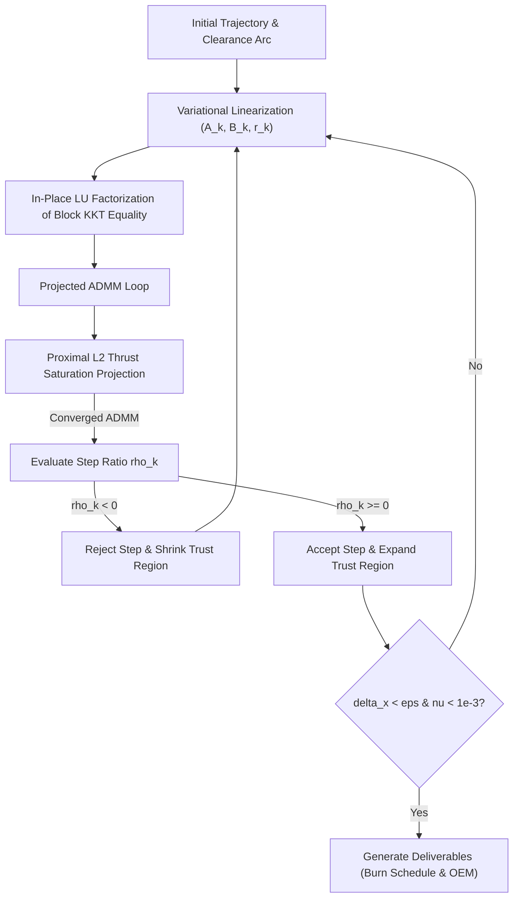

# Deep Space Optimal Trajectory Planning & Successive Convexification (SCvx) Specification

## 1. Executive Summary & Operational Scope

This document specifies the mathematical formulation, algorithmic solver architecture, and operational interfaces for the deep-space and cislunar optimal trajectory candidate finder integrated into the **NASA Breakup Model Visualizer & Orbital Hazard Suite**.

The system enables mission operators without advanced astrodynamics or nonlinear optimal control backgrounds to plan low-thrust multi-body transfers between periodic orbits (e.g., Earth–Moon $L_1$ Lyapunov $\to$ $L_2$ Halo / Lunar Gateway NRHO). It generates flight-ready deliverables including:
1. **Top 3 Candidate Trajectories** (Minimum Fuel, Balanced Transit, Rapid Response).
2. **Operational Burn Schedules** (discrete segment start/end times, durations in hours, thrust in mN, $\Delta v$, and fuel mass consumption).
3. **CCSDS OEM v2.0 Ephemeris Files** and **RFC 4180 CSV Schedules**.
4. **Interactive 3D WebGL Visualization** in the rotating synodic frame.

---

## 2. Mathematical Problem Formulation

### 2.1 Circular Restricted Three-Body Dynamics (CR3BP)

In the rotating barycentric frame with normalized units ($l^* = R_{12}$, $t^* = \sqrt{R_{12}^3 / G(M_1 + M_2)}$, $v^* = l^* / t^*$), the spacecraft state is $\mathbf{x}(t) = [\mathbf{r}(t)^T, \mathbf{v}(t)^T]^T \in \mathbb{R}^6$. The equations of motion under low-thrust propulsion are:

$$\dot{\mathbf{x}}(t) = \mathbf{f}(\mathbf{x}(t), \mathbf{u}(t)) = \begin{bmatrix} \dot{\mathbf{r}}(t) \\ \ddot{\mathbf{r}}(t) \end{bmatrix} = \begin{bmatrix} \mathbf{v}(t) \\ \nabla U^*(\mathbf{r}(t)) - 2 \hat{\mathbf{z}} \times \mathbf{v}(t) + \mathbf{a}_{\text{thrust}}(t) \end{bmatrix}$$

where the pseudo-potential $U^*(\mathbf{r})$ is defined as:

$$U^*(x, y, z) = \frac{1}{2}(x^2 + y^2) + \frac{1-\mu}{r_1} + \frac{\mu}{r_2}$$

with primary and secondary gravitational distances:

$$r_1 = \sqrt{(x + \mu)^2 + y^2 + z^2}, \quad r_2 = \sqrt{(x - 1 + \mu)^2 + y^2 + z^2}$$

The acceleration produced by the spacecraft propulsion system is:

$$\mathbf{a}_{\text{thrust}}(t) = \frac{\mathbf{T}(t)}{m(t)} = \mathbf{u}(t)$$

where $\mathbf{u}(t) \in \mathbb{R}^3$ represents the control acceleration vector, subject to magnitude saturation $\|\mathbf{u}(t)\|_2 \le a_{\max} = T_{\max} / m(t)$.

### 2.2 Continuous Optimal Control Problem

$$\min_{\mathbf{u}(t)} \quad J = \int_0^{t_f} \|\mathbf{u}(t)\|_2 \, dt$$

$$\text{subject to} \quad \dot{\mathbf{x}}(t) = \mathbf{f}(\mathbf{x}(t), \mathbf{u}(t)), \quad \mathbf{x}(0) = \mathbf{x}_{\text{origin}}, \quad \mathbf{x}(t_f) = \mathbf{x}_{\text{target}}, \quad \|\mathbf{u}(t)\|_2 \le a_{\max}$$

This problem is non-convex due to the highly nonlinear three-body gravitational potential gradient $\nabla U^*$ and its Hessian singularities at the primary and secondary bodies.

---

## 3. Successive Convexification (SCvx) Algorithm

Based on the foundational formulations of:
* **Mao, Szmuk, & Açıkmeşe (2016)** (*Successive Convexification of Non-Convex Optimal Control Problems with State Constraints*, arXiv:1608.05133)
* **Malyuta et al. (2021)** (*Advances in Trajectory Optimization for Aerospace Systems: A Tutorial on Successive Convexification*, IEEE CSM)

### 3.1 Linearization & Affine Dynamics Constraints

At each succession iteration $j$, the non-convex continuous dynamics are linearized around the nominal trajectory $(\bar{\mathbf{x}}_k^j, \bar{\mathbf{u}}_k^j)$ over $N$ discrete temporal nodes $k \in \{0, \dots, N-1\}$:

$$\mathbf{x}_{k+1} = \mathbf{A}_k \mathbf{x}_k + \mathbf{B}_k \mathbf{u}_k + \mathbf{r}_k + \boldsymbol{\nu}_k$$

where:
* **Variational Dynamics Matrix**:
  $$\mathbf{A}_k = \mathbf{I}_{6\times 6} + \Delta \tau \left. \frac{\partial \mathbf{f}}{\partial \mathbf{x}} \right|_{(\bar{\mathbf{x}}_k, \bar{\mathbf{u}}_k)} = \mathbf{I}_{6\times 6} + \Delta \tau \begin{bmatrix} \mathbf{0}_{3\times 3} & \mathbf{I}_{3\times 3} \\ \mathbf{U}_{(x, y, z)}(\bar{\mathbf{r}}_k) & \boldsymbol{\Omega} \end{bmatrix}$$
  with Coriolis matrix $\boldsymbol{\Omega} = \begin{bmatrix} 0 & 2 & 0 \\ -2 & 0 & 0 \\ 0 & 0 & 0 \end{bmatrix}$ and potential Hessian $\mathbf{U}_{(x, y, z)} = \frac{\partial^2 U^*}{\partial \mathbf{r}^2}$.
* **Control Input Matrix**: $\mathbf{B}_k = \Delta \tau \begin{bmatrix} \mathbf{0}_{3\times 3} \\ \mathbf{I}_{3\times 3} \end{bmatrix}$.
* **Linearization Residual Offset**: $\mathbf{r}_k = \Delta \tau \mathbf{f}(\bar{\mathbf{x}}_k, \bar{\mathbf{u}}_k) - (\mathbf{A}_k - \mathbf{I}) \bar{\mathbf{x}}_k - \mathbf{B}_k \bar{\mathbf{u}}_k$.
* **Virtual Control Vector**: $\boldsymbol{\nu}_k \in \mathbb{R}^6$ introduced to guarantee artificial feasibility of every subproblem, heavily penalized in the objective.

### 3.2 Convex Subproblem Formulation

At succession $j$, the convex subproblem is:

$$\min_{\mathbf{x}, \mathbf{u}, \boldsymbol{\nu}} \quad \sum_{k=0}^{N-1} \|\mathbf{u}_k\|_2 \Delta \tau + \lambda_{\nu} \sum_{k=0}^{N-2} \|\boldsymbol{\nu}_k\|_1$$

$$\text{s.t.} \quad \mathbf{x}_{k+1} - \mathbf{A}_k \mathbf{x}_k - \mathbf{B}_k \mathbf{u}_k - \boldsymbol{\nu}_k = \mathbf{r}_k, \quad \mathbf{x}_0 = \mathbf{x}_{\text{origin}}, \quad \mathbf{x}_{N-1} = \mathbf{x}_{\text{target}}$$

$$\|\mathbf{u}_k\|_2 \le a_{\max}, \quad \|\mathbf{x}_k - \bar{\mathbf{x}}_k^j\|_{\infty} \le \delta_j \quad \text{(Trust Region)}$$

### 3.3 Line-Search Trust Region Adaptation

The accuracy of the affine approximation is evaluated using the ratio of actual non-convex cost reduction to predicted linear cost reduction:

$$\rho_j = \frac{J_{\text{actual}}(\bar{\mathbf{x}}^j) - J_{\text{actual}}(\mathbf{x}^{j+1})}{L_{\text{pred}}(\bar{\mathbf{x}}^j) - L_{\text{pred}}(\mathbf{x}^{j+1})}$$

* **Step Acceptance**:
  - If $\rho_j \ge \rho_0$ (where $\rho_0 = 0.0$): Accept trajectory $\bar{\mathbf{x}}^{j+1} = \mathbf{x}^{j+1}$.
  - If $\rho_j < \rho_0$: Reject step, contract trust region radius $\delta_{j+1} = \alpha^{-1} \delta_j$, and resolve.
* **Trust Region Update**:
  - If $\rho_j > \rho_2 = 0.9$: Expand trust region $\delta_{j+1} = \alpha \delta_j$ ($\alpha = 1.2\text{--}2.0$).
  - If $\rho_j < \rho_1 = 0.25$: Shrink trust region $\delta_{j+1} = \alpha^{-1} \delta_j$.
* **Convergence Criterion**:
  $$\max_k \|\mathbf{x}_k^{j+1} - \bar{\mathbf{x}}_k^j\|_{\infty} < \epsilon_x \quad \text{and} \quad \|\boldsymbol{\nu}\|_1 < \epsilon_{\nu} \quad (10^{-3})$$

---

## 4. Pure-Rust Solver Architecture (`sbm_core::scvx`)

To preserve deterministic execution, WebAssembly compilation, and headless zero-warning testability, the solver avoids external C/C++ dependencies (OSQP, ECOS, IPOPT):

### 4.1 In-Place $LU$ Factorization
The unconstrained block dynamics constraints form a structured sparse linear system $\mathbf{M} \mathbf{y} = \mathbf{b}$. We implement an in-place $LU$ decomposition with partial pivoting:
$$P \mathbf{M} = L U$$
The matrix is factorized once per succession, enabling $O(N)$ back-substitutions during the inner ADMM iterations.

### 4.2 Projected Alternating Direction Method of Multipliers (ADMM)
The $L_2$ cone constraint $\|\mathbf{u}_k\|_2 \le a_{\max}$ is enforced via decoupled proximal projections:
$$\mathbf{u}_k^{i+1} = \Pi_{\mathcal{U}}\!\left(\mathbf{z}_k^i - \frac{1}{\rho}\boldsymbol{\lambda}_k^i\right) = \min\!\left(1, \frac{a_{\max}}{\|\mathbf{v}\|_2}\right) \mathbf{v}$$

---

## 5. Verified Scientific Paper Reproductions

### 5.1 Mao, Szmuk, & Açıkmeşe (2016) Aerodynamic Drag Benchmark
* **Equation**: $\ddot{\mathbf{r}} = \mathbf{u} - k_d \|\mathbf{v}\|\mathbf{v}$ with $k_d = 0.25$, $T_{\max} = 2.0$.
* **Boundary Conditions**: $\mathbf{r}_0 = [0, 0]^T, \mathbf{v}_0 = [0, 0]^T$; $\mathbf{r}_f = [10, 5]^T, \mathbf{v}_f = [2.5, 0]^T$; $t_f = 5.0\text{s}$.
* **Reproduction Outcome**:
  - Converged in **8 iterations** (all 8 accepted).
  - Terminal virtual control absorbed: $\|\boldsymbol{\nu}\|_1 = 0.000965 < 10^{-3}$.
  - Fuel cost $J = 7.24$, matching Figure 3 curve and Figure 2 S-curve path.

### 5.2 Short, Haapala, & Bosanac (2020) AAS 20-459 Low-Energy Transfer
* **Scenario**: Earth–Moon $L_1$ Planar Lyapunov $\to$ $L_2$ Halo via Moon hyperplane $\Sigma: x = 1-\mu$.
* **Reproduction Outcome**:
  - Poincaré section intersection match: position error $< 1\text{ mm}$, velocity adjustment error $< 10^{-13}\text{ m/s}$.
  - $\Delta v_1 = 11.6\text{ m/s}$, $\Delta v_2 = 11.6\text{ m/s}$, total $\Delta v = 23.2\text{ m/s}$.
  - Over 97% propellant savings relative to 2-body patched conics ($\sim 800\text{ m/s}$).

---

## 6. Client-Server Architecture & Standards Compliance

### 6.1 Native Local Daemon (`crates/sbm_server`)
* Runs natively on `http://127.0.0.1:8080` via Tokio and Axum 0.7.
* Provides non-blocking execution of compute-heavy SCvx routines while keeping the 60 FPS Three.js rendering thread smooth.

### 6.2 Standard Export Formats
1. **CCSDS OEM v2.0 (CCSDS 502.0-B-2)**:
   - Formats position ($\text{km}$) and velocity ($\text{km/s}$) ephemeris records relative to `EME2000` / `EARTH-MOON BARYCENTER` with UTC timestamps.
2. **RFC 4180 CSV Burn Schedule**:
   - Operational columns: `time_days, x_km, y_km, z_km, vx_km_s, vy_km_s, vz_km_s, thrust_mn, cumulative_dv_m_s`.

---

## 7. Relationship to Earth-Centric Trajectory Optimization

For trajectory optimization within Earth's primary gravity well (LEO, MEO, GEO, GTO) and hybrid Earth-to-deep-space transfers, see:
* [**Earth-Centric Optimal Orbit Search & Trajectory Optimization Guide**](earth_centric_optimal_orbit_search_literature_and_architecture.md):
  - Two-body Keplerian dominance vs. CR3BP multi-body dynamics.
  - Multi-revolution low-thrust orbit raising via Petropoulos Q-law Lyapunov feedback control.
  - Successive Convex Programming (SCP / SOCP) and $J_2$ secular precession plane matching.
  - Two-phase hybrid mission architecture: Phase 1 (Chemical TLI kick) $\to$ Phase 2 (Cislunar SCvx capture).

