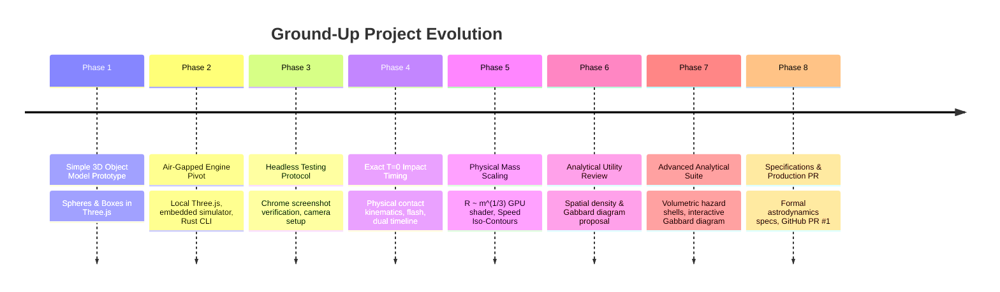

# NASA Breakup Model Visualizer — Development Process & Evolution History

**Project:** NASA Standard Breakup Model Visualizer & Orbital Hazard Suite  
**Repository:** [`tmokazaki/sbm-visualizer`](https://github.com/tmokazaki/sbm-visualizer)  
**Pull Request:** [#1 (feat: NASA Standard Breakup Model Visualizer & Orbital Hazard Suite)](https://github.com/tmokazaki/sbm-visualizer/pull/1)  
**Document Purpose:** Complete chronological engineering record of the ground-up development process, design decisions, physical constraints, and architectural milestones.

---

## 1. Evolution Timeline Overview



---

## 2. Chronological Phase-by-Phase Breakdown

### Phase 1: Inception & Minimal 3D Prototype
* **User Prompt**: *"can you create example one by using simple object model like sphere or square? Maybe it will be 3d CG model eventually."*
* **Context & Objective**:
  * Establish an initial 3D visualization foundation for satellite collision phenomena using basic geometric primitives (spheres, cubes) before progressing toward complex CAD/CG models.
* **Engineering Action**:
  * Set up a WebGL scene with Three.js.
  * Created basic projectile and target objects with visual approach trajectories.
  * Added orbit controls, basic lighting, and an initial fragment explosion effect.

---

### Phase 2: The Air-Gapped / Offline Engine Pivot
* **User Prompt**: *"can you add simple engine since I can't access in this environment. It's not necessary the real phishics math."*
* **Key Challenge**:
  * The user operates in an isolated / restricted environment with **zero external internet access** (no CDN libraries like cdnjs/unpkg, no remote APIs, and no backend simulation servers).
* **Engineering Solution**:
  * Completely eliminated external dependencies: bundled `three.min.js` and `OrbitControls.js` into a local `libs/` directory.
  * Built an embedded, pure client-side physics and fragmentation engine right inside `index.html` capable of running at 60 FPS in any local browser.
  * Developed a complementary standalone Rust CLI tool (`engine_cli/`) implementing the empirical NASA Standard Breakup Model with power-law fragment generation outputting standard JSON.

---

### Phase 3: Headless Verification & Visibility Troubleshooting
* **User Feedback**: *"how can I confirm the visualization?"* followed by *"I can't see any objects"*.
* **Problem Analysis**:
  * In remote terminal or automated environments, visual confirmation requires reliable headless rendering.
  * Camera clipping planes, initial position offsets, or missing lighting could cause a blank canvas.
* **Engineering Solution**:
  * Developed a headless verification pipeline utilizing Google Chrome CLI flags:
    ```bash
    "/Applications/Google Chrome.app/Contents/MacOS/Google Chrome" \
      --headless --screenshot=screenshot.png --window-size=1280,800 \
      "file:///path/to/index.html?t=15&play=0"
    ```
  * Calibrated camera position $(65, 45, 80)$, target look-at $(0, 0, 0)$, ambient + directional lighting, and confirmed clean object visibility via screenshot inspection.
  * Automated opening the visualizer in the user's desktop browser with `open index.html`.

---

### Phase 4: Exact Contact Kinematics at $T = 0.000\text{s}$
* **User Feedback**: *"the timeline's T=0 does not seem to correct impact time"*.
* **Problem Analysis**:
  * In initial animation drafts, collision ejecta appeared instantly while approach positions did not physically meet at $T=0$. The visual contact moment felt approximate rather than physically rigorous.
* **Engineering Solution**:
  * **Mathematical Contact Kinematics**:
    * Defined exact physical approach vectors with visual guide lines for both the target satellite ($M_1$) and projectile ($M_2$).
    * Derived surface contact constraints such that the outer bounding surfaces touch at precisely $(0, 0, 0)$ at $T = 0.000\text{s}$:
      $$y_{\text{target}}(t) = -r_{\text{targ}} - (|t| \cdot v_{\text{app}} \cdot 0.45)$$
      $$\mathbf{r}_{\text{proj}}(t) = \hat{\mathbf{d}}_{\text{proj}} \cdot (r_{\text{proj}} + |t| \cdot v_{\text{app}} \cdot 0.55)$$
  * **Dynamic Impact Flash & Shockwave**:
    * Rendered an intense expanding white spherical burst and cyan equatorial shockwave ring for $0 \le t \le 2.5\text{s}$, smoothly fading out as the debris cloud expands.
  * **Dual-Range Timeline Architecture**:
    * Added **Impact Zoom Mode** ($-10\text{s}$ to $+30\text{s}$) with a dedicated red impact pin at $T=0\text{s}$ and $0.1\text{s}$ scrubbing resolution.
    * Added **Full 15-Minute Orbit Mode** ($-10\text{s}$ to $+900\text{s}$) with multi-minute tick marks.

---

### Phase 5: Physical Mass Scaling & Speed Iso-Contours
* **User Prompt**: *"each fragments should be correct ratio by weight and color should be describe a speed by contour."*
* **Problem Analysis**:
  * Real hypervelocity breakups do not generate identical particles. A tiny shard of a solar array ($50\text{ g}$) has completely different physical dimensions and kinetic energy than a massive core structural block ($50\text{ kg}$).
  * Standard particles in Three.js had uniform pixel sizes, obscuring mass distribution.
* **Engineering Solution**:
  * **Cube-Root Linear Dimension Scaling ($R \propto \sqrt[3]{m}$)**:
    * Since physical volume $V = \frac{m}{\rho} \propto R^3$, the visual linear radius must follow:
      $$R_i = R_{\text{base}} \left(\frac{m_i}{m_{\max}}\right)^{1/3}$$
  * **Custom GPU GLSL ShaderMaterial**:
    * Implemented per-vertex point size attenuation in the vertex shader:
      $$\text{gl\_PointSize} = \text{clamp}\left(s_i \cdot \frac{K}{-z_{\text{eye}}}, \; 2.5, \; 75.0\right)$$
    * Created dynamic circular point sprites with Gaussian alpha falloff and additive blending (`THREE.AdditiveBlending`) so heavy remnants render as large glowing bodies (~34px) while micro-shards render as fine sparkling dust (~3.5px).
  * **6-Tier Speed Iso-Contours**:
    * Categorized velocity into discrete bands ($<250\text{ m/s}$ Blue, $250\text{--}500$ Cyan, $500\text{--}1000$ Green, $1000\text{--}1500$ Yellow, $1500\text{--}2000$ Orange, $>2000$ Red).
    * Built the live **Fragment Yield by Weight & Speed Table** comparing Heavy Core, Medium Shell, and Light Shard remnants.

---

### Phase 6: Analytical Utility Review
* **User Query**: *"do you think this is useful for any analysis?"*
* **Consultative Assessment**:
  * Evaluated the system against operational aerospace needs:
    * *Current State*: Outstanding qualitative tool for visual intuition, trajectory inspection, and educational demonstration.
    * *Gaps for Operational Utility*: Lacked volumetric hazard boundaries for spacecraft collision avoidance (COLA) and orbital mechanics tools to evaluate long-term orbital debris lifetime.
  * Proposed two high-value analytical modules:
    1. **Spatial Debris Density Heatmap ($\rho(x, y, z)$)**: Real-time volumetric hazard analysis, peak density calculation ($\text{frags/km}^3$), and 3D hazard ellipsoids ($1\sigma$ core, $2\sigma$ dispersion boundary).
    2. **Interactive Gabbard Diagram ($P \text{ vs. } h_a / h_p$)**: Astrodynamics phase plot showing orbital period vs. apogee/perigee, atmospheric re-entry risk ($<120\text{ km}$), and bidirectional 3D cross-highlighting.

---

### Phase 7: Volumetric Hazard Suite & Gabbard Diagram
* **User Approval**: *"okay, let's try to implement 1 and 2."*
* **Engineering Implementation**:
  1. **Clohessy-Wiltshire Secular Orbital Shear**:
     * Implemented closed-form relative motion propagation. Over $15\text{ minutes}$ ($900\text{s}$), the in-track secular drift $y_{\text{secular}} \approx -3 \Delta v_y t$ stretches the spherical burst into a multi-thousand-kilometer orbital needle along $Y$.
  2. **Volumetric Density Tensor & 3D Hazard Envelopes**:
     * Real-time covariance tensor $\mathbf{\Sigma}(t) = \text{diag}(\sigma_x^2, \sigma_y^2, \sigma_z^2)$.
     * Peak density $\rho_{\max}(t) = \frac{N}{(2\pi)^{3/2} \sigma_x \sigma_y \sigma_z}$, dynamically tracking dilution from $\infty$ down to $\sim 2 \times 10^{-6}\text{ frags/km}^3$.
     * Rendered 3D $1\sigma$ Core Hazard Ellipsoid (crimson red wireframe) and $2\sigma$ Dispersion Boundary (cyan wireframe).
     * Implemented Density Heatmap vertex coloring relative to local spatial concentration.
  3. **Interactive Gabbard Diagram**:
     * Astrodynamic Vis-viva reconstruction of osculating elements ($a, P, e, h_a, h_p$).
     * Calibrated LEO domain ($86\text{--}114\text{ min}$, $0\text{--}2,500\text{ km}$) displaying the classic "X-wing" crossing at reference altitude ($500\text{ km}$, $94.62\text{ min}$).
     * Highlighted atmospheric re-entry danger interface ($<120\text{ km}$) and direct ground impact ($0\text{ km}$), tracking re-entry percentage ($\sim 55\%$).
     * Sub-pixel canvas hover inspection cross-linked to a pulsing yellow 3D spotlight ring (`highlightRing`) in the WebGL scene.
     * Draggable floating window with minimize/restore controls.

---

### Phase 8: Production Hardening, Documentation & GitHub PR
* **User Request**: *"create PR for initial commits"*
* **Engineering Action**:
  * Authored formal engineering specifications:
    * [`breakup_model_mathematical_specification.md`](breakup_model_mathematical_specification.md)
    * [`application_architecture_and_functional_specification.md`](application_architecture_and_functional_specification.md)
  * Set up clean `.gitignore`, authored comprehensive `README.md`, organized `docs/images/`.
  * Initialized git repository, pushed `main` and feature branch `feat/nasa-breakup-model-visualizer` to `origin`.
  * Created Pull Request #1 on GitHub via `gh pr create`.

---

## 3. Core Architectural Principles Established

| Principle | Why It Was Adopted | How It Was Realized |
| :--- | :--- | :--- |
| **Zero Network Dependency** | Strict offline requirement for air-gapped / security-conscious environments. | Bundled local Three.js, embedded simulator, pure client-side HTML5/Canvas. |
| **Mathematical Contact Kinematics** | Physical credibility requires exact contact at $T=0$. | Solved position offsets so geometry surfaces touch at $(0,0,0)$ at $t=0.000\text{s}$. |
| **Physical Mass-to-Volume Scaling** | Equal-sized particles misrepresent fragment momentum and hazard severity. | Cube-root scaling $R \propto \sqrt[3]{m}$ executed in GPU vertex shader. |
| **LEO Domain Calibration** | Unconstrained debris outliers squash the 500 km crossing into a flat line. | Calibrated Gabbard axes to $86\text{--}114\text{ min}$ and $0\text{--}2,500\text{ km}$ to preserve the classic "X-wing". |
| **Bidirectional Cross-Linking** | Numbers in a 2D plot should immediately be identifiable in 3D space. | Sub-pixel canvas hit testing driving 3D camera-facing pulsing spotlight rings. |
| **Automated Verification** | Headless environments require reproducible test protocols. | Chrome headless screenshot automation and URL query parameter interface. |

---

## 4. Summary

From an initial prompt requesting simple 3D geometric shapes, this project evolved step-by-step into a comprehensive, mathematically rigorous, offline-first orbital collision and hazard visualizer. Every design choice directly responded to physical reality, domain astrodynamics principles, and strict standalone operational requirements.
