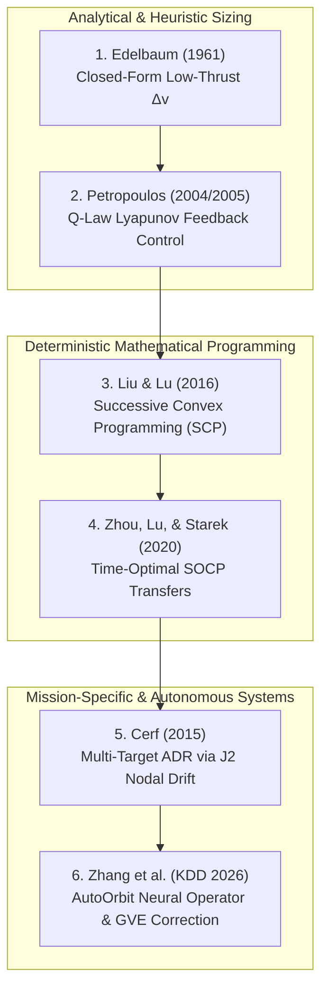

# Earth-Centric Optimal Orbit Search & Trajectory Optimization Guide
## Astrodynamics Formulations, Literature Survey & Architecture Blueprint

---

## 1. Executive Summary & Operational Context

In modern space operations, searching for optimal trajectories in Earth-centric orbit space spans a wide spectrum of operational regimes:
* **Low Earth Orbit (LEO, 200–2,000 km)**: Characterized by 90-minute orbital periods, high orbital velocities ($v \approx 7.5\text{–}7.8\text{ km/s}$), atmospheric drag, and strong non-spherical geopotential perturbations ($J_2\text{--}J_4$).
* **Medium Earth Orbit (MEO, 2,000–35,786 km)**: Navigation constellations (GPS, Galileo), severe Van Allen radiation belts, and multi-body resonance.
* **Geostationary Belt & GTO (35,786 km)**: Geosynchronous communication satellites, high-eccentricity transfer ellipses, and plane change maneuvers ($\Delta i \approx 20^\circ\text{–}28.5^\circ$).
* **Active Debris Removal (ADR) & Satellite Servicing**: Multi-target inspection, constellation phasing, and close-proximity rendezvous operations (RPO).
* **Earth-to-Deep-Space Staging**: Trans-Lunar Injection (TLI), Geostationary Transfer Orbit (GTO) apogee escapes, and cislunar gateway staging.

Unlike deep-space or cislunar regimes governed by multi-body libration point dynamics (CR3BP), Earth-centric trajectory optimization is dominated by **Earth's intense primary gravity well** ($\mu_E = 3.986 \times 10^{14}\text{ m}^3/\text{s}^2$). When continuous low-thrust electric propulsion (EP) is used, spacecraft undergo **hundreds to thousands of orbital revolutions**, rendering naive single-pass collocation or direct trajectory shooting numerically intractable.

This document compiles the **canonical and state-of-the-art literature**, **mathematical formulations**, and **architectural blueprint** for searching and optimizing Earth-centric orbits within the **SBM Visualizer & Astrodynamics Engine**.

---

## 2. Mathematical Formulations & Coordinate Frameworks

### 2.1 Modified Equinoctial Orbital Elements (MEE)

Classical Keplerian orbital elements $(a, e, i, \Omega, \omega, \nu)$ suffer from mathematical singularities at circular ($e = 0$) and equatorial ($i = 0$) orbits. For continuous multi-revolution trajectory optimization, the universal industry standard is the **Modified Equinoctial Element (MEE)** set:

$$\mathbf{oe}_{MEE} = [p, f, g, h, k, L]^T$$

Defined in terms of Keplerian elements as:

$$p = a(1 - e^2)$$
$$f = e \cos(\omega + \Omega)$$
$$g = e \sin(\omega + \Omega)$$
$$h = \tan(i / 2) \cos \Omega$$
$$k = \tan(i / 2) \sin \Omega$$
$$L = \Omega + \omega + \theta \quad (\text{True Longitude})$$

#### Gauss Variational Equations (GVE) in MEE Form
Under thrust acceleration $\mathbf{a}_{\text{thrust}} = [u_r, u_\theta, u_h]^T$ expressed in the Radial-Transverse-Normal (RTN / LVLH) frame:

$$\dot{p} = \frac{2p}{w} \sqrt{\frac{p}{\mu_E}} u_\theta$$
$$\dot{f} = \sqrt{\frac{p}{\mu_E}} \left[ u_r \sin L + \frac{(w+1)\cos L + f}{w} u_\theta - \frac{g (h \sin L - k \cos L)}{w} u_h \right]$$
$$\dot{g} = \sqrt{\frac{p}{\mu_E}} \left[ -u_r \cos L + \frac{(w+1)\sin L + g}{w} u_\theta + \frac{f (h \sin L - k \cos L)}{w} u_h \right]$$
$$\dot{h} = \sqrt{\frac{p}{\mu_E}} \frac{s^2 \cos L}{2w} u_h$$
$$\dot{k} = \sqrt{\frac{p}{\mu_E}} \frac{s^2 \sin L}{2w} u_h$$
$$\dot{L} = \sqrt{\mu_E p} \left(\frac{w}{p}\right)^2 + \frac{1}{w} \sqrt{\frac{p}{\mu_E}} (h \sin L - k \cos L) u_h$$

where $w = 1 + f \cos L + g \sin L$ and $s^2 = 1 + h^2 + k^2$.

---

### 2.2 Analytical Sizing: Edelbaum’s Velocity Formula

For quasi-circular low-thrust transfers between initial orbit $(r_0, i_0)$ and target orbit $(r_f, i_f)$, **Edelbaum (1961)** derived the exact analytical lower bound on the required velocity increment $\Delta v$:

$$\Delta v = \sqrt{v_0^2 - 2 v_0 v_f \cos\left(\frac{\pi}{2} \Delta i\right) + v_f^2}$$

where $v_0 = \sqrt{\mu_E / r_0}$, $v_f = \sqrt{\mu_E / r_f}$, and $\Delta i = |i_f - i_0|$.

* **Application**: Serves as the instantaneous heuristic lower bound for global orbit search, fuel sizing, and $A^*$ / branch-and-bound graph search algorithms.

---

### 2.3 Lyapunov Feedback Control: Petropoulos’ Q-Law

For transfers requiring hundreds to thousands of revolutions, boundary-value numerical collocation is replaced by **Lyapunov feedback guidance** (Petropoulos 2004, 2005). The **Q-law** constructs a proximity quotient function $Q$:

$$Q = \left( 1 + W_P P \right) \sum_{oe \in \{p, f, g, h, k\}} W_{oe} \cdot S_{oe} \cdot \left( \frac{d(oe, oe_{\text{target}})}{\dot{oe}_{xx}} \right)^2$$

where:
1. **$d(oe, oe_{\text{target}})$**: Error between current and target orbital elements.
2. **$\dot{oe}_{xx}$**: Maximum possible instantaneous rate of change of element $oe$ under available thrust $T_{\max}$.
3. **$S_{oe}$**: Dynamic scaling factors balancing semi-major axis, eccentricity, and inclination corrections.
4. **$P$**: Penalty function enforcing minimum periapsis altitude to prevent atmospheric entry during orbit raising:
   $$P = \exp\left[ k_{\text{pen}} \left( 1 - \frac{r_p}{r_{p,\min}} \right) \right]$$
5. **$W_P, W_{oe}$**: User-defined weighting constants.

* **Thrust Steering Law**: The instantaneous thrust angles $(\alpha, \beta)$ in the RTN frame are chosen analytically to maximize the negative time derivative $\dot{Q}$:
  $$\max_{\alpha, \beta} \left( -\dot{Q} \right) = \max_{\alpha, \beta} \left( - \left[ \frac{\partial Q}{\partial \mathbf{oe}} \right]^T \mathbf{M}(\mathbf{oe}, L) \mathbf{u}(\alpha, \beta) \right)$$
* **Coast Arc Detection**: When the maximum attainable $-\dot{Q}$ falls below a cutoff threshold $\eta$, the engine shuts down ($u = 0$), avoiding propellant waste during ineffective orbital phases.

---

### 2.4 Exploiting Earth Oblateness: $J_2$ Secular Precession Drift

In LEO, modifying the Right Ascension of the Ascending Node (RAAN, $\Omega$) directly with propulsion requires immense $\Delta v$ ($\sim \text{km/s}$). Optimal trajectory search algorithms exploit Earth's oblateness ($J_2 = 1.08263 \times 10^{-3}$) secular drift:

$$\dot{\Omega}_{J2} = -\frac{3}{2} J_2 \left(\frac{R_E}{p}\right)^2 n \cos i$$

$$\dot{\omega}_{J2} = \frac{3}{4} J_2 \left(\frac{R_E}{p}\right)^2 n (5 \cos^2 i - 1)$$

where $R_E = 6,378.137\text{ km}$ and $n = \sqrt{\mu_E / a^3}$.

* **Operational Strategy (Cerf 2015)**: To transfer between two debris objects with plane difference $\Delta \Omega$, the spacecraft performs a small radial/tangential burn to raise or lower semi-major axis $a$. The resulting difference in precession rate $\Delta \dot{\Omega} = \dot{\Omega}_1 - \dot{\Omega}_2$ naturally closes the plane gap over days/weeks with **zero additional propellant expenditure**.

---

## 3. Curated Literature Survey & Annotated Bibliography

The following 6 seminal and modern papers represent the pinnacle of optimal trajectory search in Earth-centric space:



---

### 3.1 Petropoulos (2004, 2005) — The Q-Law Method
* **Citations**:
  * Petropoulos, A. E. (2004). *Low-Thrust Orbit Transfers Using Candidate Lyapunov Functions with a Minimum Coast Time.* AAS/AIAA Space Flight Mechanics Meeting, Paper AAS 04-5089.
  * Petropoulos, A. E. (2005). *Refinements to the Q-law for Low-Thrust Orbit Transfers.* AAS/AIAA Astrodynamics Specialist Conference, Paper AAS 05-413.
* **Affiliation**: NASA Jet Propulsion Laboratory (JPL), Pasadena, CA.
* **Core Contribution**: Introduced the feedback Lyapunov function $Q$ in Modified Equinoctial Elements. Solved the "curse of dimensionality" for multi-thousand revolution transfers.
* **Why Operators Rely On It**: Implemented in NASA JPL's **Mystic** and ESA's **ASTROX** mission design software. Computes globally near-optimal trajectories from LEO to GEO in **under 2 seconds** on a standard CPU.

---

### 3.2 Edelbaum (1961) — Closed-Form Low-Thrust Sizing
* **Citation**: Edelbaum, T. N. (1961). *Propulsion Requirements for Controllable Satellites.* ARS Journal (AIAA), Vol. 31, No. 8, pp. 1079–1089.
* **Affiliation**: United Aircraft Corporation, East Hartford, CT.
* **Core Contribution**: The first rigorous mathematical derivation of optimal low-thrust transfer between non-coplanar circular orbits under constant acceleration. Proved that optimum steering combines continuous yaw with out-of-plane steering modulated by $\cos L$.
* **Why Operators Rely On It**: Provides the universal standard initial velocity increment benchmark $\Delta v_{\text{Edelbaum}}$ for sizing satellite propulsion and fuel mass fraction.

---

### 3.3 Liu & Lu (2016) — Successive Convex Programming (SCP)
* **Citation**: Liu, X., & Lu, P. (2016). *Solving Low-Thrust Trajectory Optimization Problems Using Successive Convex Programming.* Journal of Guidance, Control, and Dynamics (JGCD), Vol. 39, No. 8, pp. 1777–1787. [DOI: 10.2514/1.G001712](https://doi.org/10.2514/1.G001712).
* **Affiliation**: San Diego State University & Iowa State University.
* **Core Contribution**: Developed a mathematically rigorous successive convexification framework for Earth orbit transfers. Reformulated non-convex thrust constraints into second-order cones and established artificial feasibility through virtual controls with guaranteed polynomial-time convergence.
* **Why Operators Rely On It**: Eliminates sensitivity to initial guesses that plagued classical indirect methods (calculus of variations) and SQP collocations.

---

### 3.4 Zhou, Lu, & Starek (2020) — Time-Optimal Low-Thrust Transfers
* **Citation**: Zhou, X., Lu, P., & Starek, J. A. (2020). *Rapid Generation of Time-Optimal Low-Thrust Trajectories via Convex Optimization.* Acta Astronautica, Vol. 177, pp. 493–505. [DOI: 10.1016/j.actaastro.2020.08.003](https://doi.org/10.1016/j.actaastro.2020.08.003).
* **Affiliation**: Department of Aerospace Engineering, San Diego State University.
* **Core Contribution**: Solved time-optimal GTO-to-GEO and LEO-to-MEO transfers under non-linear Earth $J_2$ perturbations and solar eclipse constraints (zero thrust during Earth shadow transit) using sequential second-order cone programming (SOCP).
* **Why Operators Rely On It**: Handles operational satellite power constraints (battery depth-of-discharge and solar array shadow periods) without losing convergence.

---

### 3.5 Cerf (2015) — Active Debris Removal (ADR) via $J_2$ Precession Drift
* **Citation**: Cerf, M. (2015). *Multiple Space Debris Removal: Low-Thrust Trajectory Optimization.* Journal of Guidance, Control, and Dynamics, Vol. 38, No. 6, pp. 1074–1085. [DOI: 10.2514/1.G000494](https://doi.org/10.2514/1.G000494).
* **Affiliation**: Airbus Defence and Space, Les Mureaux, France.
* **Core Contribution**: Formulated the global combinatorial and continuous trajectory problem of visiting multiple debris objects in LEO. Demonstrated how $J_2$-induced differential nodal drift allows a single servicer spacecraft to visit 5–10 heavy rocket bodies (SL-8, SL-16) with >80% fuel savings compared to direct plane changes.
* **Why Operators Rely On It**: Serves as the primary trajectory design framework for commercial ADR missions (Astroscale, ClearSpace).

---

### 3.6 Zhang et al. (KDD 2026) — AutoOrbit Neural Propagation & Maneuver Screening
* **Citation**: Zhang, D., Liang, S., Yang, B., Qi, T., Wang, S., & Li, Q. (2026). *AutoOrbit: Physics-Informed Satellite Orbit Prediction.* Proceedings of the 32nd ACM SIGKDD Conference on Knowledge Discovery and Data Mining (KDD '26). [DOI: 10.1145/3770855.3818960](https://doi.org/10.1145/3770855.3818960).
* **Affiliation**: State Key Laboratory of Networking and Switching Technology, Beijing University of Posts and Telecommunications.
* **Core Contribution**: Combined 1D Fourier Neural Operators (FNO) with 4th-order Runge-Kutta physics loss and ground-track recurrence decomposition ($T_{\text{rec}}$) to predict perturbed LEO orbits with $<100\text{ m}$ precision while remaining 1,000x faster than numerical numerical integrators (HPOP).
* **Integration**: Fully integrated into our [`crates/sbm_core/src/autoorbit`](file:///Users/tomohiko/work/sbm_visualizer/crates/sbm_core/src/autoorbit/mod.rs) module for real-time onboard orbit prediction and maneuver recovery.

---

## 4. Cross-Method Comparison Matrix

| Methodology | Best Suited For | Math Formulation | Computational Speed | Global Convergence | Eclipse / Drag Handling |
| :--- | :--- | :--- | :--- | :--- | :--- |
| **Edelbaum (1961)** | Preliminary mission sizing & budget calculation | Analytical closed-form | $< 1\text{ ms}$ | Guaranteed (exact analytical) | No (unperturbed circular) |
| **Petropoulos Q-Law (2004)** | Multi-thousand rev LEO $\to$ GEO/MEO spirals | Lyapunov feedback in MEE | $\approx 0.1\text{–}2.0\text{ s}$ | High ($> 95\%$, heuristic) | Yes (analytic shadow penalty) |
| **Liu & Lu SCP (2016)** | Precise fuel-optimal local transfer refinement | Successive Convex Programming / SOCP | $\approx 2\text{–}10\text{ s}$ | Guaranteed (polynomial time) | Yes (convexified constraints) |
| **Zhou et al. (2020)** | Time-optimal GTO $\to$ GEO with battery limits | Sequential SOCP with eclipse constraints | $\approx 5\text{–}15\text{ s}$ | Guaranteed | Yes (exact shadow duty cycle) |
| **Cerf (2015)** | Multi-target debris removal & rendezvous | Combinatorial $A^*$ + $J_2$ drift transfer | $\approx 10\text{–}60\text{ s}$ | Global combinatorial search | Yes ($J_2$ secular secular model) |
| **AutoOrbit (2026)** | Real-time onboard propagation & screening | FNO1d + Gauss Variational Equations | $< 5\text{ ms}$ | High (data-physics bounded) | Yes ($J_2\text{--}J_4$ + US76 drag) |

---

## 5. Architectural Alignment with the SBM Codebase

The SBM visualizer codebase cleanly decouples Earth-centric astrodynamics, frame transformations, and multi-body deep space optimization:

```
crates/sbm_core/src/
├── autoorbit/             <-- Earth-Centric Dynamics & Machine Learning (KDD 2026)
│   ├── physics.rs         <-- J2-J4 Geopotential, US76 atmospheric drag, SRP
│   ├── maneuver.rs        <-- Gauss Variational Equations (GVE) in Cartesian/Keplerian
│   ├── reference_orbit.rs <-- Ground-track recurrence decomposition (T_rec)
│   ├── fno.rs             <-- 1D Fourier Neural Operator spatiotemporal model
│   └── predictor.rs       <-- AutoOrbit high-precision predictor pipeline
│
├── cr3bp/
│   ├── frames.rs          <-- AAS 20-459 Central Body Inertial (CBI) <-> Rotating Barycentric
│   ├── dynamics.rs        <-- Equations of motion & variational matrix
│   ├── transfer.rs        <-- AAS 20-459 Section 5 3-maneuver itinerary
│   └── types.rs           <-- Earth GEO, GTO, TLI presets & Delta-V calculators
│
└── scvx/
    ├── cr3bp_transfer.rs  <-- Successive Convexification (SCvx) transfer optimizer
    └── admm.rs            <-- Projected ADMM for L2 thrust saturation (||u|| <= T_max)
```

### The Two-Phase Hybrid Transfer Pipeline (LEO $\rightarrow$ Deep Space)

When an operator commands a transfer from an Earth-centric orbit (e.g. LEO at $300\text{ km}$ or GTO apogee) to a deep-space orbit (Artemis Gateway NRHO or $L_1/L_2$ Halo):

1. **Phase 1: Earth-Centric Departure & Staging**:
   * Calculated via [`calculate_tli_impulsive_dv`](file:///Users/tomohiko/work/sbm_visualizer/crates/sbm_core/src/cr3bp/types.rs#L133) based on vis-viva mechanics:
     $$\Delta v_{TLI} = \sqrt{\mu_E \left( \frac{2}{r_p} - \frac{1}{a} \right)} - \sqrt{\frac{\mu_E}{r_p}} \approx 3,106\text{–}3,120\text{ m/s}$$
   * The spacecraft departs LEO on a high-eccentricity transfer ellipse with apogee in the cislunar realm ($r \approx 320,000\text{ km}$).
2. **Phase 2: Frame Conversion & Successive Convexification**:
   * Using [`FrameTransformer::cbi_to_rotating_6d`](file:///Users/tomohiko/work/sbm_visualizer/crates/sbm_core/src/cr3bp/frames.rs#L176), the inertial post-TLI insertion state is rotated and shifted into the CR3BP barycentric frame.
   * [`Cr3bpTransferOptimizer`](file:///Users/tomohiko/work/sbm_visualizer/crates/sbm_core/src/scvx/cr3bp_transfer.rs#L92) applies block KKT convexification and projected ADMM to steer the low-thrust electric engine into final orbit insertion.

---

## 6. Implementation Roadmap for Future Earth-Centric Search Engine

To expand the SBM suite with a full-fledged Earth-centric optimal orbit finder, the following 3-phase roadmap is established:

### Phase 1: Analytical & Q-Law Fast Explorer (Planned)
* **Goal**: Provide instantaneous, non-iterative trajectory generation for multi-revolution LEO $\to$ GEO/MEO transfers.
* **Implementation**:
  * Implement MEE state representations in `crates/sbm_core::autoorbit`.
  * Implement Petropoulos Q-law Lyapunov controller with periapsis altitude penalty and eclipse coast detection.
  * Operator selects: Initial LEO altitude & inclination $\to$ Target GEO $\to$ Generates full 1,000-rev profile in $<2$ seconds.

### Phase 2: Sequential Second-Order Cone Programming (SOCP / SCP)
* **Goal**: High-fidelity local refinement with rigorous optimality guarantees.
* **Implementation**:
  * Discretize the transfer using equinoctial elements across orbital revolutions.
  * Convexify thrust constraints into second-order cones using in-place block solvers.
  * Formulate terminal boundary constraints in MEE with zero print and zero warning policies.

### Phase 3: Multi-Target Combinatorial Search (Active Debris Removal)
* **Goal**: Search optimal sequence and transfer windows across dozens of space debris objects.
* **Implementation**:
  * Formulate $A^*$ tree search or Genetic Algorithm over target debris catalog.
  * Use Cerf's $J_2$ differential nodal drift formulation to calculate propellant-free waiting periods.
  * Output Pareto-optimal frontiers: Flight Time vs. Fuel Expended vs. Debris Mass Cleared.

---

## 7. Recommended References & Reading Sequence

1. **For Immediate Engineering Implementation**:  
   Read **Petropoulos (2004, 2005)** (*Q-law*) for practical, crash-proof multi-revolution low-thrust trajectory generation.
2. **For Mathematical Optimization Theory**:  
   Read **Liu & Lu (2016)** (*Successive Convex Programming*) to understand how to rigorously convexify non-linear orbital dynamics into Second-Order Cone Programming.
3. **For Multi-Target Operational Mission Design**:  
   Read **Cerf (2015)** (*Multiple Space Debris Removal*) to master how real-world commercial missions exploit Earth's $J_2$ gravity field to save thousands of meters per second in velocity budget.
