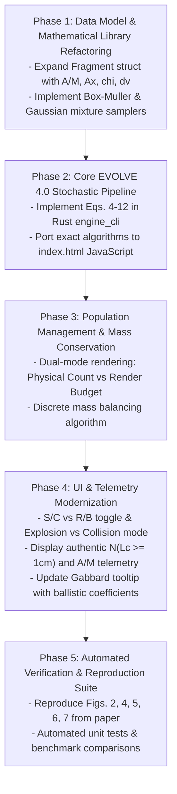

# NASA EVOLVE 4.0 Breakup Model Alignment & Reproduction Plan

**Document Version:** 1.0  
**Target System:** `sbm_visualizer` (WebGL Browser Engine & Rust `engine_cli`)  
**Standard Reference:** Johnson, N. L., Krisko, P. H., Liou, J.-C., & Anz-Meador, P. D. (2001). *"NASA's new breakup model of EVOLVE 4.0"*, *Advances in Space Research*, 28(9), pp. 1377–1384.  
**Related ADR:** [`docs/adr/ADR-001-nasa-evolve4-breakup-model-alignment.md`](file:///Users/tomohiko/work/sbm_visualizer/docs/adr/ADR-001-nasa-evolve4-breakup-model-alignment.md)

---

## 1. Objective & Gap Summary

Quantitative evaluation of the existing code ([`engine_cli/src/main.rs`](file:///Users/tomohiko/work/sbm_visualizer/engine_cli/src/main.rs), [`index.html`](file:///Users/tomohiko/work/sbm_visualizer/index.html)) against the EVOLVE 4.0 paper demonstrated significant divergences:
1. **Area-to-Mass ($A/M$) is absent**: EVOLVE 4.0's bimodal Gaussian mixture distributions for Spacecraft and Rocket Bodies (Eqs. 5–7) are completely unrepresented.
2. **$\Delta v$ is conditioned on $L_c$ instead of $\chi = \log_{10}(A/M)$**: The codebase uses $\sigma = 0.16$ instead of $0.40$ and compresses ejection speeds to an artificial band ($[30, 3200]\text{ m/s}$), failing to reproduce Figure 7.
3. **Mass is computed via an ad-hoc volume power law ($L_c^{2.3}$)**: Rather than being derived from cross-sectional area $A_x$ and area-to-mass ratio ($M = A_x / (A/M)$, Eqs. 8–10).
4. **Non-catastrophic effective mass has up to $+43.6\%$ error**: Due to an unreferenced formula $M_2 (1 + (v/2)^{1.5})$ replacing the paper's $M = M_{\text{smaller}} \cdot v_{\text{imp, km/s}}$.
5. **Fragment populations are decoupled from the physical power law**: Fixed UI sliders under-sample $1\text{ cm}$ fragments by $97\%$ and truncate large fragments $> 22\text{ cm}$.

This document outlines a **5-Phase Engineering Plan** to bring both engines into full mathematical and physical alignment with the paper.

---

## 2. Phase-by-Phase Execution Plan



---

### Phase 1: Data Model & Mathematical Library Refactoring

#### 1.1 Expand Fragment Representation
Update [`Fragment`](file:///Users/tomohiko/work/sbm_visualizer/engine_cli/src/main.rs#L39-L47) in Rust and the JavaScript fragment dictionary in [`index.html`](file:///Users/tomohiko/work/sbm_visualizer/index.html#L1249-L1268):
```rust
pub struct EvolveFragment {
    pub id: usize,
    pub lc_m: f64,              // Characteristic length [m]
    pub ax_m2: f64,             // Cross-sectional area [m^2] (Eqs. 8, 9)
    pub am_ratio: f64,          // Area-to-mass ratio A/M [m^2/kg]
    pub chi: f64,               // log10(A/M)
    pub mass_kg: f64,           // Mass M = Ax / (A/M) [kg] (Eq. 10)
    pub delta_v_mps: f64,       // Ejection speed [m/s] (Eqs. 11, 12)
    pub vel_vec: [f64; 3],      // [Radial (X), In-track (Y), Cross-track (Z)]
    pub origin_type: ObjectType,// Target vs Projectile (Spacecraft / RocketBody)
}
```

#### 1.2 Mathematical Utilities
- Implement robust sampling for 1D Gaussians $\mathcal{N}(\mu, \sigma)$ via Box-Muller or Ziggurat transform.
- Implement two-component Gaussian mixture sampling:
  ```rust
  if rng.next_f64() < alpha {
      rng.rand_normal() * sigma1 + mu1
  } else {
      rng.rand_normal() * sigma2 + mu2
  }
  ```

---

### Phase 2: Core EVOLVE 4.0 Stochastic Engine

#### 2.1 Disruption Regime & Effective Mass (Page 1379)
- **Specific kinetic energy**:
  $$E_p = \frac{\frac{1}{2} M_{\text{smaller}} v_{\text{imp}}^2}{M_{\text{larger}}} \quad [\text{J/kg}]$$
  Catastrophic if $E_p \ge 40,000\text{ J/kg} = 40\text{ kJ/kg}$.
- **Effective Mass $M$**:
  $$M = \begin{cases} M_1 + M_2 & \text{if Catastrophic} \\ M_{\text{smaller}} \cdot v_{\text{imp, km/s}} & \text{if Non-Catastrophic (Cratering)} \end{cases}$$

#### 2.2 Size Distribution Sampling (Eqs. 3, 4)
- **Cumulative number**:
  $$N(L_c \ge d) = \begin{cases} 0.1 M^{0.75} d^{-1.71} & \text{(Collision, Eq. 4)} \\ S \cdot 6 d^{-1.6} & \text{(Explosion, Eq. 3)} \end{cases}$$
- **Characteristic length inverse transform**:
  Given minimum cutoff $L_{\min}$ (e.g. $0.01\text{ m}$) and maximum size $L_{\max}$ (e.g. parent dimensions):
  $$L_c = L_{\min} \cdot \left[ 1 - u \cdot \left(1 - \left(\frac{L_{\min}}{L_{\max}}\right)^{\alpha - 1}\right) \right]^{-\frac{1}{\alpha - 1}}$$
  *(Removes the arbitrary `0.995` factor that was truncating fragments $> 22\text{ cm}$).*

#### 2.3 Area-to-Mass ($A/M$) Distribution (Eqs. 5, 6, 7)
- For $L_c < 0.08\text{ m}$: Evaluate $\mu^{\text{SOC}}(\lambda_c)$ and $\sigma^{\text{SOC}}(\lambda_c)$ from Eq. (7).
- For $L_c \ge 0.11\text{ m}$: Evaluate $\alpha, \mu_1, \sigma_1, \mu_2, \sigma_2$ from Eq. (5) (Rocket Bodies) or Eq. (6) (Spacecraft).
- For $0.08\text{ m} \le L_c < 0.11\text{ m}$: Linear interpolation bridging.

#### 2.4 Cross-Sectional Area $A_x$ & Mass (Eqs. 8, 9, 10)
- $$A_x = \begin{cases} 0.540424 L_c^2 & L_c < 0.00167\text{ m} \\ 0.556945 L_c^{2.0047077} & L_c \ge 0.00167\text{ m} \end{cases}$$
- $$M_i = \frac{A_x}{10^\chi} = \frac{A_x}{(A/M)_i}$$

#### 2.5 Ejection Velocity $\Delta v$ (Eqs. 11, 12)
- Collision: $\nu = \log_{10}(\Delta v) \sim \mathcal{N}(0.90 \chi + 2.90, \; 0.40^2)$
- Explosion: $\nu = \log_{10}(\Delta v) \sim \mathcal{N}(0.20 \chi + 1.85, \; 0.40^2)$
- $\Delta v = 10^\nu \text{ m/s}$

---

### Phase 3: Population Management & Mass Conservation

In physical breakups, the sum of individual masses $\sum M_i$ must not exceed the destroyed parent mass $M_{\text{destroyed}}$.

1. **Dual-Count Mode**:
   - **Physical Count ($N_{\text{physical}}$)**: The true number of physical fragments $N(L_c \ge 1\text{ mm})$ or $N(L_c \ge 1\text{ cm})$, calculated via Eq. (4) and displayed in telemetry.
   - **Render Sample Budget ($N_{\text{render}}$)**: For browser WebGL performance, user selects a sample budget (e.g. $1500$ or $3000$ points) with an automatically calculated lower cutoff $L_{\text{cutoff}}$ such that $N(L_c \ge L_{\text{cutoff}}) = N_{\text{render}}$.
2. **Mass Balancing Pass**:
   - Sample fragments sorted by $L_c$ from largest to smallest.
   - Once cumulative mass approaches $M_{\text{destroyed}}$, cap the smallest remnant fragment or scale fragment masses by $\kappa = M_{\text{destroyed}} / \sum M_i$ to ensure strict conservation while maintaining the sampled $A/M$ log-normal distribution.

---

### Phase 4: UI & Telemetry Modernization

1. **Object Classification Controls**:
   - Add dropdowns: **Target Type** (`Spacecraft` vs `Rocket Body / Upper Stage`) and **Projectile Type** (`Spacecraft` vs `Debris / Shard`).
2. **Breakup Mode Selector**:
   - Add toggle: **Collision** (hypervelocity impact) vs **Explosion** (upper stage propellant / battery failure).
   - In Explosion mode: expose scaling slider $S \in [0.05, 2.0]$ (default $1.0$).
3. **Telemetry & Gabbard Diagram Enhancements**:
   - Add live telemetry:
     - Total Physical Fragments ($N \ge 1\text{ cm}$): e.g. $\sim 50,200$.
     - Mean Area-to-Mass $\langle A/M \rangle$: e.g. $0.12\text{ m}^2/\text{kg}$.
     - Ballistic Coefficient $B^* = \frac{C_D A}{2 M} = \frac{C_D}{2} (A/M)$.
   - Gabbard Diagram Tooltip: Display $A/M$ and Ballistic Coefficient alongside orbital period, apogee, and perigee.

---

### Phase 5: Verification & Reproduction Benchmark Suite

A dedicated automated test suite (`tests/verify_evolve4.py` and `engine_cli/tests/benchmark.rs`) will be implemented to validate output against the five core figures in Johnson et al. (2001):

| Test Case | Paper Reference | Benchmark Target | Acceptance Criterion |
| :--- | :--- | :--- | :--- |
| **Size Distribution (Explosion)** | Figure 2, p. 1379 | $N(L_c) = 6 L_c^{-1.6}$ for upper stages ($600\text{--}1000\text{ kg}$) | Cumulative log-log slope within $\pm 2\%$ of $-1.60$. |
| **Size Distribution (Collision)** | Figure 4, p. 1380 | $N(L_c) = 0.1 M^{0.75} L_c^{-1.71}$ (SOCIT, Solwind P-78) | Cumulative log-log slope within $\pm 2\%$ of $-1.71$. |
| **A/M Scatter vs $L_c$** | Figure 5, p. 1382 | Upper stage scatter: $\log_{10}(A/M) \in [-3, +1]$, peak $\approx -1$ | $95\%$ of samples fall within $[-3.0, +1.0]$. |
| **A/M Histogram (S/C 11–35 cm)** | Figure 6, p. 1382 | Bimodal distribution with peak at $\log_{10}(A/M) \approx -0.96$ | Kolmogorov-Smirnov test $p > 0.05$ against Eq. (6). |
| **Ejection Velocity Distribution** | Figure 7, p. 1383 | Upper stage $\Delta v$ distribution: median $\sim 100\text{--}300\text{ m/s}$, tail $> 1000\text{ m/s}$ | 10th/50th/90th percentiles match Eq. (11) and (12). |

---

## 3. Timeline & Deliverables

1. **Deliverable 1 (Rust Engine CLI)**:
   - Full EVOLVE 4.0 implementation in `engine_cli/src/main.rs`.
   - Unit tests validating Equations (4)–(12).
2. **Deliverable 2 (JavaScript WebGL Engine)**:
   - Updated `runSimpleEngine()` in `index.html`.
   - Dynamic UI toggles for object type and breakup mode.
3. **Deliverable 3 (Documentation & Benchmark Report)**:
   - Automated benchmark script generating verification plots and pass/fail summary.
   - Updated `docs/breakup_model_mathematical_specification.md` reflecting EVOLVE 4.0 mathematics.
