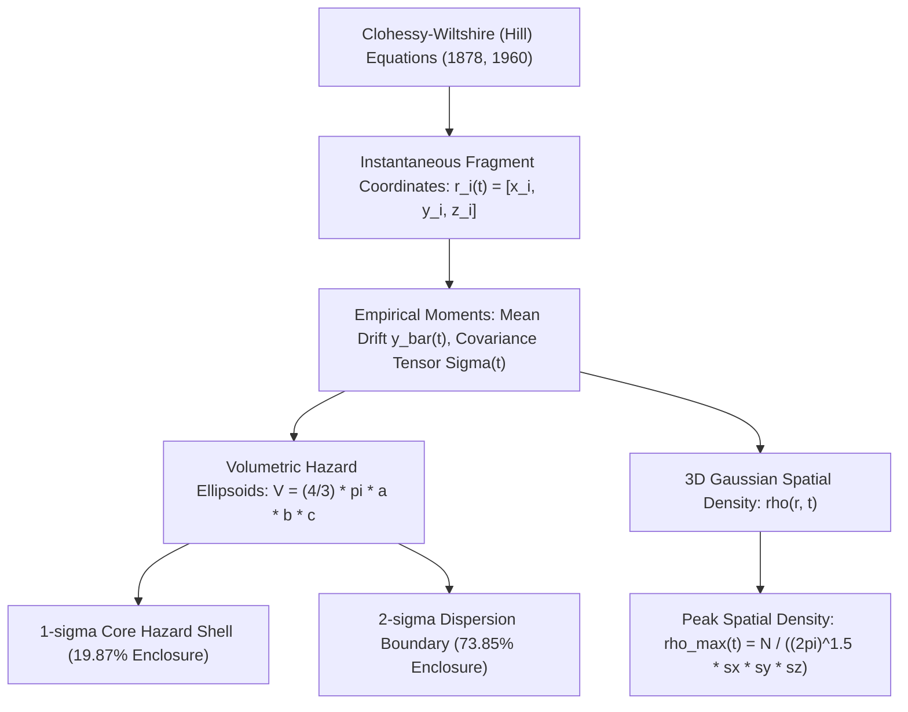
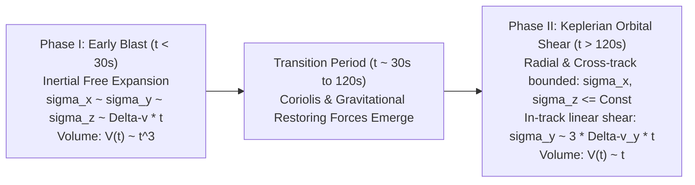

# Volumetric Hazard Analysis & Spatial Debris Density Formulation
## Mathematical Theory, Astrodynamics Derivations, and Academic Citations

**Document Version:** 1.0  
**Application:** NASA Standard Breakup Model Visualizer & Orbital Hazard Suite  
**Repository Source:** [`sbm_visualizer/index.html`](file:///Users/tomohiko/work/sbm_visualizer/index.html)  

---

## 1. Mathematical Formulation of the Hazard Volumes



### 1.1 Kinematic State in the Hill (LVLH) Orbit-Relative Frame
Let the reference orbit be circular at altitude $h_0 = 500\text{ km}$ ($r_0 = R_{\oplus} + h_0 = 6878.137\text{ km}$) with orbital frequency:
$$\omega = \sqrt{\frac{\mu_{\oplus}}{r_0^3}} \approx 1.10672 \times 10^{-3} \text{ rad/s}$$

Following the linearized equations of relative motion formulated by **Hill (1878)** and **Clohessy & Wiltshire (1960)**, the instantaneous position of fragment $i \in \{1, \dots, N\}$ in the rotating Local-Vertical Local-Horizontal (LVLH) coordinate system ($\hat{\mathbf{x}}$ radial, $\hat{\mathbf{y}}$ in-track, $\hat{\mathbf{z}}$ cross-track) at time $t \ge 0$ post-impact is given analytically by:

$$\begin{aligned}
x_i(t) &= \frac{\Delta v_{x, i}}{\omega} \sin(\omega t) + \frac{2 \Delta v_{y, i}}{\omega} (1 - \cos(\omega t)) \\
y_i(t) &= \frac{2 \Delta v_{x, i}}{\omega} (\cos(\omega t) - 1) + \frac{\Delta v_{y, i}}{\omega} (4 \sin(\omega t) - 3 \omega t) \\
z_i(t) &= \frac{\Delta v_{z, i}}{\omega} \sin(\omega t)
\end{aligned}$$

where $(\Delta v_{x, i}, \Delta v_{y, i}, \Delta v_{z, i})$ is the initial ejection velocity vector imparted by the collision shock.

---

### 1.2 Spatial Covariance Tensor & Cloud Centroid
The instantaneous spatial distribution of the fragment cloud is modeled as an evolving 3D Gaussian continuum (see **Letizia et al., 2015**; **Frey & Colombo, 2021**). The centroid of the cloud exhibits secular drift along the velocity vector:

$$\bar{\mathbf{r}}(t) = \begin{bmatrix} \bar{x}(t) \\ \bar{y}(t) \\ \bar{z}(t) \end{bmatrix} = \begin{bmatrix} 0 \\ \frac{1}{N} \sum_{i=1}^N y_i(t) \\ 0 \end{bmatrix}$$

The empirical spatial covariance matrix $\mathbf{\Sigma}(t)$ in principal axes is:

$$\mathbf{\Sigma}(t) = \begin{bmatrix} \sigma_x^2(t) & 0 & 0 \\ 0 & \sigma_y^2(t) & 0 \\ 0 & 0 & \sigma_z^2(t) \end{bmatrix}$$

where the semi-axes (standard deviations) are:
$$\sigma_x(t) = \sqrt{\frac{1}{N} \sum_{i=1}^N x_i^2(t)}$$
$$\sigma_y(t) = \sqrt{\frac{1}{N} \sum_{i=1}^N (y_i(t) - \bar{y}(t))^2}$$
$$\sigma_z(t) = \sqrt{\frac{1}{N} \sum_{i=1}^N z_i^2(t)}$$

---

### 1.3 Mahalanobis Metric & Hazard Enclosure Volumes
The normalized spatial distance of any position $\mathbf{r} = (x, y, z)^T$ relative to the cloud centroid is defined by the **Mahalanobis (1936)** distance metric:

$$D_M^2(\mathbf{r}, t) = (\mathbf{r} - \bar{\mathbf{r}}(t))^T \mathbf{\Sigma}(t)^{-1} (\mathbf{r} - \bar{\mathbf{r}}(t)) = \left(\frac{x}{\sigma_x(t)}\right)^2 + \left(\frac{y - \bar{y}(t)}{\sigma_y(t)}\right)^2 + \left(\frac{z}{\sigma_z(t)}\right)^2$$

For a 3D Gaussian random vector, the squared Mahalanobis distance follows a chi-squared distribution with 3 degrees of freedom:
$$D_M^2 \sim \chi^2(3)$$

The cumulative probability of enclosing fragments within a boundary defined by $D_M \le k$ is:
$$P(D_M \le k) = \text{erf}\left(\frac{k}{\sqrt{2}}\right) - \sqrt{\frac{2}{\pi}} k e^{-k^2/2}$$

#### A. $1\sigma$ Core Hazard Shell ($k = 1.0$)
* **Semi-axes**: $a = \sigma_x(t), \quad b = \sigma_y(t), \quad c = \sigma_z(t)$
* **Enclosed Probability**:
  $$P(D_M \le 1) = \text{erf}\left(\frac{1}{\sqrt{2}}\right) - \sqrt{\frac{2}{\pi}} e^{-1/2} \approx 0.1987 \quad (19.87\%)$$
* **Enclosed Volume**:
  $$V_{1\sigma}(t) = \frac{4}{3} \pi \sigma_x(t) \sigma_y(t) \sigma_z(t)$$
* **Physical Significance**: Defines the dense **collision nucleus** where volumetric spatial density is highest, presenting maximum strike probability to passing satellites.

#### B. $2\sigma$ Secondary Dispersion Boundary ($k = 2.0$)
* **Semi-axes**: $a = 2\sigma_x(t), \quad b = 2\sigma_y(t), \quad c = 2\sigma_z(t)$
* **Enclosed Probability**:
  $$P(D_M \le 2) = \text{erf}(\sqrt{2}) - 2\sqrt{\frac{2}{\pi}} e^{-2} \approx 0.7385 \quad (73.85\%)$$
* **Enclosed Volume**:
  $$V_{2\sigma}(t) = \frac{4}{3} \pi (2\sigma_x(t)) (2\sigma_y(t)) (2\sigma_z(t)) = 8 \cdot V_{1\sigma}(t) = \frac{32}{3} \pi \sigma_x(t) \sigma_y(t) \sigma_z(t)$$
* **Physical Significance**: Encloses nearly three-quarters of all generated fragments, defining the operational exclusion zone for Space Situational Awareness (SSA) collision avoidance (COLA) maneuvers.

---

### 1.4 Peak Spatial Debris Density ($\rho_{\max}$)
The continuous spatial concentration $\rho(\mathbf{r}, t)$ in fragments per unit volume is:

$$\rho(\mathbf{r}, t) = \frac{N}{(2\pi)^{3/2} \sigma_x(t) \sigma_y(t) \sigma_z(t)} \exp\left(-\frac{1}{2} D_M^2(\mathbf{r}, t)\right)$$

At the cloud center $\mathbf{r} = \bar{\mathbf{r}}(t)$ where $D_M = 0$:

$$\rho_{\max}(t) = \frac{N}{(2\pi)^{3/2} s_x(t) s_y(t) s_z(t)} \quad \left[\frac{\text{fragments}}{\text{km}^3}\right]$$
*(where $s_x, s_y, s_z$ are the semi-axes expressed in kilometers).*

Substituting the $1\sigma$ volume $V_{1\sigma} = \frac{4}{3} \pi s_x s_y s_z$:

$$\rho_{\max}(t) = \frac{4\pi}{3(2\pi)^{3/2}} \frac{N}{V_{1\sigma}(t)} = \sqrt{\frac{2}{9\pi}} \frac{N}{V_{1\sigma}(t)} \approx 0.266 \, \frac{N}{V_{1\sigma}(t)}$$

---

## 2. Temporal Regimes & Volumetric Growth Rates

The temporal evolution of the hazard volume exhibits two distinct physical regimes:



### Phase I: Inertial Free Expansion ($t \ll 1/\omega \approx 900\text{ s}$)
For short durations ($t < 30\text{s}$), $\omega t \ll 1$. Taylor expansion of the Clohessy-Wiltshire equations yields:
$$\sin(\omega t) \approx \omega t, \quad \cos(\omega t) \approx 1 - \frac{1}{2}(\omega t)^2$$
$$\begin{aligned}
x_i(t) &\approx \Delta v_{x, i} \, t \\
y_i(t) &\approx \Delta v_{y, i} \, t \\
z_i(t) &\approx \Delta v_{z, i} \, t
\end{aligned}$$

During this stage, gravitational differential gradients are negligible compared to fragment ejection speed. The cloud expands isotropically:
$$\sigma_x(t) \approx \sigma_{vx} t, \quad \sigma_y(t) \approx \sigma_{vy} t, \quad \sigma_z(t) \approx \sigma_{vz} t$$
$$V_{1\sigma}(t) \propto t^3 \quad (\text{Spherical Volumetric Expansion})$$
$$\rho_{\max}(t) \propto t^{-3} \quad (\text{Rapid Cubic Dilution})$$

### Phase II: Secular Keplerian Orbital Shear ($t \gg 1/\omega$)
As $t$ approaches minutes to orbital fractions, differential orbital mechanics dominates:
1. **Radial ($\sigma_x$) and Cross-track ($\sigma_z$) Bounding**:
   The terms $\sin(\omega t)$ and $(1 - \cos(\omega t))$ are strictly bounded oscillatory functions. Gravity constantly pulls displaced fragments back toward the reference orbital altitude:
   $$\sigma_x(t) \le \frac{4 \max(\Delta v)}{\omega} \approx \text{constant}$$
   $$\sigma_z(t) \le \frac{\max(\Delta v_z)}{\omega} \approx \text{constant}$$
2. **Along-Track Secular Shear ($\sigma_y$)**:
   The secular drift term $-3 \Delta v_{y, i} t$ in the in-track equation grows unbounded linearly with time:
   $$\sigma_y(t) \approx 3 \, \sigma_{vy} \, t$$

Consequently, the hazard volume growth transitions from cubic ($t^3$) to strictly linear ($t^1$):
$$V_{1\sigma}(t) \approx \frac{4}{3} \pi \sigma_x^{\max} \sigma_z^{\max} (3 \sigma_{vy} t) \propto t \quad (\text{Orbital Needle Elongation})$$
$$\rho_{\max}(t) \propto t^{-1} \quad (\text{Linear Dilution})$$

---

## 3. Academic Citations & Literature References

The theoretical foundation of this implementation is grounded in the following peer-reviewed literature and standard reference treatises:

### 3.1 Breakup Energetics & Fragmentation Modeling
1. **NASA Standard Breakup Model (NASA SBM)**:
   * **Johnson, N. L., Krisko, P. H., Liou, J.-C., & Anz-Meador, P. D. (2001)**. "NASA's new breakup model of EVOLVE 4.0". *Advances in Space Research*, 28(9), pp. 1377–1384.  
     DOI: [10.1016/S0273-1177(01)00423-5](https://doi.org/10.1016/S0273-1177(01)00423-5)  
     *Significance*: Established the empirical power-law size distribution $N(L_c \ge d) = 0.1 M_{\text{tot}}^{0.75} d^{-1.71}$, log-normal velocity distributions, and catastrophic threshold criterion ($E_p \ge 40\text{ kJ/kg}$).
2. **Model Revisions & Impact Physics**:
   * **Krisko, P. H. (2011)**. "The Revised NASA Standard Breakup Model". *Astrodynamics 2011*, Advances in the Astronautical Sciences, Vol. 142, pp. 2487–2498. NASA Technical Report: JSC-CN-23961.  
     *Significance*: Refined velocity dispersion coefficients and area-to-mass distributions for collision and explosion fragments.
   * **Hanada, T., Liou, J.-C., & Johnson, N. L. (2002)**. "Debris generated by hypervelocity impacts on satellites". *Acta Astronautica*, 51(1-9), pp. 809–816.  
     DOI: [10.1016/S0094-5765(02)00024-8](https://doi.org/10.1016/S0094-5765(02)00024-8)

---

### 3.2 Orbital Relative Motion & Propagation
3. **Relative Coordinate Dynamics (Hill-Clohessy-Wiltshire)**:
   * **Clohessy, W. H., & Wiltshire, R. S. (1960)**. "Terminal guidance system for satellite rendezvous". *Journal of the Aerospace Sciences*, 27(9), pp. 653–658.  
     DOI: [10.2514/8.8704](https://doi.org/10.2514/8.8704)  
     *Significance*: Derived the closed-form state transition matrix for relative orbital motion in a circular orbit, providing the basis for our real-time fragment propagation.
   * **Hill, G. W. (1878)**. "Researches in the Lunar Theory". *American Journal of Mathematics*, 1(1), pp. 5–26.  
     DOI: [10.2307/2369430](https://doi.org/10.2307/2369430)  
     *Significance*: Original derivation of the equations of motion in a rotating reference frame with linearized gravitational gradient.

---

### 3.3 Debris Cloud Continuum & Volumetric Hazard Density
4. **Continuum Modeling of Debris Clouds**:
   * **Letizia, F., Colombo, C., & Lewis, H. G. (2015)**. "Analytical model for the propagation of small debris clouds after fragmentation events". *Advances in Space Research*, 55(7), pp. 1799–1815.  
     DOI: [10.1016/j.asr.2015.01.035](https://doi.org/10.1016/j.asr.2015.01.035)  
     *Significance*: Developed the analytical continuity and Gaussian-based spatial density representation for fragment clouds in relative orbital frames.
   * **Frey, S., & Colombo, C. (2021)**. "A comparison of density-based and particle-based methods for debris cloud propagation and risk assessment". *Acta Astronautica*, 186, pp. 401–418.  
     DOI: [10.1016/j.actaastro.2021.05.043](https://doi.org/10.1016/j.actaastro.2021.05.043)  
     *Significance*: Validated 3D covariance ellipsoid representations and spatial volumetric density formulations against discrete N-body propagation.
   * **Baccini, M., Colombo, C., & Rossi, A. (2023)**. "Continuum modeling of fragmentation events for space debris environment assessment". *Acta Astronautica*, 204, pp. 303–318.  
     DOI: [10.1016/j.actaastro.2022.12.039](https://doi.org/10.1016/j.actaastro.2022.12.039)
   * **McKnight, D. S. (1991)**. "Determining the cause of a satellite breakup: A survey of computer simulations and analytical methods". *Space Safety and Rescue 1988–1989*, Science and Technology Series, Vol. 77, American Astronautical Society (AAS), pp. 243–257.
5. **Statistical Metrics**:
   * **Mahalanobis, P. C. (1936)**. "On the generalized distance in statistics". *Proceedings of the National Institute of Sciences of India*, 2(1), pp. 49–55.  
     *Significance*: Formulated the generalized covariance distance metric used to define the $1\sigma$ and $2\sigma$ hazard ellipsoids.

---

### 3.4 Gabbard Diagrams & Orbital Dispersion Analysis
6. **Classical Gabbard Plot Formulations**:
   * **Gabbard, J. R. (1974)**. "Orbits of fragments from Earth satellite breakups". Technical Report, North American Aerospace Defense Command (NORAD).  
     *Significance*: First introduced the orbital period vs. apogee/perigee plot to diagnose orbital fragmentation events and determine breakup altitudes.
   * **Badhwar, G. D., & Anz-Meador, P. D. (1989)**. "Determination of the velocity distribution of fragments from satellite breakups using Gabbard diagrams". *Journal of Guidance, Control, and Dynamics*, 12(4), pp. 578–581.  
     DOI: [10.2514/3.20448](https://doi.org/10.2514/3.20448)  
     *Significance*: Established the inverse relationship between Gabbard diagram wing slopes and directional fragment ejection velocities ($\Delta v$).
   * **Klinkrad, H. (2006)**. *Space Debris: Models and Risk Analysis*. Springer-Praxis Books in Astronautical Engineering, Praxis Publishing, Chichester, UK. ISBN: [978-3-540-25448-5](https://link.springer.com/book/10.1007/3-540-37674-7).  
     *Significance*: Definitive handbook on space debris kinematics, atmospheric decay limits ($120\text{ km}$ interface), and Gabbard diagram interpretation.
   * **Jehn, R. (1996)**. "Dispersion of debris clouds and their threat to spacecraft". *ESA Journal*, 20(2), pp. 161–178.

---

## 4. BibTeX Citations

For inclusion in academic publications, theses, or technical memos:

```bibtex
@article{johnson2001nasa,
  author    = {Johnson, Nicholas L. and Krisko, Paula H. and Liou, Jer-Chyi and Anz-Meador, Phillip D.},
  title     = {{NASA's} new breakup model of {EVOLVE} 4.0},
  journal   = {Advances in Space Research},
  volume    = {28},
  number    = {9},
  pages     = {1377--1384},
  year      = {2001},
  doi       = {10.1016/S0273-1177(01)00423-5}
}

@article{clohessy1960terminal,
  author    = {Clohessy, W. H. and Wiltshire, R. S.},
  title     = {Terminal guidance system for satellite rendezvous},
  journal   = {Journal of the Aerospace Sciences},
  volume    = {27},
  number    = {9},
  pages     = {653--658},
  year      = {1960},
  doi       = {10.2514/8.8704}
}

@article{letizia2015analytical,
  author    = {Letizia, Francesca and Colombo, Camilla and Lewis, Hugh G.},
  title     = {Analytical model for the propagation of small debris clouds after fragmentation events},
  journal   = {Advances in Space Research},
  volume    = {55},
  number    = {7},
  pages     = {1799--1815},
  year      = {2015},
  doi       = {10.1016/j.asr.2015.01.035}
}

@article{frey2021comparison,
  author    = {Frey, Stefan and Colombo, Camilla},
  title     = {A comparison of density-based and particle-based methods for debris cloud propagation and risk assessment},
  journal   = {Acta Astronautica},
  volume    = {186},
  pages     = {401--418},
  year      = {2021},
  doi       = {10.1016/j.actaastro.2021.05.043}
}

@article{badhwar1989determination,
  author    = {Badhwar, Gautam D. and Anz-Meador, Phillip D.},
  title     = {Determination of the velocity distribution of fragments from satellite breakups using {Gabbard} diagrams},
  journal   = {Journal of Guidance, Control, and Dynamics},
  volume    = {12},
  number    = {4},
  pages     = {578--581},
  year      = {1989},
  doi       = {10.2514/3.20448}
}

@book{klinkrad2006space,
  author    = {Klinkrad, Heiner},
  title     = {Space Debris: Models and Risk Analysis},
  publisher = {Springer-Praxis Books in Astronautical Engineering},
  address   = {Chichester, UK},
  year      = {2006},
  isbn      = {978-3-540-25448-5}
}
```
