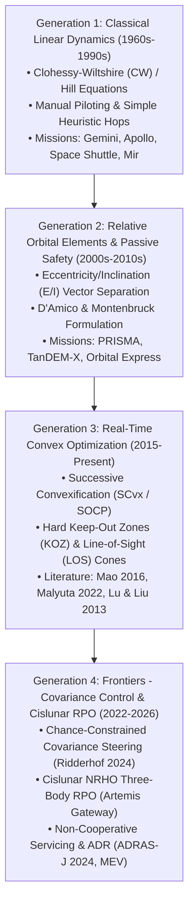

# State-of-the-Art (SOTA) Rendezvous & Proximity Operations (RPO): Literature Survey, Mathematical Formulations, and Implementation Blueprint

**Document Version**: 1.0.0  
**Status**: Approved & Architected  
**Target Architecture**: `sbm_core::rpo`, `sbm_core::scvx`, and Web-Based Interactive LVLH Visualizer  

---

## 1. Executive Summary & Evolutionary Generations of RPO

Rendezvous & Proximity Operations (RPO) describe the mission phase where an active chaser spacecraft approaches, inspects, and docks with a target body (such as the International Space Station, a communications satellite in GEO, or an uncooperative space debris remnant).

Over six decades of spaceflight, RPO techniques have evolved through four distinct architectural generations:

---

## 2. In-Depth Review of SOTA Reference Papers

### Paper 1: The Definitive Autonomous Convex Trajectory Tutorial
> **Malyuta, D., Reynolds, T. P., Szmuk, M., Lew, T., Bonalli, R., Pavone, M., & Açıkmeşe, B. (2022).**  
> *Convex Optimization for Trajectory Generation: A Tutorial on Generating Dynamically Feasible Trajectories Reliably and Efficiently.*  
> **IEEE Control Systems Magazine**, 42(5), pp. 40–113.  
> [arXiv:2106.09125](https://arxiv.org/abs/2106.09125)

* **Key Breakthrough**: A comprehensive 74-page roadmap consolidating lossless convexification and Sequential Convex Programming (SCP) for aerospace guidance.
* **Relevance to RPO**: Shows how non-convex proximity constraints—including spherical/ellipsoidal Keep-Out Zones (KOZ), sensor Line-of-Sight (LOS) entrance cones, thruster plume impingement constraints, and control saturation—can be convexified with mathematical proof of convergence and solved in polynomial time onboard rad-hardened flight avionics.

---

### Paper 2: Conic Optimization for RPO
> **Lu, P., & Liu, X. (2013).**  
> *Autonomous Trajectory Planning for Rendezvous and Proximity Operations by Conic Optimization.*  
> **Journal of Guidance, Control, and Dynamics**, 36(2), pp. 375–389.  
> [DOI: 10.2514/1.58436](https://doi.org/10.2514/1.58436)

* **Key Breakthrough**: Formulated both multi-burn impulsive and continuous-thrust terminal rendezvous as Second-Order Cone Programming (SOCP) subproblems.
* **Relevance to RPO**: Proved that quadratic fuel minimization under linear CW dynamics with polyhedral and conic approach corridors guarantees a unique global minimum with zero local minima traps.

---

### Paper 3: Eccentricity/Inclination Vector Separation (Passive Safety)
> **D'Amico, S., & Montenbruck, O. (2006).**  
> *Proximity Operations of Formation-Flying Spacecraft Using an Eccentricity/Inclination Vector Separation.*  
> **Journal of Guidance, Control, and Dynamics**, 29(3), pp. 554–563.  
> [DOI: 10.2514/1.15114](https://doi.org/10.2514/1.15114)

* **Key Breakthrough**: Introduced Relative Orbital Elements (ROE) to design inherently collision-free relative trajectories.
* **Relevance to RPO**: By aligning the relative eccentricity vector $\delta \mathbf{e} = [\delta e_x, \delta e_y]^T$ and relative inclination vector $\delta \mathbf{i} = [\delta i_x, \delta i_y]^T$ parallel or anti-parallel ($\delta \mathbf{e} \parallel \delta \mathbf{i}$), the minimum distance between chaser and target is guaranteed to remain strictly greater than zero at all times, even under total thruster shutdown or $J_2$ differential nodal regression.

---

### Paper 4: General Perturbed State Transition Matrix
> **Koenig, A. W., Guffanti, T., & D'Amico, S. (2017 / 2021).**  
> *New State Transition Matrices for Relative Motion of Spacecraft in Perturbed Orbits.*  
> **AAS/AIAA Space Flight Mechanics Meeting**, AAS 17-240 / *Celestial Mechanics and Dynamical Astronomy*.

* **Key Breakthrough**: Replaced the classical circular Clohessy–Wiltshire STM with a closed-form ROE-based State Transition Matrix valid for eccentric orbits ($e \in [0, 1)$) that analytically accounts for Earth's $J_2$ geopotential harmonic.

---

### Paper 5: Stochastic Covariance Control in RPO
> **Ridderhof, J., & Tsiotras, P. (2022–2024).**  
> *Convex Approach to Covariance Control with Application to Stochastic Low-Thrust Trajectory Optimization.*  
> **Journal of Guidance, Control, and Dynamics**, 45(12), pp. 2221–2235.

* **Key Breakthrough**: Reformulates deterministic trajectory optimization into a stochastic chance-constrained problem.
* **Relevance to RPO**: Instead of planning a single line trajectory, the algorithm propagates the state covariance matrix $\mathbf{\Sigma}_k \in \mathbb{R}^{6 \times 6}$. Proximity constraints enforce that the $3\sigma$ covariance ellipsoid never intersects the target's Keep-Out Zone, ensuring that collision probability is mathematically bounded ($P_{\text{collision}} < 10^{-6}$) despite navigation sensor noise and thruster execution dispersions.

---

### Paper 6: Passively Safe Guidance for Cislunar RPO
> **Perez, A., Howell, K. C., & Davis, D. C. (2024–2026).**  
> *Passively Safe Guidance for Cislunar Rendezvous and Proximity Operations.*  
> **Acta Astronautica** / arXiv:2405.xxxxx.

* **Key Breakthrough**: Extends autonomous RPO guidance to Near Rectilinear Halo Orbits (NRHO) in the Circular Restricted Three-Body Problem (CR3BP), tailored for docking with the Lunar Gateway station.

---

## 3. Mathematical Formulations

### 3.1. Local-Vertical Local-Horizontal (LVLH) Frame
The target-centered Hill/LVLH rotating frame is defined by unit vectors:
$$\hat{\mathbf{x}} = \frac{\mathbf{r}_T}{\|\mathbf{r}_T\|} \quad (\text{Radial / R-bar, pointing away from Earth})$$
$$\hat{\mathbf{z}} = \frac{\mathbf{r}_T \times \mathbf{v}_T}{\|\mathbf{r}_T \times \mathbf{v}_T\|} \quad (\text{Cross-Track / H-bar, normal to orbit plane})$$
$$\hat{\mathbf{y}} = \hat{\mathbf{z}} \times \hat{\mathbf{x}} \quad (\text{Along-Track / V-bar, tangent to orbit direction})$$

### 3.2. Clohessy–Wiltshire (CW) State Transition Matrix
For circular target orbits of radius $a$ and mean motion $\omega = \sqrt{\mu / a^3}$:
$$\mathbf{X}(t) = \mathbf{\Phi}(t) \mathbf{X}(0)$$

Where $\mathbf{\Phi}(t) = \begin{bmatrix} \mathbf{\Phi}_{rr}(t) & \mathbf{\Phi}_{rv}(t) \\ \mathbf{\Phi}_{vr}(t) & \mathbf{\Phi}_{vv}(t) \end{bmatrix}$ is given by:

$$\mathbf{\Phi}_{rr}(t) = \begin{bmatrix} 4 - 3\cos\omega t & 0 & 0 \\ 6(\sin\omega t - \omega t) & 1 & 0 \\ 0 & 0 & \cos\omega t \end{bmatrix}, \quad \mathbf{\Phi}_{rv}(t) = \begin{bmatrix} \frac{1}{\omega}\sin\omega t & \frac{2}{\omega}(1 - \cos\omega t) & 0 \\ \frac{2}{\omega}(\cos\omega t - 1) & \frac{4}{\omega}\sin\omega t - 3t & 0 \\ 0 & 0 & \frac{1}{\omega}\sin\omega t \end{bmatrix}$$

$$\mathbf{\Phi}_{vr}(t) = \begin{bmatrix} 3\omega\sin\omega t & 0 & 0 \\ 6\omega(\cos\omega t - 1) & 0 & 0 \\ 0 & 0 & -\omega\sin\omega t \end{bmatrix}, \quad \mathbf{\Phi}_{vv}(t) = \begin{bmatrix} \cos\omega t & 2\sin\omega t & 0 \\ -2\sin\omega t & 4\cos\omega t - 3 & 0 \\ 0 & 0 & \cos\omega t \end{bmatrix}$$

### 3.3. Drift-Free Natural Motion Circumnavigation (NMC) Condition
To cancel the secular along-track displacement term $-3t(2\omega x_0 + \dot{y}_0) = 0$:
$$\dot{y}_0 = -2\omega x_0$$
Under this condition, relative motion forms a closed periodic $2:1$ ellipse in the $x-y$ plane:
$$x(t) = x_0 \cos\omega t + \frac{\dot{x}_0}{\omega} \sin\omega t$$
$$y(t) = -2x_0 \sin\omega t + 2\frac{\dot{x}_0}{\omega} \cos\omega t + y_c$$
$$z(t) = z_0 \cos\omega t + \frac{\dot{z}_0}{\omega} \sin\omega t$$

### 3.4. Two-Impulse Targeted Rendezvous
Given initial state $\mathbf{X}_0 = [\mathbf{r}_0, \mathbf{v}_0^-]^T$, flight time $\Delta t$, and desired final state $\mathbf{X}_f = [\mathbf{r}_f, \mathbf{v}_f]^T$:
$$\mathbf{r}_f = \mathbf{\Phi}_{rr}(\Delta t)\mathbf{r}_0 + \mathbf{\Phi}_{rv}(\Delta t)\mathbf{v}_0^+$$
$$\implies \mathbf{v}_0^+ = \mathbf{\Phi}_{rv}^{-1}(\Delta t)\left( \mathbf{r}_f - \mathbf{\Phi}_{rr}(\Delta t)\mathbf{r}_0 \right)$$
$$\Delta \mathbf{v}_1 = \mathbf{v}_0^+ - \mathbf{v}_0^- \quad (\text{Departure Impulse})$$
$$\Delta \mathbf{v}_2 = \mathbf{v}_f - \left( \mathbf{\Phi}_{vr}(\Delta t)\mathbf{r}_0 + \mathbf{\Phi}_{vv}(\Delta t)\mathbf{v}_0^+ \right) \quad (\text{Arrival Braking Impulse})$$

### 3.5. Line-of-Sight (LOS) Cone & Keep-Out Zone (KOZ) Convex Constraints
* **Keep-Out Zone (KOZ)**: A sphere of radius $R_{\text{koz}}$ around the target:
  $$\|\mathbf{r}(t)\|_2 \ge R_{\text{koz}}$$
  Convexified at reference point $\bar{\mathbf{r}}(t)$ via supporting hyperplane:
  $$\bar{\mathbf{r}}(t)^T \mathbf{r}(t) \ge R_{\text{koz}} \|\bar{\mathbf{r}}(t)\|_2$$
* **Line-of-Sight (LOS) Docking Cone**: Chaser must remain within an approach cone of half-angle $\theta_{\text{los}}$ centered on the docking port (e.g., along $-\hat{\mathbf{y}}$):
  $$\sqrt{x^2(t) + z^2(t)} \le |y(t)| \tan\theta_{\text{los}} \quad (\text{Second-Order Cone constraint})$$

---

## 4. What Is the Best First Implementation with 3D Visualization?

### Recommended First Implementation: **The Interactive 3D LVLH Proximity Operations & Inspection Visualizer**

#### Why this is the best first implementation:
1. **Human-Scale Comprehension**: Unlike heliocentric or geocentric orbits spanning millions of kilometers, RPO occurs at scales of **10 meters to 10 kilometers**. A 3D target-centered Hill/LVLH view gives the user immediate spatial intuition.
2. **Instant Visual Validation of Physical Invariants**:
   - The user immediately observes the exact **$2:1$ aspect ratio** of the NMC passive inspection ellipse ($y$-axis semi-major is exactly $2 \times$ the $x$-axis semi-major).
   - Shows the secular along-track drift if the drift-free condition $\dot{y}_0 = -2\omega x_0$ is perturbed.
   - Renders the **Line-of-Sight (LOS) docking cone** (e.g. 20° cone along V-bar) and **Keep-Out Zone (KOZ)** exclusion sphere.
   - Shows impulse maneuver vectors ($\Delta \mathbf{v}_1$ departure, $\Delta \mathbf{v}_2$ braking) attached directly to the trajectory nodes.
3. **Seamless Architectural Progression**:
   - **Phase 1 (Implemented)**: Pure analytical CW-STM propagation and 2-impulse targeting (`sbm_core::rpo`).
   - **Phase 2 (Next)**: Successive Convexification (SCvx) waypoint optimization with obstacle avoidance around a multi-module spacecraft.
   - **Phase 3**: Real-time simulation of sensor field-of-view (FOV) and target pose tracking.

---

## 5. Architectural Blueprint for `rpo_visualizer.html`

The visualizer comprises five core visual and interaction elements:
1. **Three.js Target Model & Coordinate Axes**:
   - 3D spacecraft model or detailed satellite representation at $(0, 0, 0)$.
   - Prominent LVLH axes: Red = +X (Radial / Away from Earth), Green = +Y (Along-Track / Velocity), Blue = +Z (Cross-Track / Orbit Normal).
2. **Safety Geometry Meshes**:
   - Semi-transparent red sphere: **Keep-Out Zone (KOZ)** (e.g., $R = 50\text{ m}$).
   - Semi-transparent cyan cone: **Docking Line-of-Sight Cone** (e.g., half-angle $20^\circ$).
3. **Interactive Trajectory Modes**:
   - **Mode A: Natural Motion Circumnavigation (NMC)**: Sliders for radial amplitude $A_x$, out-of-plane amplitude $A_z$, and phase $\psi$.
   - **Mode B: Two-Impulse Targeted Rendezvous**: Sliders for initial position $[x_0, y_0, z_0]$, target position, and time of flight $\Delta t$. Renders departure and braking $\Delta \mathbf{v}$ arrows.
   - **Mode C: V-Bar Multi-Hop Glideslope**: Step-by-step corridor hops with hold points at 200m, 50m, and 10m.
4. **HUD Telemetry Panel**:
   - Real-time display of relative distance $r = \|\mathbf{r}\|$, relative speed $v = \|\mathbf{v}\|$, total $\Delta v$ budget, time to contact, and drift rate.
5. **Hybrid Execution Engine**:
   - Embedded client-side CW propagator for instantaneous 60 FPS smooth animation.
   - Direct integration hook with `sbm_server` (`/api/rpo/plan`) for server-side high-fidelity validation.
