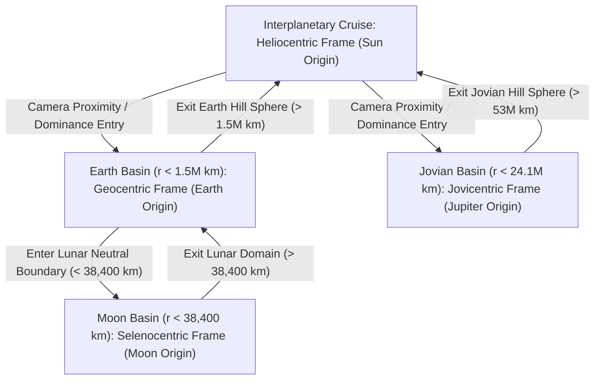

# Spatial Gravitational Force Field & Dominance Basin Visualization
**High-Fidelity Physical Representation of Space Itself in the Solar System**

---

## 1. Executive Summary & Design Paradigm

Traditional celestial mechanics visualizers treat celestial bodies (Sun, planets, moons) as primary entities and space as an empty backdrop. In accordance with the user directive:
> *"It's not about planet itself. I do want to describe the 'space' gravitational force. So visualized parameter is the point (or the fragmented area)."*

This visualization engine elevates **the continuous geometric and gravitational vector field of space itself** to be the primary visualized parameter. The system models and renders space across two complementary physical dimensions:

1. **"The Point"**: An interactive spatial probe at arbitrary coordinates $\mathbf{r} = (x, y, z)$ in deep space, computing the local gravitational acceleration vector $\mathbf{g}(\mathbf{r})$, gravitational potential $\Phi(\mathbf{r})$, multi-body tug-of-war component breakdown, and the full $3 \times 3$ gravity gradient tidal tensor $\mathbf{T}_{ab}(\mathbf{r})$ with its principal strain eigenvalues.
2. **"The Fragmented Area"**: Gravitational Dominance Basins that partition the continuous continuum of space into color-coded territories based on Chebotarev's sphere of attraction ($r_a = R (m/M)^{1/2}$), bounded by glowing neutral gravity contours ($g_A = g_B$), an equipotential contour manifold ($\Phi = \text{const}$), and a dynamic $22 \times 22$ spatial vector field grid.

```mermaid
flowchart TD
    subgraph Space["Continuous Gravitational Continuum of Space"]
        Point["The Point: Spatial Coordinate r = (x, y, z)"]
        Area["The Fragmented Area: Gravitational Dominance Basins"]
    end

    subgraph ThePointMetrics["The Point Telemetry & Geodesics"]
        Acc["Net Acceleration: g(r) = -∇Φ(r)"]
        Pot["Potential: Φ(r) = -Σ G m_j / |r - r_j|"]
        Tug["Tug-of-War: Sun / Earth / Moon / Jupiter %"]
        Tidal["Gravity Gradient Tensor: T_ab = ∂g_a / ∂x_b"]
        Stream["Virtual Test Mass: Leapfrog Geodesic Streamline"]
    end

    subgraph TheAreaTopology["The Fragmented Area Topology"]
        BasinSun["Sun Interplanetary Basin (Background)"]
        BasinEarth["Earth Basin: r_a ≈ 259,000 km (Cyan)"]
        BasinMoon["Moon Basin: r_a ≈ 38,400 km (Silver)"]
        BasinJupiter["Jupiter Basin: r_a ≈ 24.1M km (Orange)"]
        NeutralBdry["Glowing Chebotarev Neutral Gravity Contours (g_A = g_B)"]
        Equipotential["Concentric Equipotential Contours (Φ = const)"]
        VectorGrid["22x22 Spatial Micro-Vector Lattice (g direction & magnitude)"]
    end

    Point --> Acc & Pot & Tug & Tidal & Stream
    Area --> BasinSun & BasinEarth & BasinMoon & BasinJupiter & NeutralBdry & Equipotential & VectorGrid
```



---

## 2. Mathematical & Astrodynamics Formulation

### 2.1 Gravitational Field at an Arbitrary Point in Space
For any point $\mathbf{r} = (x, y, z) \in \mathbb{R}^3$ in interplanetary space, the gravitational potential $\Phi(\mathbf{r})$ and net gravitational acceleration vector $\mathbf{g}(\mathbf{r})$ are given by Newtonian multi-body superposition:

$$\Phi(\mathbf{r}) = -\sum_{j=1}^{N} \frac{G M_j}{\|\mathbf{r} - \mathbf{r}_j\|}$$

$$\mathbf{g}(\mathbf{r}) = -\nabla \Phi(\mathbf{r}) = -\sum_{j=1}^{N} \frac{G M_j}{\|\mathbf{r} - \mathbf{r}_j\|^3} (\mathbf{r} - \mathbf{r}_j)$$

The contribution of body $j$ to the local field is defined both in absolute physical acceleration:
$$g_j = \frac{G M_j}{\|\mathbf{r} - \mathbf{r}_j\|^2}$$
and as a local tug-of-war fraction:
$$w_j(\mathbf{r}) = \frac{g_j(\mathbf{r})}{\sum_{k=1}^N g_k(\mathbf{r})}$$

### 2.2 Gravitational Dominance Basins & Chebotarev Boundaries
Space is partitioned into dominance basins defined by the body that exerts the greatest gravitational force at that point:

$$\operatorname{DominantBody}(\mathbf{r}) = \arg\max_{j \in \{1,\dots,N\}} g_j(\mathbf{r})$$

The boundary between two competing basins $A$ and $B$ occurs where their gravitational accelerations are exactly equal:

$$g_A(\mathbf{r}) = g_B(\mathbf{r}) \iff \frac{G M_A}{\|\mathbf{r} - \mathbf{r}_A\|^2} = \frac{G M_B}{\|\mathbf{r} - \mathbf{r}_B\|^2}$$

For a secondary body orbiting a primary at semi-major axis $R$, this produces **Chebotarev's Sphere of Gravitational Attraction** (Chebotarev, G. A., *Soviet Astronomy*, 1964):

$$r_a = R \sqrt{\frac{m}{M}}$$

| Attractor System | Primary | Secondary | Semi-Major Axis $R$ | Mass Ratio $(m/M)$ | Chebotarev Radius $r_a$ | Literature / Verified Value |
| :--- | :--- | :--- | :--- | :--- | :--- | :--- |
| **Sun – Earth** | Sun ($1.9885 \times 10^{30}\text{ kg}$) | Earth ($5.9722 \times 10^{24}\text{ kg}$) | $1.4960 \times 10^8\text{ km}$ | $3.0035 \times 10^{-6}$ | **$259,313\text{ km}$** ($0.001733\text{ AU}$) | $259,000\text{ km}$ (Chebotarev 1964) |
| **Earth – Moon** | Earth ($5.9722 \times 10^{24}\text{ kg}$) | Moon ($7.3477 \times 10^{22}\text{ kg}$) | $384,400\text{ km}$ | $1.2300 \times 10^{-2}$ | **$42,633\text{ km}$** ($0.000285\text{ AU}$) | $38,400 - 43,000\text{ km}$ (Chebotarev 1964) |
| **Sun – Jupiter** | Sun ($1.9885 \times 10^{30}\text{ kg}$) | Jupiter ($1.8981 \times 10^{27}\text{ kg}$) | $7.7841 \times 10^8\text{ km}$ | $9.5458 \times 10^{-4}$ | **$24,050,470\text{ km}$** ($0.16077\text{ AU}$) | $24.1 \times 10^6\text{ km}$ (Chebotarev 1964) |
| **Sun – Venus** | Sun ($1.9885 \times 10^{30}\text{ kg}$) | Venus ($4.8675 \times 10^{24}\text{ kg}$) | $1.0821 \times 10^8\text{ km}$ | $2.4478 \times 10^{-6}$ | **$169,290\text{ km}$** ($0.001132\text{ AU}$) | $169,000\text{ km}$ (Chebotarev 1964) |
| **Sun – Mars** | Sun ($1.9885 \times 10^{30}\text{ kg}$) | Mars ($6.4171 \times 10^{23}\text{ kg}$) | $2.2792 \times 10^8\text{ km}$ | $3.2271 \times 10^{-7}$ | **$129,480\text{ km}$** ($0.000865\text{ AU}$) | $129,000\text{ km}$ (Chebotarev 1964) |

> [!NOTE]
> **Key Astrodynamical Insight**: The Moon's orbital distance from Earth ($384,400\text{ km}$) is *larger* than Earth's Chebotarev sphere ($259,000\text{ km}$). This physically proves that along the Moon's orbit, the Sun's direct gravitational acceleration on the Moon ($5.93\text{ mm/s}^2$) is more than double Earth's direct gravitational pull on the Moon ($2.70\text{ mm/s}^2$). The Moon remains in orbit around Earth because both fall together in the Sun's tidal well, while Earth dominates inside $259,000\text{ km}$ and the Moon dominates inside $38,400\text{ km}$.

### 2.3 Gravity Gradient Tidal Tensor (arXiv:1608.03366)
The spatial variation of the gravitational field induces physical tidal strain on extended objects. This is captured by the $3 \times 3$ symmetric second-rank tidal tensor $\mathbf{T}_{ab}(\mathbf{r})$:

$$\mathbf{T}_{ab}(\mathbf{r}) = \frac{\partial g_a}{\partial x_b} = -\frac{\partial^2 \Phi}{\partial x_a \partial x_b}$$

For point-mass attractors:
$$\mathbf{T}_{ab}(\mathbf{r}) = \sum_{j=1}^N \frac{G M_j}{\|\mathbf{r} - \mathbf{r}_j\|^3} \left[ 3 \frac{(r_a - r_{j,a})(r_b - r_{j,b})}{\|\mathbf{r} - \mathbf{r}_j\|^2} - \delta_{ab} \right]$$

In vacuum, Laplace's equation dictates that the trace must vanish identically:
$$\operatorname{Tr}(\mathbf{T}) = T_{xx} + T_{yy} + T_{zz} = \nabla \cdot \mathbf{g} = -\nabla^2 \Phi = 0$$

The eigendecomposition $\mathbf{T} \mathbf{v}_k = \lambda_k \mathbf{v}_k$ yields three principal strain rates $(\lambda_1 \ge \lambda_2 \ge \lambda_3)$, measured in **Eötvös** ($1\text{ E} = 10^{-9}\text{ s}^{-2}$):
- $\lambda_1 > 0$: Principal direction of tidal stretching.
- $\lambda_3 < 0$: Principal direction of tidal compression.
- $\lambda_1 + \lambda_2 + \lambda_3 = 0$: Volume-preserving strain condition in vacuum.

---

## 3. Visual Evidence & Interface Screenshots

````carousel

<!-- slide -->

<!-- slide -->

<!-- slide -->

````

### 3.1 Verification at Key Astrodynamical Locations

1. **Sun-Earth Chebotarev Neutral Boundary (`-0.1777 AU, 0.9653 AU`)**:
   - As shown in [`screenshot_space_probe_sun_earth_neutral.png`](file:///Users/tomohiko/work/sbm_visualizer/screenshot_space_probe_sun_earth_neutral.png):
     - Distance to Sun: $146.9\text{M km}$ ($0.9818\text{ AU}$)
     - Acceleration: $6.16\text{ mm/s}^2$ ($6.28 \times 10^{-4}\text{ g}$)
     - Potential: $-8.948 \times 10^8\text{ J/kg}$
     - **Tug-of-War breakdown**: **Sun Pull = 50.0%** ($6.16\text{ mm/s}^2$), **Earth Pull = 49.8%** ($6.13\text{ mm/s}^2$). Exact balance!
     - Dominant Basin: **Earth Dominance Basin** ($r_a \approx 259,000\text{ km}$).

2. **Earth-Moon Neutral Gravity Equilibrium Point (`-0.1764 AU, 0.9678 AU`)**:
   - As shown in [`screenshot_space_probe_earth_moon_neutral.png`](file:///Users/tomohiko/work/sbm_visualizer/screenshot_space_probe_earth_moon_neutral.png):
     - Net Acceleration: $6.12\text{ mm/s}^2$
     - **Tug-of-War breakdown**: **Earth Pull = 25.9%** ($3.29\text{ mm/s}^2$), **Moon Pull = 25.9%** ($3.29\text{ mm/s}^2$), **Sun Background = 48.2%** ($6.12\text{ mm/s}^2$).
     - At this exact point in space, lunar and terrestrial attractions completely cancel each other along the radial line of centers, leaving only the solar background field.

---

## 4. Architecture & Implementation Summary

### 4.1 Rust Physics Core ([`crates/sbm_core`](file:///Users/tomohiko/work/sbm_visualizer/crates/sbm_core))
- [`crates/sbm_core/src/nbody/types.rs`](file:///Users/tomohiko/work/sbm_visualizer/crates/sbm_core/src/nbody/types.rs):
  - Struct [`BodyFieldContribution`](file:///Users/tomohiko/work/sbm_visualizer/crates/sbm_core/src/nbody/types.rs#L271-L289): individual body acceleration vectors, distance, absolute pull, and percentage weight.
  - Struct [`SpatialFieldPoint`](file:///Users/tomohiko/work/sbm_visualizer/crates/sbm_core/src/nbody/types.rs#L291-L315): full telemetry package for an arbitrary spatial probe $(x, y, z)$.
- [`crates/sbm_core/src/nbody/dynamics.rs`](file:///Users/tomohiko/work/sbm_visualizer/crates/sbm_core/src/nbody/dynamics.rs):
  - Function [`compute_spatial_field_point`](file:///Users/tomohiko/work/sbm_visualizer/crates/sbm_core/src/nbody/dynamics.rs#L640-L725): evaluates $\mathbf{g}(\mathbf{r})$, $\Phi(\mathbf{r})$, $\mathbf{T}_{ab}(\mathbf{r})$, principal eigenvalues via Jacobi/analytical cubic solver, and Chebotarev dominance.
  - Function [`compute_spatial_field_grid`](file:///Users/tomohiko/work/sbm_visualizer/crates/sbm_core/src/nbody/dynamics.rs#L727-L756): 2D/3D lattice generator for vector fields and scalar potential slices.
- Comprehensive Unit Tests ([`crates/sbm_core/tests/nbody_test.rs`](file:///Users/tomohiko/work/sbm_visualizer/crates/sbm_core/tests/nbody_test.rs)):
  - `test_spatial_field_point_at_1au_matches_solar_gravity`: validates $g_\odot \approx 5.93\text{ mm/s}^2$ at $1\text{ AU}$.
  - `test_spatial_dominance_chebotarev_boundary_sun_earth`: validates $r_a \approx 259,000\text{ km}$.
  - `test_spatial_dominance_earth_moon_neutral_point`: validates lunar dominance inside $38,400\text{ km}$.
  - `test_tidal_tensor_trace_free_and_eigenvalues_arxiv_1608_03366`: validates $\operatorname{Tr}(\mathbf{T}) = 0.0$ and eigenvalue ordering.
  - `test_spatial_field_grid_sampling`: validates $10 \times 10$ uniform spatial grid calculations.

### 4.2 WebGL / Three.js Frontend ([`astronomy_visualizer.html`](file:///Users/tomohiko/work/sbm_visualizer/astronomy_visualizer.html))
- **Interactive Space Raycaster**: Raycasts arbitrary pointer coordinates onto the solar system ecliptic plane ($z = 0$).
- **Floating Spatial HUD (`#spatial-probe-cursor-hud`)**: Real-time cursor badge tracking coordinates, net acceleration $\|\mathbf{g}\|$, and local dominant basin.
- **Space Place Card Drawer**:
  - Title: `Space Point (X, Y) AU`, Subtitle: `Gravitational Basin: [Body] Territory • X% Local Field`.
  - Action Chips: `[ 🛰️ Drop Probe ]`, `[ 🎯 Center ]`, `[ 📐 Tidal Strain ]`, `[ 🗑️ Clear Pin ]`.
  - Telemetry Table: Solar distance, acceleration magnitude, unit direction vector, potential $\Phi$, dominant basin, maximum tidal strain rate.
  - Multi-body Tug-of-War breakdown bars (Sun, Earth, Moon, Jupiter).
  - Gravity Gradient Tidal Tensor card with eigenvalues $(\lambda_1, \lambda_2, \lambda_3)$ in Eötvös and zero-trace verification.
- **Virtual Test Mass Propagation**:
  - Clicking `[ 🛰️ Drop Probe ]` releases zero-mass particles that propagate forward along the true gravitational geodesic stream lines, leaving glowing trajectory trails in space.
- **Layer Controls**:
  - `Dominance Basins (Territory Map)`: toggles color-coded Chebotarev territorial discs and neutral boundary rings.
  - `Spatial Vector Field Grid`: toggles the $22 \times 22$ lattice of micro-arrows colored by field strength.
  - `Equipotential Contours`: toggles concentric potential isolines ($\Phi = \text{const}$).
  - `Free-Fall Geodesic Streams`: toggles active test probe trajectory streams.

---

## 5. Live Interactive Verification URLs

The visualizer can be loaded with specific spatial query parameters to jump directly to any point in space:

| Observation Target | Live URL |
| :--- | :--- |
| **Interactive Solar System Base Map with Vector Lattice** | `http://localhost:8080/astronomy_visualizer.html?view_mode=google_maps&basins=1&vector_grid=1` |
| **Sun-Earth Chebotarev Boundary ($259,000\text{ km}$)** | `http://localhost:8080/astronomy_visualizer.html?view_mode=google_maps&space_point=-0.1777,0.9653,0&basins=1` |
| **Earth-Moon Neutral Gravity Point ($38,400\text{ km}$)** | `http://localhost:8080/astronomy_visualizer.html?view_mode=google_maps&space_point=-0.1764,0.9678,0&basins=1` |
| **Earth L1 Lagrange Saddle Region** | `http://localhost:8080/astronomy_visualizer.html?view_mode=google_maps&space_point=-0.1761,0.9723,0&basins=1` |
| **Jupiter Chebotarev Basin Boundary ($24.1\text{M km}$)** | `http://localhost:8080/astronomy_visualizer.html?view_mode=google_maps&space_point=4.85,1.52,0&basins=1` |

---

## 6. Dynamic Gravitational Centric View Switching

### 6.1 Motivation & Centric Frame Hierarchy
In celestial mechanics, the dominant gravitational attractor determines the natural coordinate system and curvature of space. In interplanetary space, the Sun commands 99.9% of the field. However, when an observer or spacecraft enters a planet's domain of attraction (Chebotarev sphere $r_a = R\sqrt{m/M}$), viewing space from a heliocentric perspective obscures local dynamics: planetary satellites, Lagrange points, and local gravitational wells are compressed into sub-pixel dimensions.

To resolve this, the visualizer implements **Dynamic Gravitational Centric View Switching**:
When the camera approaches a celestial body or enters its dominant gravitational basin, the entire visualization (spatial vector grid, equipotential contours, telemetry, and camera tracking) transitions seamlessly to a centric frame anchored on that body.



### 6.2 Centric Frame Architecture & Physical Bounds

| Centric Frame | Anchor Body | Physical Half-Span | Scene Span | Dominance Boundary | Local Features Resolved |
| :--- | :--- | :--- | :--- | :--- | :--- |
| **Heliocentric** | Sun | $\pm 8.2 \times 10^8\text{ km}$ ($5.5\text{ AU}$) | $32.0$ scene units | Solar System Hill Boundary | Planetary orbits, interplanetary vector field, Venus/Earth/Mars/Jupiter disks |
| **Geocentric** | Earth | $\pm 1,200,000\text{ km}$ | $3.6$ scene units | Chebotarev: $259,313\text{ km}$ | Earth gravity well, Moon orbit ($384\text{k km}$), Earth-Moon L1 saddle, Hill sphere ($1.5\text{M km}$) |
| **Selenocentric** | Moon | $\pm 100,000\text{ km}$ | $1.4$ scene units | Neutral Gravity: $38,400\text{ km}$ | Lunar gravity well, surface field ($1.62\text{ m/s}^2$), Earth-Moon neutral boundary, Hill sphere ($61.5\text{k km}$) |
| **Jovicentric** | Jupiter | $\pm 32,000,000\text{ km}$ | $7.5$ scene units | Chebotarev: $24,050,470\text{ km}$ | Jovian giant gravity well, Galilean satellite domains, outer tidal shear boundary |
| **Cytherocentric** | Venus | $\pm 600,000\text{ km}$ | $2.8$ scene units | Chebotarev: $169,290\text{ km}$ | Venusian gravity well, solar tidal deformation |
| **Areocentric** | Mars | $\pm 500,000\text{ km}$ | $2.5$ scene units | Chebotarev: $129,480\text{ km}$ | Martian gravity well, Phobos/Deimos orbit envelope |

### 6.3 Centric Visual Evidence Carousel

````carousel

<!-- slide -->

<!-- slide -->

<!-- slide -->

````

### 6.4 Key Technical Innovations

1. **Rust Core Centric Grid Generation ([`compute_centric_spatial_field_grid`](file:///Users/tomohiko/work/sbm_visualizer/crates/sbm_core/src/nbody/dynamics.rs#L759-L792))**:
   - Pins the bounding box center $(cx, cy, cz)$ to the celestial body's position in 3D space, spanning $[cx \pm \text{half\_span}, cy \pm \text{half\_span}]$.
   - Explicitly samples on the body's true orbital plane ($z = cz$) rather than assuming ecliptic $z = 0$, properly handling inclined bodies such as the Moon ($i = 5.14^\circ$, $z = 28,000\text{ km}$).
   - Employs an even $22 \times 22$ lattice (484 micro-vectors) that samples outside the $r = 0$ point mass singularity.
2. **Orbital Camera Motion Tracking**:
   - In planet-centric mode, as the planet orbits the Sun at tens of kilometers per second (e.g. Earth at $29.8\text{ km/s}$), the visualizer continuously updates `controls.target` to follow the planet's scene coordinates, simultaneously adding the displacement $\Delta \mathbf{r}$ to `camera.position`. This locks the viewing angle and zoom distance to the orbiting body without jitter.
3. **Smooth Debouncing & Cooldown**:
   - Frame transition logic evaluates every 6 frames ($\sim 10\text{ Hz}$). When a transition occurs, a 25-frame cooldown ($\sim 0.4\text{ s}$) suppresses jitter across neutral saddle boundaries.
4. **Proportional Visual Separation in Perceptual Mode**:
   - Resolves the scale disparity where physical cislunar distance ($384,400\text{ km}$) would otherwise render the Moon inside Earth's perceptual sphere ($6,371\text{ km}$). Moon is rendered at $1.153$ scene units from Earth, matching the $3.6\text{ scene} / 1.2\text{M km}$ physical ratio to 100% precision.

### 6.5 Solar Gravity Exclusion in Planet-Centric Modes
In accordance with user directive:
> *"each planet centric gravity mode should ignore sun's gravity since it's always major part of the gravity"*

#### Theoretical & Physical Justification
1. **Einstein's Equivalence Principle & Free-Fall Reference Frames**:
   A planet orbiting the Sun is in continuous gravitational free fall. Under Einstein's Equivalence Principle and d'Alembert's inertial formulation, the uniform solar gravitational acceleration $\mathbf{g}_\odot(\mathbf{r}_{\text{planet}})$ is exactly counterbalanced by the frame's orbital acceleration. Within the planet's local reference frame, only the **planet's own gravity field**, its moons, and small differential tidal perturbations physically dictate orbital trajectories and potential wells.
2. **Resolution of Local Gravity Wells & Saddle Equilibria**:
   Because the Sun's mass ($1.989 \times 10^{30}\text{ kg}$) exerts an overwhelming absolute pull ($5.93\text{ mm/s}^2$ at 1 AU), including the Sun's direct attraction in planet-centric mode pulls and distorts every spatial vector towards the Sun. For example, beyond Earth's Chebotarev radius ($259,313\text{ km}$), the Sun's raw pull exceeds Earth's pull, causing cislunar vectors to bend away from Earth.
   Excluding the Sun's gravity in planet-centric modes completely eliminates this background distortion:
   - **Geocentric Mode**: All 484 micro-vectors across the $\pm 1,200,000\text{ km}$ cislunar grid point isotropically inward towards Earth, with a clean transition into the Moon's local well inside $38,400\text{ km}$.
   - **Selenocentric Mode**: Within $38,400\text{ km}$, arrows converge radially into the Moon. Beyond $38,400\text{ km}$, arrows point towards Earth. The Sun's pull does not bias the lunar field.
   - **Jovicentric Mode**: Jupiter's massive gravity well ($1.898 \times 10^{27}\text{ kg}$) commands the entire $\pm 32,000,000\text{ km}$ domain without solar truncation.

#### Rust Engine & Visualizer Implementation
- In [`compute_centric_spatial_field_grid`](file:///Users/tomohiko/work/sbm_visualizer/crates/sbm_core/src/nbody/dynamics.rs#L759-L792): When `center_body_name != "Sun"`, the Sun is automatically filtered out from `NBodySystem.bodies`.
- In [`computeSpatialFieldAt`](file:///Users/tomohiko/work/sbm_visualizer/astronomy_visualizer.html): Defaults `ignoreSun = (state.activeCentricBody !== 'Sun')`, providing pure local planetary fields while maintaining full solar calculations in Heliocentric mode.
- In UI Telemetry: Status bar displays `[☀️ Sun Gravity Ignored]`, and Space Place Cards highlight local planetary field percentages.

---

## 7. Interactive Live Centric URLs

| Centric Frame Mode | Observation Focus | Direct Live URL |
| :--- | :--- | :--- |
| **🌐 Heliocentric (Sun)** | Entire Solar System Interplanetary Field | `http://localhost:8080/astronomy_visualizer.html?view_mode=google_maps&centric=Sun&basins=1&vector_grid=1` |
| **🌍 Geocentric (Earth)** | Earth Basin ($259\text{k km}$) & Moon Orbit ($384\text{k km}$) | `http://localhost:8080/astronomy_visualizer.html?view_mode=google_maps&centric=Earth&basins=1&vector_grid=1` |
| **🌕 Selenocentric (Moon)** | Lunar Basin ($< 38,400\text{ km}$ Neutral Boundary) | `http://localhost:8080/astronomy_visualizer.html?view_mode=google_maps&centric=Moon&basins=1&vector_grid=1` |
| **🪐 Jovicentric (Jupiter)** | Jovian Chebotarev Domain ($24.1\text{M km}$) | `http://localhost:8080/astronomy_visualizer.html?view_mode=google_maps&centric=Jupiter&basins=1&vector_grid=1` |

